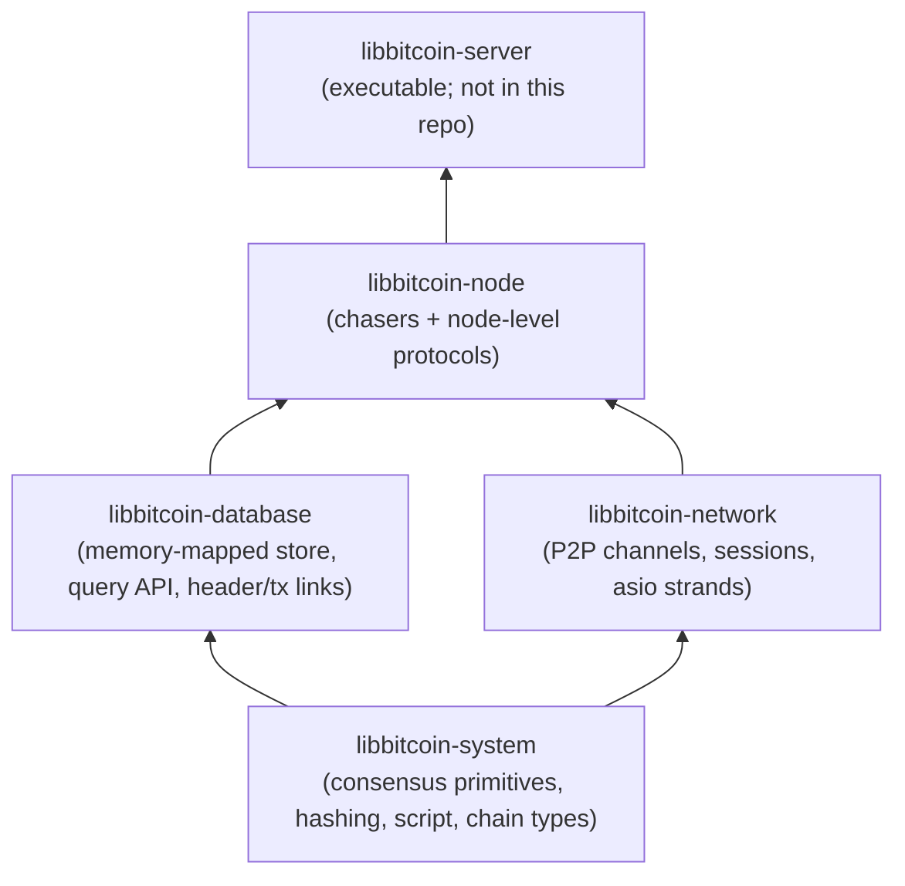
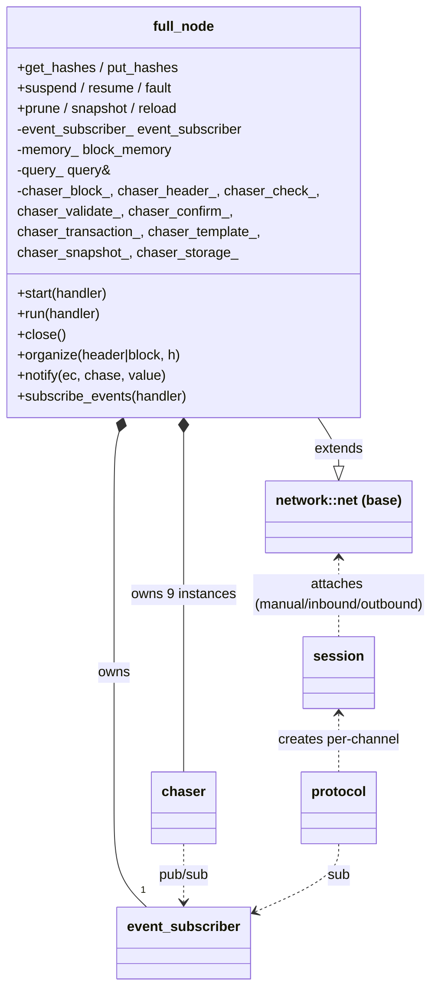
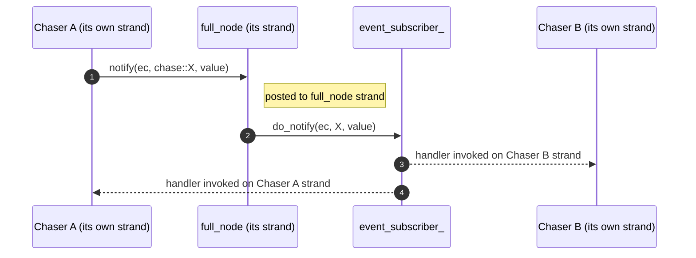
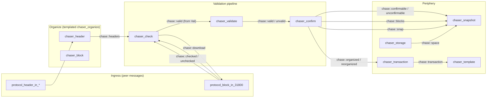
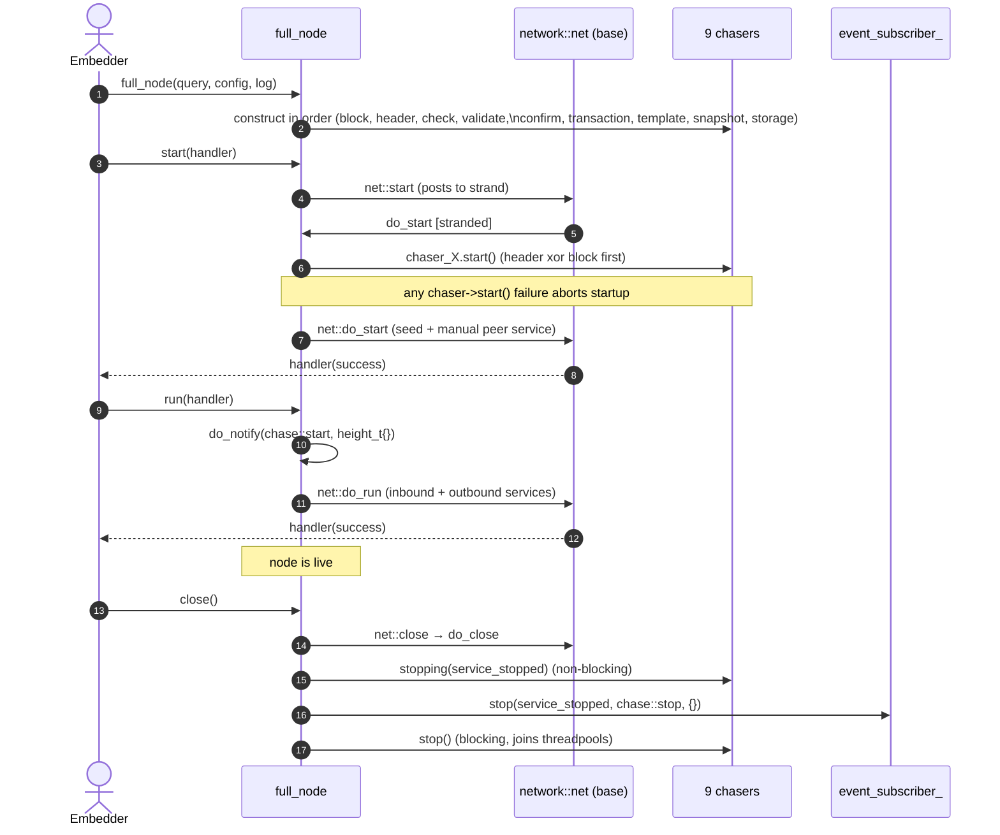

# libbitcoin-node — Architectural Overview

> **Purpose.** This document is the top-down map of the node. It is the entry
> point for the deeper subsystem docs in this directory. It is written for two
> downstream audiences:
>
> 1. A re-implementer producing a functional (e.g. Lisp) port — needs precise
>    functional decomposition and clean interfaces.
> 2. A formal-verification effort — needs explicit state machines, invariants,
>    and concurrency boundaries.
>
> All non-trivial claims are anchored with `path/to/file.ext:line` citations
> into the C++ so the spec can be re-derived if the source drifts.

---

## 1. Layer stack

libbitcoin is a stack of cooperating libraries. The node sits at the top and
composes the lower layers; it adds no new I/O primitives — only the chain
state machine and the orchestration of validation across many threads.

The node owns no executable
(`README.md:19` — *"This component contains no executable as it moved up to libbitcoin-server."*).
Embedders construct one `full_node` (`include/bitcoin/node/full_node.hpp:38`)
against an externally-owned `query&` (the database handle) and a
`configuration&`, then call `start() → run() → close()`.

---

## 2. Top-level object graph

Key facts:

- `full_node` is a `network::net` subclass
  (`include/bitcoin/node/full_node.hpp:38-40`). Networking (peer discovery,
  channels, message framing) is inherited unchanged from
  libbitcoin-network. The node only *adds* chasers and *overrides* session
  attachment to use node-specific sessions.
- `full_node` owns the **nine chasers as direct members**
  (`include/bitcoin/node/full_node.hpp:189-197`). They are constructed in
  order at `full_node` construction (`src/full_node.cpp:43-51`) and live
  exactly as long as the node.
- All chasers share a single `event_subscriber_`
  (`include/bitcoin/node/full_node.hpp:198`) — this is the central event bus.
- The store is **not owned** by `full_node`; only a reference to a `query` is
  held (`src/full_node.cpp:51`). Lifetime is the embedder's responsibility.

---

## 3. Concurrency model

### 3.1 Three flavours of execution context

| Context              | Scope                                | Where defined                                  |
| -------------------- | ------------------------------------ | ---------------------------------------------- |
| `full_node` strand   | Event-bus mutation; chaser ctor      | inherited from `network::net`                  |
| Per-chaser strand    | One strand per chaser instance       | `include/bitcoin/node/chasers/chaser.hpp:160`  |
| Per-channel strand   | One strand per peer channel/protocol | inherited from `network::channel`              |

> **Invariant (Concurrency-1).** Every chaser method that mutates chaser state
> must be on that chaser's own strand. The base provides `strand()`,
> `stranded()`, and `POST` macros to enforce this
> (`include/bitcoin/node/chasers/chaser.hpp:62-119`).

> **Invariant (Concurrency-2).** All `event_subscriber_` mutation (subscribe,
> notify, notify_one) happens on the `full_node` strand
> (`src/full_node.cpp:187-247`). Calls from chasers/protocols are posted into
> that strand by `full_node::notify` (`src/full_node.cpp:187-193`).

### 3.2 Notification flow

Implementation: `full_node::notify` posts to `strand()`, then
`do_notify` calls `event_subscriber_.notify(...)`
(`src/full_node.cpp:187-201`). Each subscriber's handler was registered with
a `BIND` that re-posts to the subscriber's own strand — so handlers always
run stranded with respect to their owning chaser/protocol.

> **Invariant (Concurrency-3).** A subscription is created via
> `subscribe_events` from a chaser's `start()`
> (`include/bitcoin/node/chasers/chaser.hpp:101`), which must itself be called
> on the node strand. Protocols subscribe via the async variant
> (`include/bitcoin/node/full_node.hpp:99-100`) which posts to the strand and
> uses a completer.

### 3.3 Why per-chaser strands

Chasers do consensus-critical, often expensive work (script execution,
database writes, snapshotting). Each strand allows the chaser to serialize
its *own* mutations while still running in parallel with the other chasers
(see `include/bitcoin/node/chasers/chaser.hpp:32-35` — *"Each chaser operates
on its own strand … allowing concurrent chaser operations to the extent that
threads are available"*).

This is one of the two main axes of parallelism in the node. The chasers
form a pipeline; each stage runs on its own strand and they communicate
by publishing events. The other axis, equally important, is **per-channel
strands**: every peer connection also runs on its own strand. Peers and
chasers therefore execute concurrently with each other, bounded only by
the shared threadpool size.

---

## 4. The event bus

The bus is an enumerated message type `enum class chase`
(`include/bitcoin/node/chase.hpp:27-164`) carried alongside a `code` (error)
and an `event_value` variant (`include/bitcoin/node/define.hpp:79-84`,
typed payloads: `height_t`, `header_t`, `peer_t`, `object_t`, `count_t`,
`transaction_t`).

The enum **is the specification** of inter-chaser coupling. The summary
below is the *source-verified* mapping (issuer/handler columns reflect
actual `notify(chase::...)` and `case chase::...:` sites — not the
`chase.hpp` inline doc, which has several stale entries). For every site
citation and the full discrepancy list, see
[`01-event-bus.md`](01-event-bus.md).

⚠ in the issuer column marks a divergence from the chase.hpp comment;
*dormant* means the handler/issuer exists in source but is currently
commented out or absent — wired but not yet active.

| Event             | Payload         | Issuer(s)                          | Handler(s)                                       |
| ----------------- | --------------- | ---------------------------------- | ------------------------------------------------ |
| **Work shuffling**                                                                                                                            |
| `start`           | `height_t`      | `full_node`                        | `check`, `validate`, `confirm`                   |
| `space`           | `count_t`       | `full_node`                        | `storage` (snapshot does *not* handle)           |
| `snap`            | `height_t`      | *dormant — no live issuer* ⚠       | `snapshot`                                       |
| `bump`            | `height_t`      | `organize` (template)              | `check`, `validate`, `confirm`                   |
| `suspend`         | —               | `full_node` **+** `organize` ⚠     | `observer`                                       |
| `resume`          | —               | `full_node`                        | `check`, `validate`, `confirm`                   |
| `starved`         | `object_t`      | `protocol_block_in_31800`          | `check`                                          |
| `split`           | `object_t`      | `check` ⚠ (not `session_outbound`) | `protocol_block_in_31800`                        |
| `stall`           | `peer_t`        | `check` ⚠ (not `session_outbound`) | `protocol_block_in_31800`                        |
| `purge`           | `peer_t`        | `check`                            | `protocol_block_in_31800`                        |
| `report`          | `count_t`       | *external* (executor / server)     | `protocol_block_in_31800`                        |
| **Candidate chain**                                                                                                                           |
| `blocks`          | `height_t`      | `chaser_block` (via `chase_object()`) | *dormant — snapshot arm commented out*        |
| `headers`         | `height_t`      | `chaser_header` (via `chase_object()`) | `check`                                       |
| `download`        | `count_t`       | `check`                            | `protocol_block_in_31800`                        |
| `regressed`       | `height_t`      | `organize` (template)              | `check`, `validate`, `confirm`                   |
| `disorganized`    | `height_t`      | `organize` (template)              | `check`, `validate`, `confirm`                   |
| **Check / Identify**                                                                                                                          |
| `checked`         | `height_t`      | `protocol_block_in_31800`          | `check`, `validate` (snapshot arm dormant)       |
| `unchecked`       | `header_t`      | `protocol_block_in_31800`          | `organize` (template)                            |
| **Accept / Connect**                                                                                                                          |
| `valid`           | `height_t`      | `validate`                         | `check`, `confirm` (snapshot arm dormant)        |
| `unvalid`         | `header_t`      | `validate`                         | `organize` (template)                            |
| **Confirm (block)**                                                                                                                           |
| `confirmable`     | `header_t`      | `confirm`                          | *snapshot arm commented out — currently no live consumer* |
| `unconfirmable`   | `header_t`      | `confirm`                          | `organize` (template)                            |
| **Confirm (chain)**                                                                                                                           |
| `block`           | `header_t`      | `confirm` ⚠ (not `transaction`)    | `snapshot`, `protocol_block_out_106`, `protocol_header_out_70012` |
| `organized`       | `header_t`      | `confirm`                          | *no live consumer*                               |
| `reorganized`     | `header_t`      | `confirm`                          | *no live consumer*                               |
| **Mining**                                                                                                                                    |
| `transaction`     | `transaction_t` | `transaction`                      | `template`, `protocol_transaction_out_106`       |
| `template_`       | `height_t`      | *dormant — no live issuer* ⚠       | (miners, external)                               |
| **Stop**                                                                                                                                      |
| `stop`            | —               | `full_node`                        | all (chasers + subscribing protocols)            |

> **Note for the spec.** Treat this table as the **interface boundary**
> between chasers. A formal model can represent each chaser as a process
> with a single inbox typed `chase × event_value`; the C++ implementation
> just happens to use asio strands.
>
> Discrepancies (⚠) and *dormant* entries are documented at
> [`01-event-bus.md`](01-event-bus.md#22-verified-event-reference) with
> grep methodology so the table can be re-derived mechanically when source
> changes.

There is also a parallel, lower-volume `events` enum
(`include/bitcoin/node/events.hpp:28-65`) — these are *reporting* events
(metrics: timespans, archived/organized counts), surfaced via
`network::net::span<...>` (e.g. `src/full_node.cpp:314, 335, 360`). They are
**not** part of the inter-chaser protocol; they exist only for telemetry and
should not be modelled in the spec.

---

## 5. Chaser pipeline (logical view)

The nine chasers form a directed pipeline. The diagram below is a
*conceptual* sketch; the **authoritative, source-verified** issuer/handler
graph (with the dormant edges shown dashed) is in
[`01-event-bus.md §3`](01-event-bus.md#3-verified-issuer--handler-diagram).

Two organization modes (mutually exclusive per build/config):

- **Headers-first** (`config_.node.headers_first == true`): `chaser_header`
  starts; headers stream in first, blocks chase them
  (`src/full_node.cpp:79-81`).
- **Blocks-first**: `chaser_block` starts; full blocks are organized
  directly. Same path, file `src/full_node.cpp:79-81`.

The selection happens once at `do_start`. Both
`chaser_block` and `chaser_header` instantiate the templated
`chaser_organize<Block>` (`include/bitcoin/node/chasers/chaser_organize.hpp:33-35`)
— so the organize state machine is identical; only the unit (header vs.
block) differs. This is a strong hint that a formal spec should model
"organize" once, parameterized.

---

## 6. Lifecycle

### 6.1 Construction → start → run → close

Citations:
`src/full_node.cpp:62-72` (`start`),
`src/full_node.cpp:74-95` (`do_start`),
`src/full_node.cpp:97-119` (`run` / `do_run`),
`src/full_node.cpp:121-156` (`close` / `do_close`).

> **Invariant (Lifecycle-1).** The store must be initialised before `start`:
> `full_node::start` short-circuits with `error::store_uninitialized` if
> `query_.is_initialized()` is false (`src/full_node.cpp:64-67`).

> **Invariant (Lifecycle-2).** `do_close` initiates non-blocking
> `stopping(...)` first, then `event_subscriber_.stop(...)`, then `close()`
> blocks on per-chaser `stop()`. Order matters: chasers must observe stop
> before the bus is torn down (`src/full_node.cpp:139-156`).

### 6.2 Suspend / resume / fault

`suspend(ec)` and `resume()` are pre-existing `network::net` overrides that
also emit `chase::suspend` / `chase::resume`
(`src/full_node.cpp:252-271`). `fault(ec)` is the unified
"something terminal happened" entry; it dispatches by store state
(`is_full` → `chase::space`, `is_fault` → log, otherwise resumable) and
always calls `suspend(ec)` (`src/full_node.cpp:273-295`).

`prune` / `snapshot` / `reload` (`src/full_node.cpp:298-362`) all share a
pattern: suspend network, run the store operation, leave network suspended
on completion (caller resumes on success). Each emits a metrics event
(`events::prune_msecs`, `events::snapshot_secs`, `events::reload_msecs`).

> **Invariant (Store-1).** During a store maintenance operation, all peer
> connections are suspended; the caller is responsible for `resume()` after
> success. A `wait_lock` event during the op causes a *renewed* `suspend`
> (`src/full_node.cpp:308-311, 329-332, 354-357`) — racy connections that
> missed the first suspend are caught here.

---

## 7. Network layer at a glance

`full_node` overrides three session-attachment hooks
(`src/full_node.cpp:444-457`):

- `attach_manual_session` → `node::session_manual`
- `attach_inbound_session` → `node::session_inbound`
- `attach_outbound_session` → `node::session_outbound`

Each `node::session_*` adds a `node::session` mixin
(`include/bitcoin/node/sessions/session.hpp:31-124`) which mostly forwards to
`full_node` (organize, get/put_hashes, notify, subscribe). The mixin's job is
to give every protocol instance on every channel a reference to the node's
event bus and organizers.

Protocols are versioned by Bitcoin P2P protocol number:

| Family    | Versions               | Direction |
| --------- | ---------------------- | --------- |
| block     | 106, 31800             | in        |
| block     | 106, 70012             | out       |
| header    | 31800, 70012           | in        |
| header    | 31800, 70012           | out       |
| tx        | 106                    | in/out    |
| filter    | 70015 (BIP157/158)     | out       |
| meta      | observer, peer, performer | —      |

Each protocol class lives in `include/bitcoin/node/protocols/` and is
implemented in `src/protocols/`. `protocol_block_in_31800` is the central
performance-sensitive class — it's the only one referenced from many
`chase` event handlers (download, starved, split, stall, purge, report,
checked, unchecked). It deserves its own subsystem doc.

---

## 8. Memory model: the block arena

`full_node` owns a `block_memory` controller
(`include/bitcoin/node/full_node.hpp:44, 185`) sized by
`allocation_multiple × network.threads` (`src/full_node.cpp:41`). This is
exposed to derived sessions via `get_memory()` and is the source of arena
allocations for block-shaped objects.

The header carries an unusually strong lifetime warning
(`include/bitcoin/node/full_node.hpp:32-37`):

> *"when full node is using block_memory controller, all shared block
> components invalidate when the block destructs. Lifetime of the block is
> assured for the extent of all methods below, however if a sub-object is
> retained by shared_ptr, beyond method completion, a copy of the block
> shared_ptr must also be retained. Taking a block or sub-object copy is
> insufficient, as copies are shallow (copy internal shared_ptr objects)."*

> **Implication for a port.** A Lisp implementation that uses garbage
> collection should **not** replicate the arena-lifetime contract verbatim —
> it is a C++-specific optimisation. A formal model can abstract block
> contents as immutable values; the arena is below the spec layer. The
> closest correctness obligation is: any reference held beyond a chaser
> method must keep the root block alive.

---

## 9. Failure model

Errors flow as `std::error_code` values. The node-specific category is
defined in `include/bitcoin/node/error.hpp:32-101`. Categories:

- **store**: `store_uninitialized`, `store_reload`, `store_prune`, `store_snapshot`
- **network**: `slow_channel`, `stalled_channel`, `exhausted_channel`,
  `sacrificed_channel`, `suspended_channel`, `suspended_service`
- **blockchain**: `orphan_block`, `orphan_header`, `duplicate_block`,
  `duplicate_header`
- **faults (terminal)**: `protocol1-2`, `header1`, `organize1-15`,
  `validate1-8`, `confirm1-12`

> **Note for the spec.** The `organizeN` / `validateN` / `confirmN` codes are
> *terminal* error markers (`error.hpp:62` — *"faults (terminal, code error
> and store corruption assumed)"*). Each represents an internal invariant
> violation. Each numbered code corresponds to a specific
> `BC_ASSERT`-equivalent site in the relevant chaser; locating each site is
> a prerequisite for a formal proof obligation list. **See the per-chaser
> docs (to be written) for the mapping.**

---

## 10. Subsystem docs (planned)

This overview will be followed by drill-downs at the same level of rigour
(state machines, invariants, sequence diagrams). Proposed structure:

1. `01-event-bus.md` — every `chase` event with formal pre/post-conditions
   and the C++ call sites that issue/consume it.
2. `02-chaser-organize.md` — the templated organize state machine
   (shared by header/block).
3. `03-chaser-check.md` — block download orchestration + work splitting.
4. `04-chaser-validate.md` — script & consensus validation (the core
   target for formal verification).
5. `05-chaser-confirm.md` — confirmation, reorg, UTXO commit.
6. `06-chaser-snapshot-storage.md` — disk-space, snapshot, prune, reload.
7. `07-chaser-transaction-template.md` — mempool + mining template.
8. `08-sessions.md` — inbound/outbound/manual lifecycle + suspend/resume.
9. `09-protocols-block-header.md` — versioned P2P protocols, esp.
   `protocol_block_in_31800` (the chase-event-heavy class).
10. `10-protocols-tx-filter.md` — tx, filter protocols.
11. `11-memory-and-arena.md` — `block_arena` and lifetime contract.
12. `12-failure-model.md` — full enumeration of error codes to source
    sites, with proof obligations.

Each subsystem doc will explicitly call out:

- **State variables** and their invariants
- **Pre/post-conditions** on every state-mutating operation
- **Events consumed/emitted** (typed)
- **Concurrency boundary** (which strand, what may run concurrently)
- **Source citations** with `file:line`

---

## Appendix A — Glossary

- **Chaser**: a long-running strand-confined state machine that owns one
  responsibility in the blockchain pipeline (header sync, validation, etc.).
- **Organize**: the act of attaching a header or block to the candidate
  chain. Implemented once for both via `chaser_organize<Block>`.
- **Candidate chain**: the chain of headers/blocks the node *prefers* but
  has not yet fully confirmed.
- **Confirmed chain**: the chain of blocks that have passed all consensus
  checks and been committed (UTXO-applied).
- **Strand**: an asio primitive that serializes execution of posted
  callbacks; the node uses one per chaser and one per channel.
- **Event bus**: `event_subscriber_` on `full_node`; carries `chase`
  enumerators between chasers and protocols.
- **Block arena**: a custom allocator owned by `full_node` that backs the
  components of received blocks; lifetime is tied to the root block.
