# 02 — `chaser_organize<Block>` (header and block organization)

> Companion to [`00-overview.md`](00-overview.md) and
> [`01-event-bus.md`](01-event-bus.md).
>
> `chaser_organize<Block>` is the templated state machine that attaches
> incoming headers (and, in blocks-first mode, full blocks) to the
> **candidate chain**. Both `chaser_header` and `chaser_block` are
> instantiations of this template, so the state machine is *shared* —
> only a handful of hook methods differ. This makes it the single most
> important subsystem to specify cleanly for a port or formal model.

| File                                                                                            | Role                                                |
| ----------------------------------------------------------------------------------------------- | --------------------------------------------------- |
| `include/bitcoin/node/chasers/chaser_organize.hpp`                                              | Template declaration + per-Block `static constexpr` differentiators |
| `include/bitcoin/node/impl/chasers/chaser_organize.ipp`                                         | Template implementation (the core state machine)    |
| `include/bitcoin/node/chasers/chaser_header.hpp` / `src/chasers/chaser_header.cpp`              | Instantiation for `system::chain::header`           |
| `include/bitcoin/node/chasers/chaser_block.hpp` / `src/chasers/chaser_block.cpp`                | Instantiation for `system::chain::block`            |

---

## 1. State

### 1.1 Persistent (the store, accessed via `archive()`)

The chaser does not own the chain — the database does. It manipulates two
chain projections exposed by `database::query`:

| Projection      | Mutators called from organize                          | Read methods used                                                                                                                          |
| --------------- | ------------------------------------------------------ | ------------------------------------------------------------------------------------------------------------------------------------------ |
| Candidate chain | `push_candidate(link)`, `pop_candidate()`              | `get_top_candidate`, `to_candidate(height)`, `is_candidate_header(link)`, `get_candidate_fork(out fork_point) → header_links`              |
| Confirmed chain | — (organize never writes confirmed; see chaser_confirm) | `get_confirmed_fork(fork) → header_links`                                                                                                  |
| Header records  | `set_code(out link, block, ctx, milestone, checked)`, `set_block_unconfirmable(link)` | `to_header(hash)`, `to_parent(link)`, `is_unconfirmable(link)`, `get_header_state(id)`, `get_header_key(link)`, `get_chain_state(...)`     |

> **Invariant (Organize-Store-1).** Every store mutation in organize is
> performed on the chaser's own strand
> (`include/bitcoin/node/impl/chasers/chaser_organize.ipp:115, 330` — both
> `do_organize` and `do_disorganize` open with `BC_ASSERT(stranded())`).
> Concurrent writes from other chasers do not occur in this template's
> scope; coordination across chasers happens via the event bus.

### 1.2 In-memory (this chaser only)

```cpp
// chaser_organize.hpp:186-194
const system::settings& settings_;           // immutable
const system::chain::checkpoints& checkpoints_;  // immutable

bool bumped_{};                               // strand-only
chain_state::cptr state_{};                   // strand-only
block_tree tree_{};                           // strand-only
                                              //   = unordered_map<hash_cref, Block::cptr>
```

- **`state_`** — current top of the *candidate* chain, cached as a
  `chain_state` (height, hash, flags, BIP-window context). Initialised in
  `start()` to top of candidate (`ipp:51-59`); updated at the end of every
  successful `do_organize` (`ipp:323`); rewound by `do_disorganize`
  (`ipp:434-436`).
- **`tree_`** — a memory-resident map of *weak-branch* candidates (blocks
  not strong enough to displace the current candidate). Populated by
  `cache()` (`ipp:530-538`); drained by `push_block(key)`
  (`ipp:518-527`).
- **`bumped_`** — latches `true` after the first time validation has been
  kicked off via `chase::bump` (`ipp:304-313`). Used to fire `bump` exactly
  once per "currentness" transition.

> **Invariant (Organize-Mem-1).** `bumped_` is set on the strand and read
> on the strand. It exists to *suppress redundant validation bumps* after
> the first one in the current run, not to enforce a chain property.

### 1.3 Concrete subclass state

#### `chaser_header` (`src/chasers/chaser_header.cpp`)

```cpp
const system::chain::checkpoint milestone_;   // immutable, from settings
size_t active_milestone_height_{};            // strand-only
const bool /*node_witness_*/                  // not applicable to header
```

`active_milestone_height_` tracks the highest height for which a milestone
has been observed on the current candidate. See §6.2.

#### `chaser_block` (`src/chasers/chaser_block.cpp`)

```cpp
const bool node_witness_;                     // immutable; affects get_block
```

`chaser_block` has **no milestone tracking** —
`is_under_milestone(size_t)` returns `false` unconditionally
(`chaser_block.cpp:164-167`).

---

## 2. Public interface (process boundary)

```mermaid
sequenceDiagram
    autonumber
    participant Peer as protocol_*_in (peer-receiving protocol)
    participant Sess as session
    participant FN as full_node
    participant Org as chaser_organize&lt;Block&gt;

    Peer->>Sess: organize(block, h)
    Sess->>FN: organize(block, h)
    FN->>Org: organize(block, h)
    Org->>Org: POST(do_organize, block, h) [own strand]
    activate Org
    Org->>Org: do_organize (see §3)
    Org-->>Peer: h(ec, height) (via continuation chain)
    deactivate Org
```

There are exactly **three external entry points** (state-mutating):

1. **`organize(Block::cptr, organize_handler)`** —
   `ipp:69-76` → posts `do_organize` to strand.
2. **`handle_event(code, chase, event_value)`** — bus subscriber.
   On `chase::unchecked` / `chase::unvalid` / `chase::unconfirmable`,
   posts `do_disorganize(header_t)` (`ipp:82-109`).
3. **`stop`** — base `chaser::stop`, drains the strand and unsubscribes.

Plus one read-only:
4. **`tree()`** — used by subclasses to walk the tree
   (`chaser_header.cpp:194-209` uses it for milestone matching).

> **Invariant (Organize-Iface-1).** No `organize` call ever runs
> concurrently with another `organize` call or with a `do_disorganize` on
> the same chaser instance: both go through `POST(...)` to the chaser's
> strand and asio strand semantics serialise them.

---

## 3. `do_organize`: the forward state machine

This is the core. The diagram below labels each branch with the source
line and, where applicable, the `error::organize{N}` code it returns.
Faults marked **F** are terminal and call `fault(ec)` (which suspends the
network); non-fatal returns hand `ec` to the caller via `handler`.

```mermaid
stateDiagram-v2
    [*] --> CHECK_CLOSED: do_organize(block, h)
    CHECK_CLOSED: ipp:125-129
    CHECK_CLOSED --> RETURN_STOPPED: closed()
    CHECK_CLOSED --> CHECK_TREE_DUP: open

    CHECK_TREE_DUP: ipp:131-136\nlook up hash in tree_
    CHECK_TREE_DUP --> RETURN_DUP_TREE: found
    CHECK_TREE_DUP --> CHECK_STORE_DUP: not in tree

    CHECK_STORE_DUP: ipp:138-143\nduplicate(out height, hash)
    CHECK_STORE_DUP --> RETURN_DUP_STORE: ec ≠ success
    CHECK_STORE_DUP --> CHECK_PARENT_BAD: ec == success

    CHECK_PARENT_BAD: ipp:148-154\nis_unconfirmable(to_header(prev))
    CHECK_PARENT_BAD --> RETURN_BAD_PARENT: true
    CHECK_PARENT_BAD --> GET_PARENT_STATE: false

    GET_PARENT_STATE: ipp:156-162\nget_chain_state(prev)
    GET_PARENT_STATE --> RETURN_ORPHAN: null (parent unknown)
    GET_PARENT_STATE --> ROLL_STATE: parent known

    ROLL_STATE: ipp:165-166\nchain_state(*parent, header, settings)

    ROLL_STATE --> CHECK_CHECKPOINT
    CHECK_CHECKPOINT: ipp:171-175\ncheckpoint::is_conflict
    CHECK_CHECKPOINT --> RETURN_CHKPT_CONFLICT: conflict
    CHECK_CHECKPOINT --> VALIDATE_HOOK: ok

    VALIDATE_HOOK: ipp:188-192\nvalidate(*block, *state)\n[virtual hook — §4]
    VALIDATE_HOOK --> RETURN_INVALID: ec ≠ block_success
    VALIDATE_HOOK --> CHECK_STORABLE: ok

    CHECK_STORABLE: ipp:195-201\nis_storable(state) [virtual hook]
    CHECK_STORABLE --> CACHE_AND_RETURN: false (cache in tree_)
    CHECK_STORABLE --> COMPUTE_WORK: true

    COMPUTE_WORK: ipp:206-213\nget_branch_work(out work, tree_branch, store_branch)
    COMPUTE_WORK --> F_organize2: false
    COMPUTE_WORK --> STRONG_CHECK: true

    STRONG_CHECK: ipp:215-222\nget_strong_branch(work, branch_point)
    STRONG_CHECK --> F_organize3: false
    STRONG_CHECK --> CHECK_WEAK_BRANCH: ok

    CHECK_WEAK_BRANCH: ipp:225-231\n!strong
    CHECK_WEAK_BRANCH --> CACHE_AND_RETURN: weak (cache, return)
    CHECK_WEAK_BRANCH --> UPDATE_MS: strong

    UPDATE_MS: ipp:238-241\nupdate_milestone(header, h, bp) [virtual hook]

    UPDATE_MS --> CHECK_BP_BELOW_TOP
    CHECK_BP_BELOW_TOP: ipp:243-249\nbranch_point ≤ top
    CHECK_BP_BELOW_TOP --> F_organize4: branch_point > top
    CHECK_BP_BELOW_TOP --> POP_TO_BP: ok

    POP_TO_BP: ipp:251-260\nset_reorganized(top--) for top down to bp+1
    POP_TO_BP --> F_organize5: pop_candidate() failed

    POP_TO_BP --> EMIT_REGRESSED: regress = (branch_point < top₀)
    EMIT_REGRESSED: ipp:262-266\nif regress: notify(chase::regressed, bp)

    EMIT_REGRESSED --> PUSH_STORE_BRANCH
    PUSH_STORE_BRANCH: ipp:268-276\nfor each in store_branch (rev):\n  set_organized(link, ++top)
    PUSH_STORE_BRANCH --> F_organize6: push_candidate failed

    PUSH_STORE_BRANCH --> PUSH_TREE_BRANCH
    PUSH_TREE_BRANCH: ipp:278-288\nfor each in tree_branch (rev):\n  push_block(key) [archive + set_organized]
    PUSH_TREE_BRANCH --> F_PUSH_KEY: code != success

    PUSH_TREE_BRANCH --> PUSH_TOP_NEW
    PUSH_TOP_NEW: ipp:290-295\npush_block(*block, ctx)
    PUSH_TOP_NEW --> F_PUSH_NEW: code != success

    PUSH_TOP_NEW --> CHECK_CURRENT
    CHECK_CURRENT: ipp:302\nis_block() || is_current(header.timestamp())
    CHECK_CURRENT --> EMIT_NOT_CURRENT: header && !current\n(skip bump and chase_object)
    CHECK_CURRENT --> EMIT_BUMP_AND_OBJ: yes

    EMIT_BUMP_AND_OBJ: ipp:304-318\nif !bumped_: notify(chase::bump);\nbumped_ = true;\nnotify(chase_object(), bp)\n(chase::headers or chase::blocks)

    EMIT_BUMP_AND_OBJ --> UPDATE_STATE: ipp:322-324
    EMIT_NOT_CURRENT --> UPDATE_STATE
    UPDATE_STATE: state_ = state; handler(success, h)
    UPDATE_STATE --> [*]

    RETURN_STOPPED --> [*]: handler(service_stopped, {})
    RETURN_DUP_TREE --> [*]: handler(error_duplicate(), h)
    RETURN_DUP_STORE --> [*]: handler(ec, h)
    RETURN_BAD_PARENT --> [*]: handler(database::block_unconfirmable, {})
    RETURN_ORPHAN --> [*]: handler(error_orphan(), {})
    RETURN_CHKPT_CONFLICT --> [*]: handler(checkpoint_conflict, h)
    RETURN_INVALID --> [*]: handler(ec, h)
    CACHE_AND_RETURN --> [*]: cache(block, state); handler(success, h)

    F_organize2 --> [*]: F → fault(organize2)
    F_organize3 --> [*]: F → fault(organize3)
    F_organize4 --> [*]: F → fault(organize4)
    F_organize5 --> [*]: F → fault(organize5)
    F_organize6 --> [*]: F → fault(organize6)
    F_PUSH_KEY --> [*]: F → fault(ec)\n(may be organize14, organize15 from push_block)
    F_PUSH_NEW --> [*]: F → fault(ec)\n(may be organize14, organize15)
```

### 3.1 Logical phases (for the spec)

```
PHASE                                LINES                 OBSERVABLE EFFECTS
---------------------------------    -----------------     ----------------------------------
A. Dedup / parent check              ipp:131-154           none (read-only)
B. State roll-forward                ipp:156-166           none (in-memory)
C. Consensus pre-validate            ipp:171-192           none (read-only validate hook)
D. Storable decision                 ipp:195-201           may write to tree_
E. Branch-work accounting            ipp:206-222           none
F. Strong-branch test                ipp:225-231           may write to tree_
G. Reorganize candidate chain        ipp:233-295           DB writes; emit regressed
H. Currency check & emit             ipp:300-319           emit bump (once) + chase_object
I. State commit                      ipp:321-324           in-memory state_ update; handler
```

The split between (D) cache-on-not-storable and (F) cache-on-not-strong is
deliberate: storable means *we'd archive it if it became strong* —
checkpoints, milestones, and (for headers) "current & sufficient work"
qualify; everything else is held only in `tree_`.

### 3.2 Side-effect summary table

| Path                           | DB writes                                                                        | Bus emits                                              | Reporting events                                                          |
| ------------------------------ | -------------------------------------------------------------------------------- | ------------------------------------------------------ | ------------------------------------------------------------------------- |
| Cache (weak or not-storable)   | none                                                                             | none                                                   | none                                                                      |
| Reorg without regress          | `set_strong_chain` ops (via push_block) + `push_candidate` per pushed link        | `chase_object()` (headers or blocks); maybe `bump`     | `events::header_archived/block_archived`; `events::header_organized`      |
| Reorg with regress             | pop_candidate (top→bp+1) + pushes above                                          | `chase::regressed`, then `chase_object()`; maybe `bump`| `events::header_reorganized` for each popped; `events::*_organized` for each pushed |
| Non-current header (org. ok)   | DB writes as above                                                               | *neither* `bump` nor `chase_object`                    | reporting events as above                                                  |

> **Invariant (Organize-Emit-1).** `chase::bump` is emitted at most once
> per chaser instance lifetime (latched by `bumped_`,
> `ipp:304-313`).
>
> **Invariant (Organize-Emit-2).** `chase::headers` (or `chase::blocks`)
> is emitted on **every** successful organize that yields a current top,
> not only on regress. Source: emission at `ipp:318` is outside the
> `if (regress)` block.

---

## 4. Hooks: where the template differs

The state machine is identical; six virtual hooks let each instantiation
plug in chain-specific semantics. See `chaser_organize.hpp:60-83` for
declarations. Below is what each instantiation does.

| Hook                          | `chaser_header`                                                                                            | `chaser_block`                                                                                                                                        |
| ----------------------------- | ---------------------------------------------------------------------------------------------------------- | ----------------------------------------------------------------------------------------------------------------------------------------------------- |
| `get_header(Block&)`          | identity (`chaser_header.cpp:44-47`)                                                                       | `block.header()` (`chaser_block.cpp:38-41`)                                                                                                           |
| `get_block(out, link)`        | `query.get_header(link)` (`chaser_header.cpp:49-55`)                                                       | `query.get_block(link, node_witness_)` (`chaser_block.cpp:43-49`)                                                                                     |
| `duplicate(out h, hash)`      | If header exists: returns `block_unconfirmable` if state says so; else `duplicate_header`. (`chaser_header.cpp:57-89`) | Same idea but checks block state (`unassociated` is *not* a duplicate). (`chaser_block.cpp:51-83`)                                                    |
| `validate(block, state)`      | `header.check()` + `header.accept(ctx)` (`chaser_header.cpp:91-114`)                                       | `header.check + header.accept`; if under checkpoint: `block.identify` only; else: `block.check`, `populate`, `block.accept`, `block.connect`. (`chaser_block.cpp:85-154`) |
| `is_storable(state)`          | checkpoint ∨ milestone ∨ (current ∧ hard) (`chaser_header.cpp:119-147`)                                    | **`true`** unconditionally (`chaser_block.cpp:156-159`)                                                                                               |
| `is_under_milestone(h)`       | `h ≤ active_milestone_height_` (`chaser_header.cpp:175-178`)                                               | **`false`** unconditionally (`chaser_block.cpp:164-167`)                                                                                              |
| `update_milestone(hdr,h,bp)`  | Updates `active_milestone_height_`; scans tree branch for milestone match (`chaser_header.cpp:182-221`)    | **No-op**, returns false (`chaser_block.cpp:169-172`)                                                                                                 |

### 4.1 Spec implications

For a formal model, these hooks are the **chain-shape parameters** of the
organize machine. A clean factoring:

```
organize(M : ChainParams) : Process
  where ChainParams = {
    Unit  : Type,                                  -- header | block
    duplicate     : Unit -> Store -> DupResult,
    validate      : Unit -> ChainState -> Code,    -- consensus pre-check
    is_storable   : ChainState -> Bool,            -- gating on tree promotion
    milestone     : Heightℕ -> Bool                -- monotone height predicate
  }
```

`chaser_block::validate` notably includes `block.connect(ctx)` (i.e. UTXO
*consumption* checks via `populate`), but the comment block at
`chaser_block.cpp:130-151` flags that **blocks-first does not currently
emit `chase::valid`** — the validation chaser has separate work to do that
isn't possible here because the block isn't archived yet. This is why
blocks-first is the secondary path and headers-first is the production
default.

> **Implication.** A specification of "fully validated" must come from
> `chaser_validate`, not from this template's `validate` hook — even for
> `chaser_block`. The hook is `validate-up-to-consensus-acceptance`; the
> deeper UTXO/witness obligations are completed elsewhere.

---

## 5. `do_disorganize`: the rollback state machine

Triggered by `handle_event` on `chase::unchecked`, `chase::unvalid`,
`chase::unconfirmable` (`ipp:82-109`). Argument is the `header_t` link of
the offending header.

```mermaid
stateDiagram-v2
    [*] --> STRAND_GUARD: do_disorganize(link)
    STRAND_GUARD: ipp:330\nBC_ASSERT(stranded())
    STRAND_GUARD --> CHECK_CLOSED
    CHECK_CLOSED: ipp:334-335
    CHECK_CLOSED --> RETURN: closed()
    CHECK_CLOSED --> ALREADY_REORG: open

    ALREADY_REORG: ipp:337-339\n!is_candidate_header(link)\n(may have been undone)
    ALREADY_REORG --> RETURN: yes (silent return)
    ALREADY_REORG --> GET_FORK: no

    GET_FORK: ipp:344-346\nget_candidate_fork(out fork_point)
    GET_FORK --> PART_AT_LINK
    PART_AT_LINK: ipp:349-351\npart(candidates, invalids, link)
    PART_AT_LINK --> RETURN: !part (degenerate)
    PART_AT_LINK --> GET_FORK_STATE: ok

    GET_FORK_STATE: ipp:356-361\nget_candidate_chain_state(fork_point)
    GET_FORK_STATE --> F_organize7: null
    GET_FORK_STATE --> REBUILD_TREE: ok

    REBUILD_TREE: ipp:363-375\nfor each candidate below link:\n  state = chain_state(state, header)\n  cache(block, state)
    REBUILD_TREE --> F_organize8: get_block failed
    REBUILD_TREE --> POP_INVALIDS

    POP_INVALIDS: ipp:380-393\nfor each invalid (top→link):\n  set_block_unconfirmable\n  set_reorganized(invalid)
    POP_INVALIDS --> F_organize9: set_block_unconfirmable failed
    POP_INVALIDS --> F_organize10: set_reorganized failed
    POP_INVALIDS --> POP_WEAK

    POP_WEAK: ipp:398-405\nfor each candidate below link (rev):\n  set_reorganized(candidate)
    POP_WEAK --> F_organize11: set_reorganized failed
    POP_WEAK --> PUSH_CONFIRMED

    PUSH_CONFIRMED: ipp:411-421\nfor each in get_confirmed_fork(fork):\n  set_organized(confirmed, ++fork_point)
    PUSH_CONFIRMED --> F_organize12: set_organized failed
    PUSH_CONFIRMED --> REFRESH_STATE

    REFRESH_STATE: ipp:427-432\nget_candidate_chain_state(fork_point)
    REFRESH_STATE --> F_organize13: null
    REFRESH_STATE --> EMIT_DISORG

    EMIT_DISORG: ipp:435-442\nstate_ = state;\nnotify(chase::disorganized, fork_point);\nnotify(chase::suspend, {})
    EMIT_DISORG --> [*]

    F_organize7 --> [*]
    F_organize8 --> [*]
    F_organize9 --> [*]
    F_organize10 --> [*]
    F_organize11 --> [*]
    F_organize12 --> [*]
    F_organize13 --> [*]
    RETURN --> [*]
```



### 5.1 What disorganize accomplishes

After a successful run, post-conditions:

1. **`set_block_unconfirmable`** has been called for the offending link
   and every candidate at or above it. The store now permanently marks
   these headers as bad (`ipp:382`).
2. The **candidate chain top equals the previous confirmed chain top**:
   every candidate above the fork point has been popped
   (`ipp:380-405`); every confirmed block above the fork point has been
   re-pushed as candidate (`ipp:411-421`).
3. The valid portion of the candidate branch (below the bad link) has
   been re-cached into `tree_` so that subsequent organize calls can
   re-promote it (`ipp:363-375`).
4. `state_` is reset to the new (lower) candidate top (`ipp:435-436`).
5. **`chase::disorganized`** is published with payload = new fork point;
   downstream chasers (`check`, `validate`, `confirm`) rewind themselves
   to this height.
6. **`chase::suspend`** is published; peer connections are dropped.

> **Invariant (Organize-Disorg-1).** After `chase::disorganized` is
> emitted, the candidate top equals the confirmed top (modulo races; the
> caller-side `query` interlock guarantees the snapshot used to compute
> the fork point is consistent). This is the strongest correctness
> obligation in the organize machine — see `ipp:438` comment: *"Candidate
> is same as confirmed, reset chasers to new top."*

> **Invariant (Organize-Disorg-2).** `chase::suspend` follows
> `chase::disorganized` *unconditionally* on success (`ipp:439-442`).
> The two emissions are not reordered. A specification can treat them as
> a single atomic publish.

### 5.2 Re-entrancy

Disorganize can be triggered while another disorganize is still in
flight (a second `chase::unvalid` arrives). The `is_candidate_header`
short-circuit at `ipp:337-339` handles this gracefully: the second call
silently returns because the offending link is no longer on the
candidate chain. There is no explicit lock.

> **Invariant (Organize-Disorg-3).** Repeated disorganize calls on the
> same link are idempotent: the second is a no-op after
> `is_candidate_header(link)` returns false.

---

## 6. Auxiliary state machines

### 6.1 The header tree (`tree_`)

`tree_` is an in-memory cache of blocks/headers that have arrived but
cannot yet be archived. Two arrival paths:

1. **Not storable** (`ipp:195-201`) — header isn't current/strong enough
   to gate archival. Held until enough work accumulates and `is_storable`
   becomes true on a subsequent arrival.
2. **Not strong** (`ipp:225-231`) — branch work doesn't beat the current
   candidate top.

Exit paths:
- **`push_block(key)`** (`ipp:518-527`) — extracts from `tree_`, archives,
  pushes to candidate.
- **`cache` in disorganize** (`ipp:374`) — re-adds blocks below a bad
  link so they remain candidates after the rollback.

> **TODO marker.** `ipp:536` notes "guard cache against memory exhaustion
> (DoS)". The tree is currently unbounded. For a spec, this is a
> liveness assumption (peer cannot drive memory unbounded); a
> formal proof of safety should require a bound on `|tree_|`.

### 6.2 Header milestone tracking (`chaser_header` only)

A *milestone* is a configured `(hash, height)` pair that fixes the chain.
Functionally similar to a checkpoint but mutable per node settings.

State: `active_milestone_height_` is the height of the *most recent
milestone observed on the current candidate*. Initialised by
`initialize_milestone()` (`chaser_header.cpp:153-173`) by reading the
candidate at the milestone height and comparing hashes.

`update_milestone` (`chaser_header.cpp:182-221`) runs during organize
and:
- Sets `active_milestone_height_` if the new header *is* the milestone.
- Else scans `tree_` for an ancestor that matches the milestone; sets
  height if found.
- Else, if the new branch reorganises below the previously-active
  milestone, retracts `active_milestone_height_` to the branch point
  (`chaser_header.cpp:214-218`).

`is_under_milestone(h)` is then simply `h ≤ active_milestone_height_`.

> **Invariant (Organize-Milestone-1).** `active_milestone_height_` is
> non-decreasing *along the current candidate*. It only decreases when
> the candidate is reorganized below the milestone (a rare event), and
> only via `update_milestone`.

`chaser_block` skips milestones entirely. The full block already carries
enough state to validate without the heuristic.

---

## 7. Error inventory (`organizeN` and friends)

Every numbered fault is a *terminal* (calls `chaser::fault` which
suspends the network and is meant to indicate a programmer or
store-corruption error). For a formal model, each is a proof obligation:
"this branch is unreachable under the system invariants".

| Code               | Site                                | Meaning (paraphrased from comments)                                                                                                |
| ------------------ | ----------------------------------- | ---------------------------------------------------------------------------------------------------------------------------------- |
| `header1`          | `chaser_header.cpp:38-40`           | `initialize_milestone()` failed (mismatch between milestone height and stored candidate)                                          |
| `organize1`        | `ipp:55-59`                         | `start()`: `get_candidate_chain_state(top)` returned null                                                                          |
| `organize2`        | `ipp:209-213`                       | `get_branch_work` failed (store inconsistency in branch sum)                                                                       |
| `organize3`        | `ipp:218-222`                       | `get_strong_branch` failed (could not decide strength)                                                                             |
| `organize4`        | `ipp:243-249`                       | branch_point > current candidate top (impossible if state is consistent)                                                           |
| `organize5`        | `ipp:255-259`                       | `pop_candidate()` failed during reorg                                                                                              |
| `organize6`        | `ipp:271-276`                       | `push_candidate(stored.link)` failed during reorg                                                                                  |
| `organize7`        | `ipp:357-361`                       | disorganize: `get_candidate_chain_state(fork_point)` returned null                                                                 |
| `organize8`        | `ipp:367-370`                       | disorganize: `get_block(candidate)` returned null (missing block for known-candidate)                                              |
| `organize9`        | `ipp:382-386`                       | disorganize: `set_block_unconfirmable(invalid)` failed                                                                             |
| `organize10`       | `ipp:388-392`                       | disorganize: `set_reorganized(invalid)` failed (pop while marking unconfirmable)                                                   |
| `organize11`       | `ipp:400-404`                       | disorganize: `set_reorganized(candidate)` failed (pop weak)                                                                        |
| `organize12`       | `ipp:416-420`                       | disorganize: `set_organized(confirmed, ...)` failed (push confirmed back as candidate)                                             |
| `organize13`       | `ipp:428-432`                       | disorganize: `get_candidate_chain_state(fork_point)` after rebuild returned null                                                   |
| `organize14`       | `ipp:515` (in `push_block`)         | `set_organized` failed after a successful `set_code` (we archived but couldn't push to candidate)                                  |
| `organize15`       | `ipp:521-523` (in `push_block(key)`)| Tree extract returned no handle (item was missing when expected)                                                                   |
| `stalled_channel`  | `ipp:471-475` (in `set_organized`, NDEBUG-only check) | Candidate height isn't `top+1` (broken sequencing)                                                                    |
| `suspended_channel`| `ipp:477-483` (in `set_organized`, NDEBUG-only check) | Parent of new candidate isn't current top (broken sequencing)                                                         |

> **Spec obligation list.** A formal model should be able to discharge
> `organize2` through `organize15` as unreachable, given:
> - Store consistency invariants supplied by libbitcoin-database.
> - The strand invariant (Organize-Iface-1) excluding concurrent writes.
> - `tree_` invariant (every key has a value).
>
> `organize1` and `header1` are startup-only and reduce to "store was
> initialised at boot".

---

## 8. Differences from the inline `chase.hpp` comments

(For book-keeping; cross-reference with
[`01-event-bus.md §2`](01-event-bus.md#2-verified-event-reference).)

- `chase.hpp:46` says **`chase::bump`** is "Issued by 'organize'". ✓
  This template is the only issuer (`ipp:311`).
- `chase.hpp:79-85` say `chase::blocks` / `chase::headers` are issued by
  `block` / `header` respectively. Technically correct: both come from
  this template via `chase_object()` (`ipp:318`); the template
  instantiates as `chaser_block` or `chaser_header`.
- `chase.hpp:91-97` say `chase::regressed` / `disorganized` are issued
  by 'organize'. ✓ (`ipp:265`, `ipp:439`).
- `chase.hpp:50` says **`chase::suspend`** is issued by `full_node`.
  Incomplete: this template *also* emits it after a disorganize
  (`ipp:442`). This is the source of the ⚠ in
  [`01-event-bus.md §2.1`](01-event-bus.md#21-work-shuffling).

---

## 9. Notes for the Lisp port

- The state machine is naturally functional. A pure-Lisp implementation
  can model `do_organize` as a pipeline of `Maybe`-returning steps
  with the store as an effectful argument. The DB writes and bus emits
  are the only effectful boundaries; everything between them is pure
  computation over `(block, parent_state, settings)`.

- The two-mode template can be implemented in Lisp as a single function
  parameterised by a record of hook closures, mirroring the spec
  factoring in §4.1.

- `tree_` is naturally a `hash-table` keyed by header hash. The DoS
  concern (`§6.1 TODO`) can be enforced by a size cap with a
  least-recently-used eviction.

- `update_milestone` walks `tree_` by parent-hash chain — straightforward
  recursion.

---

## 10. Notes for the formal model

- The whole state machine is *strand-confined*, so single-threaded
  semantics suffice for proving local invariants.

- The store is treated as an oracle: every numbered failure mode
  `organizeN` reduces to a store-consistency assumption.

- Strongest provable property: after every `do_organize` that returns
  `success`, the candidate top has either (a) advanced strictly
  forward, (b) reorganized to a different top with at least as much
  work, or (c) the block is cached in `tree_`. Cases (a)/(b) coincide
  with emission of `chase_object()`; (c) does not emit.

- The "after disorganize, candidate == confirmed" post-condition
  (Organize-Disorg-1) is the hinge for downstream chasers: `check`,
  `validate`, `confirm` all use it to bound their rewind.

- A useful proof structure: define `Φ(σ)` = "candidate chain in `σ` has
  cumulative work `W` and parent of top has `W − proof(top)`" as a
  loop invariant for the reorg phase (G) — every iteration of the
  inner loops at `ipp:269-288` preserves it.

---

## Cross-references

- [`00-overview.md`](00-overview.md) §2 (object graph), §3 (concurrency),
  §5 (chaser pipeline).
- [`01-event-bus.md`](01-event-bus.md) §2 (every event with citations).
- Upcoming: `03-chaser-check.md` (consumer of `headers`, producer of
  `download`/`split`/`stall`/`purge`).
- Upcoming: `04-chaser-validate.md` (consumer of `checked`, producer of
  `valid`/`unvalid`).
- Upcoming: `05-chaser-confirm.md` (the only writer to the *confirmed*
  chain).
