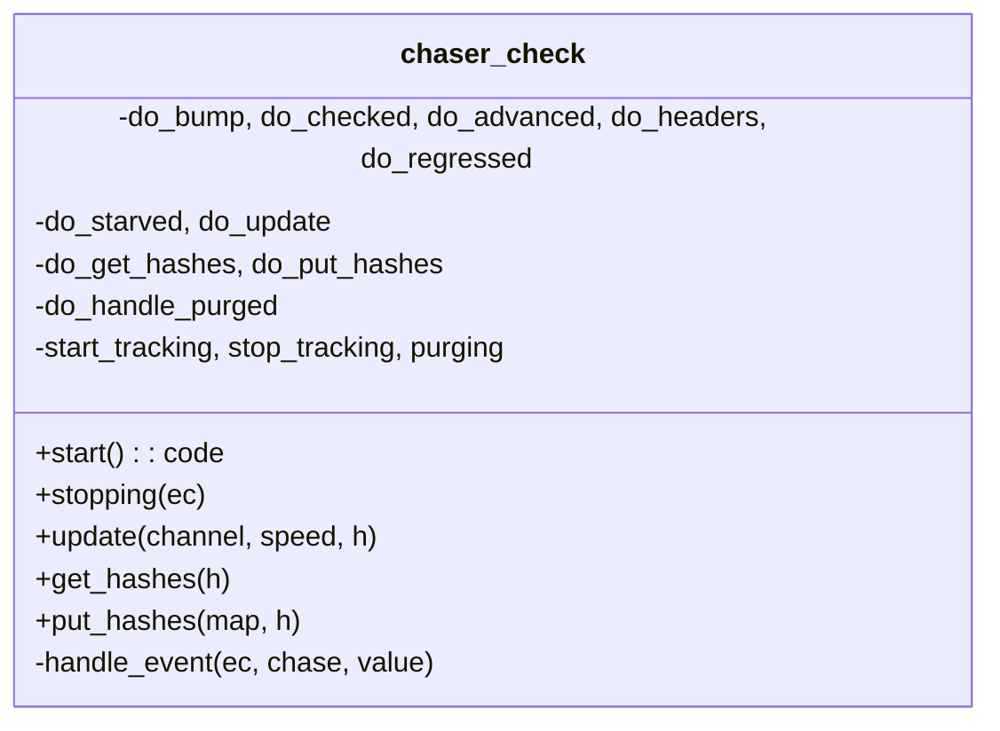

# 03 — `chaser_check` (block-download orchestration)

> Companion to [`00-overview.md`](00-overview.md),
> [`01-event-bus.md`](01-event-bus.md),
> [`02-chaser-organize.md`](02-chaser-organize.md).
>
> `chaser_check` is the dispatcher between the **header chain** and the
> peer **block-download protocols**. Conceptually:
>
> 1. The header chaser commits to a candidate chain of *headers*.
> 2. `chaser_check` notices which heights in that chain still lack block
>    bodies (are *unassociated*) and partitions them into work-maps.
> 3. Peer protocols (`protocol_block_in_31800`) pull maps via
>    `get_hashes`, download the blocks, and return any leftovers via
>    `put_hashes`.
> 4. As blocks arrive (`chase::checked`), the position advances; as
>    validation completes (`chase::valid`), the request window slides
>    forward.
>
> `chaser_check` also runs the **performance-policing loop**: peers report
> their download speed, slow peers are detected by standard deviation,
> and starved peers cause work to be split off slow peers.

| File                                                               | Role                                                                   |
| ------------------------------------------------------------------ | ---------------------------------------------------------------------- |
| `include/bitcoin/node/chasers/chaser_check.hpp`                    | Class declaration; private types `speeds`, `maps`                       |
| `src/chasers/chaser_check.cpp`                                     | Implementation                                                          |

---

## 1. State

### 1.1 Configuration (immutable, set at construction)

```cpp
// chaser_check.hpp:97-101  / chaser_check.cpp:62-69
const float  allowed_deviation_;       // σ multiplier for "slow" cutoff
const size_t maximum_concurrency_;     // download window size cap
const size_t maximum_height_;          // hard ceiling (0 → no cap)
const size_t connections_;             // target outbound count (or inbound if no outbound)
const size_t step_;                    // = min(max_concurrency, max_inv × connections)
```

`connections_` is derived from network config
(`chaser_check.cpp:45-53`): outbound + manual peer count if any, else
inbound count. `step_` is the maximum number of hashes scanned per
`set_unassociated` call (`chaser_check.cpp:55-60`).

### 1.2 Strand-protected runtime state

```cpp
// chaser_check.hpp:104-111
size_t   inventory_{};   // per-channel inventory size — latched after first nonzero
size_t   requested_{};   // height of last request issued
size_t   advanced_{};    // count of chase::valid events received (NOT a height)
job::ptr job_{};         // network::race_all<const code&> token; null ⇒ "purging"
speeds   speeds_{};      // map<object_key channel, double kbps>
maps     maps_{};        // deque<map_ptr> of pending download chunks
```

Plus `position()` from the base `chaser` — the height at which all blocks
below are associated (downloaded) on the candidate chain.

### 1.3 Why `advanced_` is a counter, not a height

`do_advanced` (`chaser_check.cpp:357-367`) increments `advanced_` on every
`chase::valid` event, regardless of which height was validated. The
*round* is complete when `advanced_ == requested_`. This is correct
because:

- Every block hash that is requested will eventually be validated or the
  peer will fail (and the hash is returned to the pool).
- Once `requested_` round-trips have completed, the request window can
  slide forward without leaving gaps below.

It does **not** track an in-order height; out-of-order validation is
permitted as long as the count balances.

> **Invariant (Check-State-1).** `position() ≤ requested_` and
> `advanced_ ≤ requested_` always hold on the strand. `set_unassociated`
> short-circuits if either falls behind (`chaser_check.cpp:492-493`).

### 1.4 The `job_` token (purge semaphore)

`job_` is a `network::race_all<const code&>` whose completer is
`handle_purged`. Semantics:

- A `race_all` invokes its completer **once all copies are dropped**.
- `chaser_check` holds one copy in `job_`. Every peer protocol that
  calls `get_hashes` receives a copy via the `map_handler`
  (`chaser_check.cpp:443`: `handler(success, get_map(), job_)`).
- When `chaser_check` drops its copy via `stop_tracking()`
  (`chaser_check.cpp:184-192`), the completer fires only after every
  peer has also dropped its copy — i.e., released its current download
  work.

So `job_` is effectively a *purge barrier*: "wait until every
in-flight download has either completed or surrendered, then resume".

> **Invariant (Check-Job-1).** `job_ == nullptr` ⇒ chaser is *purging*
> (currently waiting for the barrier). While purging, all of `do_bump`,
> `do_get_hashes`, `do_put_hashes`, and `set_unassociated` are no-ops:
>
> - `purging()` guards `do_bump` (`chaser_check.cpp:381-382`).
> - `purging()` guards `do_get_hashes` (`chaser_check.cpp:440-441`).
> - `purging()` guards `do_put_hashes` (`chaser_check.cpp:451-452`).
> - `purging()` guards `set_unassociated` (`chaser_check.cpp:488-489`).
>
> The transition out of purging is exactly the `do_handle_purged`
> callback (`chaser_check.cpp:204-210`) which calls `start_tracking()`
> followed by `do_bump(0)`.

---

## 2. Public interface



| External entry                            | Caller                            | Stranded? | Effect summary                                                                                          |
| ----------------------------------------- | --------------------------------- | --------- | ------------------------------------------------------------------------------------------------------- |
| `start()`                                 | `full_node::do_start`             | on node strand at startup | initialise tracking, position, requested/advanced; subscribe to bus            |
| `stopping(ec)`                            | `chaser::stop` path               | no        | drop `job_`                                                                                              |
| `update(channel, speed, h)`               | `full_node::performance` → protocols | posts to strand | record speed; detect slow channel; reply `slow_channel` if so                                      |
| `get_hashes(h)`                           | `full_node::get_hashes` → protocols | posts to strand | hand a map and the `job_` pointer to the caller                                                |
| `put_hashes(map, h)`                      | `full_node::put_hashes` → protocols | posts to strand | re-queue the returned map; emit `chase::download(map.size())`                                  |
| Bus subscription via `handle_event`       | `event_subscriber_`               | yes (strand-bound handler) | dispatch to `do_*`                                                                            |

---

## 3. Behaviour overview (3 cooperating state machines)

```mermaid
flowchart LR
    subgraph SM1 [Position tracker]
        direction TB
        P0([position])
        P0 -- chase::checked(h) --> P1{h == position+1?}
        P1 -- yes --> P2[do_bump: skip associated\nadvance position]
        P1 -- no --> P0
        P2 --> P3[do_headers]
        P3 -- "added > 0" --> P4[emit chase::download(added)]
        P3 -- "added == 0" --> P0
    end

    subgraph SM2 [Request window]
        direction TB
        R0([requested, advanced])
        R0 -- chase::valid --> R1[advanced++]
        R1 -- "advanced == requested" --> R2[do_headers]
        R2 -- "set_unassociated\nadds work" --> R3[requested = new top]
        R3 -- emit chase::download --> R0
    end

    subgraph SM3 [Speed policy]
        direction TB
        S0([speeds map])
        S0 -- update(ch, speed) --> S1{speed==max?}
        S1 -- yes --> S2[erase ch\nec = exhausted_channel]
        S1 -- "speed==0" --> S3[erase ch\nec = stalled_channel]
        S1 -- "else" --> S4[record\nif > 3 samples\ncheck σ deviation]
        S4 -- "below mean - α·σ" --> S5[ec = slow_channel]
        S4 -- "else" --> S0
    end
```

These three are interleaved on the same strand. The Mermaid grouping is
conceptual; in code they share `do_*` handlers.

---

## 4. Bus integration (verified)

Inputs (from [`01-event-bus.md §2`](01-event-bus.md#2-verified-event-reference)):

| Event           | Source                          | Reaction                                                                |
| --------------- | ------------------------------- | ----------------------------------------------------------------------- |
| `chase::start`  | `full_node`                     | `do_bump(0)` — kickstart                                                |
| `chase::resume` | `full_node`                     | `do_bump(0)`                                                            |
| `chase::bump`   | `chaser_organize`               | `do_bump(0)`                                                            |
| `chase::headers`| `chaser_header` (organize)      | `do_headers(branch_point)`                                              |
| `chase::checked`| `protocol_block_in_31800`       | `do_checked(height)`                                                    |
| `chase::valid`  | `chaser_validate`               | `do_advanced(height)`                                                   |
| `chase::regressed`/`disorganized` | `chaser_organize`     | `do_regressed(branch_point)` — purge work, emit `purge`                 |
| `chase::starved`| `protocol_block_in_31800`       | `do_starved(channel)` — emit `split` or `stall`                         |
| `chase::stop`   | service                         | unsubscribe (return false)                                              |

Outputs:

| Event              | When                                                                | Payload         |
| ------------------ | ------------------------------------------------------------------- | --------------- |
| `chase::download`  | After `set_unassociated` adds new work, or `do_put_hashes` re-queues | `count_t added` |
| `chase::purge`     | After `do_regressed` purges all outstanding work                    | `peer_t` (= branch_point) |
| `chase::split`     | (`notify_one`) On starvation, target the slowest tracked channel    | `object_t` (= starved channel id) |
| `chase::stall`     | On starvation when **no speeds** are tracked                        | `peer_t` (= starved channel id)   |

> **Discrepancy with chase.hpp comments**: chase.hpp:60-66 attribute
> `split` and `stall` to `session_outbound`. Reality (verified by grep):
> both come from `chaser_check::do_starved`.

---

## 5. The download-window state machine

```mermaid
stateDiagram-v2
    [*] --> CONFIGURED: start()\nset_position(get_fork())\nrequested_ = advanced_ = position\nstart_tracking

    CONFIGURED --> ACTIVE: subscribe + first bump

    state ACTIVE {
        [*] --> IDLE
        IDLE --> BUMP_HEIGHT: chase::checked(h)\nh == pos+1
        BUMP_HEIGHT --> SCAN_ASSOC: do_bump\nadvance pos over associated
        SCAN_ASSOC --> ISSUE: do_headers\nset_unassociated → emit download
        ISSUE --> IDLE
        IDLE --> ADV_COUNT: chase::valid(h)
        ADV_COUNT --> CHECK_ROUND: advanced_++
        CHECK_ROUND --> ISSUE: advanced_ == requested_
        CHECK_ROUND --> IDLE: else
        IDLE --> REQUEUE: put_hashes(map)
        REQUEUE --> IDLE: emit download(map.size())
        IDLE --> HANDOUT: get_hashes()
        HANDOUT --> IDLE: hand pop_front(maps_) + job_
    }

    ACTIVE --> PURGING: chase::regressed(bp) || chase::disorganized(bp)\n[bp < position]\ndo_regressed:\n  set_position(bp)\n  stop_tracking (drop job_)\n  maps_.clear()\n  emit purge(bp)

    PURGING --> DRAINED: all peers release their job_ copies\nrace_all completer fires\nhandle_purged → do_handle_purged

    DRAINED --> ACTIVE: start_tracking()\ndo_bump(0)

    ACTIVE --> STOPPED: chase::stop / chaser::stop
    PURGING --> STOPPED: chase::stop / chaser::stop
    STOPPED --> [*]
```

> **Invariant (Check-Purge-1).** A `chase::purge` emission is always
> followed (eventually, after barrier completion) by an idempotent return
> to the ACTIVE state with `position_` rewound to `branch_point` and
> `maps_` empty. While in PURGING, no work is handed out and no new work
> is computed.

> **Invariant (Check-Purge-2).** `do_regressed` ignores regressions that
> are *above* the current position (`chaser_check.cpp:344-345`). These
> are "inconsequential": the chaser hasn't reached that height yet, so
> there's no work to purge.

---

## 6. The performance / speed policy

`chaser_check` is the only chaser that interacts with peer connections
beyond bus events: `protocol_block_in_31800` calls
`full_node::performance(channel, speed, handler)` periodically, which
forwards to `chaser_check::update`. The reply `code` tells the peer
whether to keep going or terminate.

### 6.1 `do_update` decision tree

```
speed == max_uint64:    erase(channel); return exhausted_channel
speed == 0:             erase(channel); return stalled_channel
otherwise:              record speed = double(speed)
                        if count(speeds_) ≤ 3:        return success
                        compute mean, σ from speeds_
                        if speed ≥ mean:               return success
                        if (mean - speed) > α·σ:       return slow_channel
                        else:                          return success
```

(`chaser_check.cpp:269-334`)

- `exhausted_channel`: peer announces "I have nothing else useful for
  you". Peer drops itself; bus knows to release work.
- `stalled_channel`: peer reports zero progress. Same effect.
- `slow_channel`: peer is statistically below the herd. Returned only
  when ≥ 4 samples and the gap exceeds `allowed_deviation × σ`.

### 6.2 `do_starved` (when a peer has no work)

`protocol_block_in_31800` emits `chase::starved(self)` when its queue
empties. `do_starved` (`chaser_check.cpp:215-244`):

1. Removes `self` from `speeds_` (so it can't be picked as its own
   victim).
2. Picks the slowest remaining channel by `speeds_` min.
3. If found: `notify_one(slow, chase::split, self)` — direct that
   single channel to split its work and stop, leaving the starved
   channel something to claim.
4. If `speeds_` is empty: broadcast `chase::stall(self)` to all
   download-capable channels.

The receiver of `split`/`stall` is `protocol_block_in_31800`; see future
doc on the protocols layer for that side.

---

## 7. `set_unassociated` — the work generator

`set_unassociated` (`chaser_check.cpp:484-532`) is the heart of work
generation. It:

1. Early-exit if not all previously-requested work has cleared
   (`position < requested || advanced < requested`)
   (`chaser_check.cpp:492-493`).
2. Latches `inventory_` on first nonzero
   (`chaser_check.cpp:496-498` → `get_inventory_size`).
3. Computes a `stop` height
   (`min(position + max_concurrency, maximum_height)`).
4. Loops `query.get_unassociated_above(requested_, inventory_, stop)`,
   chunking each result into a `map_ptr` and pushing onto `maps_`, until
   `set_map` returns false (empty map, end of unassociated headers
   below `stop`).
5. Returns total count added.

`get_inventory_size` (`chaser_check.cpp:534-543`):

- Returns 0 if no connections OR if `is_current(false)` — i.e. the
  **candidate** (header) chain isn't current.
- Otherwise: `ceilinged_divide(unassociated_count_above(fork, step), connections)`.

The candidate-current gate is *not* "wait until caught up" — issuing
zero work until the node is caught up would just stall (you can't get
caught up without downloading). Instead it guards against dividing
work over a *weak* header chain: until headers are current, the
partitioning of unassociated heights into per-peer inventory chunks
could be meaningless or wrong, so block download is paused until
header sync has produced a current (and therefore presumed
near-canonical) candidate.

> **Invariant (Check-Inventory-1).** `inventory_` is computed at most
> once (latch on first nonzero result). Stored in
> `chaser_check.cpp:496-498`. This is intentional: peer inventory size is
> fixed for the run, after the first "currentness" of the chain.

---

## 8. Error inventory

Unlike `chaser_organize`, `chaser_check` does **not** define numbered
faults. Its errors are channel-class codes returned to the peer (the
chaser itself does not call `fault`):

| Code returned by `do_update`                | Meaning                                            |
| ------------------------------------------- | -------------------------------------------------- |
| `error::exhausted_channel`                  | peer has no more work to offer                     |
| `error::stalled_channel`                    | peer reports zero progress                         |
| `error::slow_channel`                       | peer below statistical floor (mean − α·σ)          |
| `network::error::service_stopped`           | chaser is closed; `update` short-circuits          |
| `error::success`                            | continue                                           |

The peer-side reaction (drop connection vs. continue) lives in
`protocol_block_in_31800`.

---

## 9. Coupling diagram

```mermaid
flowchart LR
    ORG[chaser_organize\n(header)] -- "chase::headers (bp)" --> CHK[chaser_check]
    ORG -- "chase::regressed / disorganized (bp)" --> CHK
    VAL[chaser_validate] -- "chase::valid (h)" --> CHK
    FN[full_node] -- "chase::start, resume" --> CHK

    CHK -- "chase::download (n)" --> PIN[protocol_block_in_31800]
    CHK -- "chase::purge (bp)" --> PIN
    CHK -- "chase::split (target)" --> PIN_one[(one channel via notify_one)]
    CHK -- "chase::stall (peer)" --> PIN

    PIN -- "chase::checked (h)" --> CHK
    PIN -- "chase::starved (self)" --> CHK
    PIN -- "get_hashes() →" --> CHK
    PIN -- "put_hashes(map) →" --> CHK
    PIN -- "performance(speed) →" --> CHK
```

---

## 10. Spec view

### 10.1 As a process

A formal model can represent `chaser_check` as a process with:

- **inputs**:
  - bus messages (`chase::*` listed in §4)
  - request RPCs: `update`, `get_hashes`, `put_hashes` (each carries a
    `result_handler` continuation)
- **outputs**:
  - bus messages (`chase::download`, `chase::purge`, `chase::split`,
    `chase::stall`)
  - returned codes to request RPCs
- **state**:
  - `position`, `requested`, `advanced` ∈ ℕ
  - `inventory` ∈ ℕ (latched after first nonzero)
  - `purging` ∈ {true, false}  -- abstracts `job_`
  - `maps` : Queue of `map`  -- each `map` is a non-empty set of
    `(height, hash)` pairs
  - `speeds` : finite map from channel-id to ℝ⁺

### 10.2 Safety properties to prove

1. **No-overshoot**: `position ≤ requested` and `advanced ≤ requested`
   are loop invariants.
2. **Purge soundness**: while `purging`, `maps = ∅` and no `download`
   is emitted.
3. **Eventual progress**: assuming peers honour `get_hashes`/`put_hashes`
   contracts, the position increases monotonically when not purging.
   *Liveness*; requires fairness on peer scheduling.
4. **Split correctness**: `chase::split(self)` is sent only to
   `notify_one(slow)` where `slow ≠ self`
   (`chaser_check.cpp:219-221, 238`).
5. **Purge barrier completeness**: every `chase::purge` is eventually
   followed by a `chase::download` (or by `stop`). This depends on the
   `race_all` semantics and peer compliance.

### 10.3 Liveness assumptions

- Peers eventually release `job_` copies after `chase::purge` — the
  protocols layer must guarantee this (see future doc).
- `query.get_unassociated_above` terminates and is monotone in
  `requested_`.

---

## 11. Notes for the Lisp port

- The three state machines (§3) are independent in their state space
  but interleaved in time. A straightforward Lisp port can use one
  agent/actor per chaser with a single message-pump.
- The `race_all` token (`job_`) is a non-trivial primitive. In Lisp it
  could be modelled as a `(condition-variable, ref-count)` pair: each
  peer increments on `get_hashes` and decrements when done; the chaser
  waits on count → 0.
- `set_unassociated` is naturally a generator/iterator (lazy sequence
  of maps).

---

## 12. Notes for the formal model

- All `do_*` methods run on the strand. Race-freedom on internal state
  is by construction.
- The only externally-visible interaction beyond the bus is the peer
  speed/inventory protocol (§6, §7). Model the peer as a process that
  responds to `slow_channel`/`exhausted_channel`/`stalled_channel`
  return values by dropping its connection.
- A model of `race_all` requires a counted semaphore or refcount; this
  is the only place in `chaser_check` that needs more than
  single-threaded reasoning.

---

## Cross-references

- [`00-overview.md`](00-overview.md) §5 (chaser pipeline overview)
- [`01-event-bus.md`](01-event-bus.md) §2.1 (work-shuffling events) and
  §2.2 (candidate-chain events)
- [`02-chaser-organize.md`](02-chaser-organize.md) §3.2 (organize emits
  `headers`/`bump`/`regressed`/`disorganized` consumed here)
- Upcoming: `04-chaser-validate.md` (issuer of `valid`)
- Upcoming: `09-protocol-block-in-31800.md` (peer-side counterpart;
  consumer of `download`/`purge`/`split`/`stall`/`report`)
