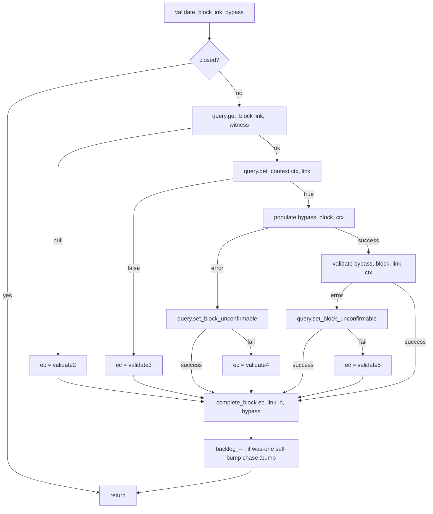

# 04 — `chaser_validate` (consensus validation)

> Companion to [`00-overview.md`](00-overview.md),
> [`01-event-bus.md`](01-event-bus.md),
> [`02-chaser-organize.md`](02-chaser-organize.md),
> [`03-chaser-check.md`](03-chaser-check.md).
>
> `chaser_validate` is the **consensus pre-check stage**. For each block
> on the candidate chain (in heights-first order):
>
> - it ensures the block is downloaded (`chase::checked` already received)
> - it fetches the block from the store and runs full block-validation
>   logic from libbitcoin-system (`block.populate`, `block.accept`,
>   `block.connect`)
> - if valid, it persists prevout metadata and the filter body, and marks
>   the block as `block_valid`
> - it emits `chase::valid(height)` on success or `chase::unvalid(link)`
>   on failure
>
> This is the chaser most directly relevant to **formal verification**:
> it is where script execution and prevout (UTXO availability) checks
> happen before confirmation. Consensus is **not** confined to this
> chaser however — it is split across several stages:
>
> - **Headers** (`chaser_header::validate`) — context-free header
>   consensus (proof-of-work, version, etc.) plus limited-context checks.
> - **Blocks at receive time** (`protocol_block_in_31800::check`,
>   `chaser_block::validate` in blocks-first mode) — context-free
>   block-level consensus (size, sigops, commitments) and limited
>   context checks (no prevouts yet).
> - **This chaser** — full block consensus with prevouts populated:
>   `block.accept(ctx, …)` (block-wide rules) and `block.connect(ctx)`
>   (script execution per input).
> - **`chaser_confirm`** — block-relative order-based consensus checks
>   via `query.block_confirmable(link)`: previous-output is confirmed in
>   a "strong" tx, maturity, relative-locktime rules (see
>   [`05 §10.4`](05-chaser-confirm.md#104-the-utxo-oracle)).
> - **Transactions** (planned) — same shape, not yet implemented.
>
> So this chaser is the **largest single block of consensus work** and
> the natural focal point of a formal model, but not the sole source.

| File                                                                  | Role                                                                                  |
| --------------------------------------------------------------------- | ------------------------------------------------------------------------------------- |
| `include/bitcoin/node/chasers/chaser_validate.hpp`                    | Class declaration; private types `race`, `parallel<>` helper                          |
| `src/chasers/chaser_validate.cpp`                                     | Implementation                                                                        |

---

## 1. Critical configuration & operating modes

`chaser_validate` is **inactive in blocks-first mode**:
```cpp
// chaser_validate.cpp:52-61
code chaser_validate::start() NOEXCEPT
{
    if (!node_settings().headers_first)
        return error::success;
    ...
    SUBSCRIBE_EVENTS(handle_event, _1, _2, _3);
    return error::success;
}
```

If `node.headers_first == false`, the chaser does not subscribe to the
bus and never validates. Validation in that mode is folded into
`chaser_block::validate` (the organize hook; see
[`02-chaser-organize.md §4`](02-chaser-organize.md#4-hooks-where-the-template-differs)).

> **Invariant (Validate-Mode-1).** `chaser_validate` is active iff
> `headers_first == true`. In blocks-first mode, no
> `chase::valid`/`chase::unvalid` events are issued by this chaser.

### 1.1 Other configuration

```cpp
// chaser_validate.hpp:85-92, chaser_validate.cpp:38-50
const uint32_t subsidy_interval_;        // bitcoin: 210000 (halving interval)
const uint64_t initial_subsidy_;         // bitcoin: 50 * 10^8 sat
const size_t   maximum_backlog_;         // concurrent in-flight validations cap
const bool     node_witness_;            // include witness data when fetching block
const bool     defer_;                   // skip the consensus pass entirely
const bool     filter_;                  // run filter body even when bypassing validation
                                         //   = !defer && archive.filter_enabled()
std::atomic<size_t> backlog_{};          // in-flight count (atomic; updated off-strand)
```

`defer_` is a performance/operational lever. When true, validation is
"deferred" — the chaser emits `chase::valid` without doing actual
consensus work, leaving the obligation to a later phase (or never, for
trusted bootstraps). With `defer_ = false` AND `filter_enabled`, the
filter body is computed even on bypass paths so block-filter data
remains complete.

### 1.2 Bypass conditions per block

Each block-level decision uses a local `bypass` flag computed at
`chaser_validate.cpp:161-162`:

```
bypass = defer_ || is_under_checkpoint(height) || query.is_milestone(link)
```

- **Under checkpoint** — height is at or below the top configured
  checkpoint (`chaser::is_under_checkpoint`). Hard-coded chain truth.
- **Milestone** — header was archived under an active milestone
  (set during organize; see
  [`02-chaser-organize.md §6.2`](02-chaser-organize.md#62-header-milestone-tracking-chaser_header-only)).

> **Invariant (Validate-Bypass-1).** Under `bypass`:
> - `block.accept(ctx, ...)`, `block.connect(ctx)` are *not* run.
> - `query.set_prevouts(link, block)` is *not* called.
> - `query.set_block_valid(link)` is *not* called.
>
> Only `populate_without_metadata` and (optionally) `set_filter_body`
> run. This is the only place where consensus checks can be elided; it
> is gated on checkpoint/milestone/`defer_` — the rest of the system
> must trust that these gates are sound.

---

## 2. Concurrency model — unique among the chasers

`chaser_validate` is the only chaser with its **own thread pool**.

```cpp
// chaser_validate.hpp:81-86
network::threadpool        validation_threadpool_;
network::asio::strand      validation_strand_;   // on validation_threadpool_

// chaser_validate.cpp:40-42, 358-366
validation_threadpool_(node_settings.threads_(), node_settings.thread_priority_()),
validation_strand_(validation_threadpool_.service().get_executor()),
...
strand()    → validation_strand_     // overrides base
stranded()  → validation_strand_.running_in_this_thread()
```

This means:

| Method                                       | Runs on                              |
| -------------------------------------------- | ------------------------------------ |
| `handle_event` (bus callback)                | validation strand                    |
| `do_bump`, `do_bumped`, `do_checked`, `do_regressed`, `post_block` | validation strand                    |
| `validate_block`, `populate`, `validate`     | **validation threadpool (any worker)** — one job per block in flight |
| `complete_block`                             | validation threadpool worker (whichever ran `validate_block`) |

The strand serialises *scheduling*; the pool parallelises *execution*.
`maximum_backlog_` caps in-flight parallelism.

### 2.1 Lifecycle override

```cpp
// chaser_validate.cpp:342-356
void chaser_validate::stopping(const code& ec) NOEXCEPT
{
    validation_threadpool_.stop();    // ← halt new work; existing tasks finish
    chaser::stopping(ec);
}

void chaser_validate::stop() NOEXCEPT
{
    if (!validation_threadpool_.join()) {
        BC_ASSERT_MSG(false, "failed to join threadpool");
        std::abort();
    }
}
```

This is why `full_node::close` calls per-chaser `stop()` blocking
(`src/full_node.cpp:127-135`): validate's pool must be joined before the
process tears down.

> **Invariant (Validate-Lifecycle-1).** All posted `validate_block` jobs
> must complete or be cancelled before `stop()` returns. The
> threadpool's `join` is what enforces this.

### 2.2 Backlog control

```cpp
// chaser_validate.cpp:144-197 (do_bumped, on strand)
while ((backlog_ < maximum_backlog_) && !closed() && !suspended()) {
    ... pick next height, decide bypass, post_block(link, bypass) ...
    set_position(height++);
}

// chaser_validate.cpp:199-205 (post_block, on strand)
backlog_.fetch_add(1);
PARALLEL(validate_block, link, bypass);

// chaser_validate.cpp:246-247 (validate_block, off-strand, at the END)
if (is_one(backlog_.fetch_sub(1)))
    handle_event(error::success, chase::bump, height_t{});
```

Two important details:

1. The strand loop **does not block** for any validation to complete; it
   pre-fills the backlog and exits. New iterations come from later
   events.
2. The completing worker that pulls the counter to zero **calls
   `handle_event` directly**, *not* through the bus
   (`chaser_validate.cpp:247`). This is a stall-prevention optimisation:
   re-bumps the strand without paying the bus round-trip cost. The
   `handle_event` body then `POST`s `do_bump`, so the strand becomes
   active again.

> **Invariant (Validate-Backlog-1).** The number of concurrently running
> `validate_block` tasks is always ≤ `maximum_backlog_`. Enforced by
> the loop guard at `chaser_validate.cpp:151`.

> **Invariant (Validate-Backlog-2).** Self-bump on backlog drain
> (`chaser_validate.cpp:246-247`) prevents validation from stalling when
> the loop guard would otherwise sit idle. From a spec standpoint it is
> equivalent to a bus-mediated `chase::bump`; treat it as such.

---

## 3. Bus integration (verified)

Inputs:

| Event              | Source                          | Reaction                                                                     |
| ------------------ | ------------------------------- | ---------------------------------------------------------------------------- |
| `chase::start`     | `full_node`                     | `do_bump(0)` — try next height                                               |
| `chase::resume`    | `full_node`                     | `do_bump(0)`                                                                  |
| `chase::bump`      | `chaser_organize` (or self)     | `do_bump(0)`                                                                  |
| `chase::checked`   | `protocol_block_in_31800`       | `do_checked(height)` — kick when the *next* sequential block arrives          |
| `chase::regressed`/`disorganized` | `chaser_organize` | `do_regressed(branch_point)` — rewind position if affected                    |
| `chase::stop`      | service                         | unsubscribe                                                                   |

Suspension gate: `handle_event` short-circuits with `return true`
(remain subscribed) if `suspended()`
(`chaser_validate.cpp:71-72`). Already-posted validations keep running.

Outputs:

| Event           | Site                              | Payload                  | Trigger                                        |
| --------------- | --------------------------------- | ------------------------ | ---------------------------------------------- |
| `chase::valid`  | `complete_block` `:330`           | `height_t height`        | block validated (or bypassed without error)    |
| `chase::unvalid`| `complete_block` `:321`           | `header_t link`          | validation produced a non-fault error          |

And implicit:
- `fire(events::block_unconfirmable, height)` `:322`
- `fire(events::block_validated, height)` `:334`

---

## 4. The validation pipeline (per block)

The block-level pipeline (off-strand, concurrent) runs four phases. Each
can fail and short-circuit to `complete_block` with a code.



### 4.1 `populate(bypass, block, ctx)` — prevout filling

```cpp
// chaser_validate.cpp:250-275
if (bypass) {
    block.populate(ctx);                                 // internal-only spends
    if (!query.populate_without_metadata(block))
        return system::error::missing_previous_output;
} else {
    if (const auto ec = block.populate(ctx))             // includes time/maturity locks
        return ec;
    if (!query.populate_with_metadata(block))
        return system::error::missing_previous_output;
}
return error::success;
```

`block.populate(ctx)` (libbitcoin-system) fills in internal prevouts —
inputs that reference outputs from earlier transactions in the same
block — and checks BIP68 sequence locks, coinbase maturity, etc.

`query.populate_with_metadata(block)` fills external prevouts from the
store and attaches the spent-coin metadata used by `set_prevouts`. On
bypass, the metadata is unnecessary so the cheaper variant is used.

> **Invariant (Validate-Populate-1).** Every input not satisfied by
> internal-block prevouts must be satisfied by the store, otherwise
> `populate` returns `missing_previous_output`. This is the *UTXO
> availability* check.

### 4.2 `validate(bypass, block, link, ctx)` — consensus

```cpp
// chaser_validate.cpp:277-304
if (!bypass) {
    if ((ec = block.accept(ctx, subsidy_interval_, initial_subsidy_)))
        return ec;                                       // (4.2a)
    if ((ec = block.connect(ctx)))
        return ec;                                       // (4.2b)
    if (!query.set_prevouts(link, block))
        return error::validate6;                         // (4.2c)
}

if (!query.set_filter_body(link, block))
    return error::validate7;                             // (4.2d)

if (!bypass && !query.set_block_valid(link))
    return error::validate8;                             // (4.2e)

return error::success;
```

| Step  | What it checks                                                                                     |
| ----- | -------------------------------------------------------------------------------------------------- |
| 4.2a  | **`block.accept(ctx, subsidy, initial)`** — block-wide consensus: coinbase amount, BIP30, fee sum, witness commitment, sigops, sapling, etc. The full set of "above-script" rules. |
| 4.2b  | **`block.connect(ctx)`** — runs script verification on every input via libbitcoin-system's script engine. This is the expensive step. |
| 4.2c  | **`query.set_prevouts(link, block)`** — persist prevout metadata used to short-cut confirmation.   |
| 4.2d  | **`query.set_filter_body(link, block)`** — BIP158 filter body, computed for every block.           |
| 4.2e  | **`query.set_block_valid(link)`** — mark block state in the store as `block_valid`.                |

> **Invariant (Validate-Ordering-1).** Steps 4.2c, 4.2d, 4.2e are
> ordered:
> 1. `set_prevouts` MUST run before `set_filter_body`
>    (`chaser_validate.cpp:291` comment: *"Prevouts optimize confirmation"*).
> 2. `set_block_valid` MUST run after both
>    (`chaser_validate.cpp:299` comment: *"Valid must be set after set_prevouts and set_filter_body"*).
>
> Reasoning: the store represents block state as a monotone progression
> (`unvalidated` → `block_valid` → `block_confirmable`/`block_unconfirmable`).
> Setting `block_valid` before metadata is complete would expose
> downstream chasers (confirm) to an incomplete record.

### 4.3 `complete_block(ec, link, height, bypass)`

Three terminal cases:

```cpp
// chaser_validate.cpp:307-337
if (ec) {
    if (node::error::error_category::contains(ec)) {
        fault(ec);                       // ← terminal: validate1..8 are all node errors
        return;
    }
    notify(ec, chase::unvalid, link);    // ← invalid block (consensus failure)
    fire(events::block_unconfirmable, height);
    return;
}
notify(ec, chase::valid, height);        // ← VALID
if (!defer_)
    fire(events::block_validated, height);
```

> **Invariant (Validate-Complete-1).** Three mutually-exclusive paths:
> (a) node-error → `fault` (suspends network), (b) consensus error →
> `chase::unvalid` (organize disorganises), (c) success →
> `chase::valid` (downstream chasers advance). Every concurrent
> `validate_block` invocation reaches exactly one of these.

> **Invariant (Validate-Complete-2).** `chase::valid` is emitted even
> under `defer_` (`chaser_validate.cpp:330` is unguarded). This is
> *required* for `chaser_check` to advance its `advanced_` counter; see
> [`03-chaser-check.md §1.3`](03-chaser-check.md#13-why-advanced_-is-a-counter-not-a-height).

---

## 5. The strand-level state machine (`do_*` methods)

```mermaid
stateDiagram-v2
    [*] --> RUNNING: start (only if headers_first)
    RUNNING --> RUNNING: chase::start/resume/bump → do_bump\nadvance if next height is validateable
    RUNNING --> RUNNING: chase::checked(h) → do_checked\nif h == position+1: do_bumped
    RUNNING --> RUNNING: do_bumped: walk heights, fill backlog
    RUNNING --> RUNNING: chase::regressed/disorganized(bp) → do_regressed\nif bp < position: set_position(bp)
    RUNNING --> SUSPENDED_BUT_FINISHING: suspend(ec)\n(handle_event short-circuits; in-flight continues)
    SUSPENDED_BUT_FINISHING --> RUNNING: resume
    RUNNING --> STOPPED: chase::stop / closed()
    SUSPENDED_BUT_FINISHING --> STOPPED: chase::stop / closed()
    STOPPED --> [*]
```

### 5.1 `do_bumped` height iteration

`do_bumped` (`chaser_validate.cpp:144-197`) is the inner work-finder.
For each iteration:

1. Compute `link = to_candidate(height)`; fetch `get_block_state(link)`.
2. Compute `bypass`.
3. Branch on the state:
   - `unassociated` → return (we hit the gap; nothing more to do)
   - `unvalidated` | `unknown_state` →
     - if `!bypass || filter_` → `post_block`
     - else → complete immediately with `success` (no work needed)
   - `block_valid` | `block_confirmable` → already done, complete with
     `success` (this advances `position_`)
   - `block_unconfirmable` → return (chain top is bad; halt)
   - anything else → `fault(validate1)`
4. `set_position(height++)`.

> **Invariant (Validate-Iter-1).** `position_` increases monotonically
> in `do_bumped`, regardless of bypass. Each iteration that doesn't
> early-exit advances by one.

> **Invariant (Validate-Iter-2).** Encountering an
> `unassociated` state aborts the loop (`chaser_validate.cpp:158-159`).
> This guarantees that **no block is bypassed-as-valid without being
> downloaded first** — there's no path through the loop that calls
> `set_block_valid` on an unassociated link.

### 5.2 `do_checked` and `do_regressed`

`do_checked(h)` (`chaser_validate.cpp:123-130`): if `h == position+1`,
call `do_bumped(h)`. This is the *fast path* for when a block arrives
right at the head — skip waiting for the next `chase::bump`.

`do_regressed(bp)` (`chaser_validate.cpp:114-121`): if `bp < position`,
set position to `bp`. The next bump re-walks from there. Crucially,
**there is no purge** like in `chaser_check`: in-flight validations on
heights above `bp` keep running. Their results either:

- Find the block still on the candidate chain (rare) → emit
  `chase::valid(h)` harmlessly; check chaser will increment a stale
  counter.
- Find the block no longer there (typical) → still emit
  `chase::valid(h)`; downstream effects are absorbed.

In either case, the validation work itself is correct; the only "wasted"
output is bus traffic.

> **Invariant (Validate-Regress-1).** A regression does not invalidate
> in-flight validations. Their results are persisted via
> `set_block_valid(link)` only if validation succeeds and bypass is
> false; the store reconciles correctness via the link/state map.

---

## 6. Error inventory

| Code         | Site                                    | Origin                                                                           |
| ------------ | --------------------------------------- | -------------------------------------------------------------------------------- |
| `validate1`  | `chaser_validate.cpp:188`               | `default` arm of `get_block_state` switch — unexpected state value               |
| `validate2`  | `chaser_validate.cpp:226`               | `query.get_block(link, witness)` returned null                                   |
| `validate3`  | `chaser_validate.cpp:230`               | `query.get_context(ctx, link)` returned false                                    |
| `validate4`  | `chaser_validate.cpp:235`               | `set_block_unconfirmable` failed after a `populate` failure                      |
| `validate5`  | `chaser_validate.cpp:240`               | `set_block_unconfirmable` failed after a `validate` failure                      |
| `validate6`  | `chaser_validate.cpp:293`               | `query.set_prevouts(link, block)` failed                                         |
| `validate7`  | `chaser_validate.cpp:297`               | `query.set_filter_body(link, block)` failed                                      |
| `validate8`  | `chaser_validate.cpp:301`               | `query.set_block_valid(link)` failed                                             |

All eight are *node-category* errors (terminal): `complete_block` routes
them to `fault(ec)` which suspends the network. The remaining errors
(libbitcoin-system consensus failures from `block.accept`/`block.connect`
and `database::error::missing_previous_output` from `populate`) are
**not** node-category — they flow to `chase::unvalid`, which routes to
`chaser_organize::do_disorganize`.

> **Spec obligation list.** `validate1` through `validate8` should be
> proved unreachable under the store-consistency invariants supplied by
> libbitcoin-database, combined with the strand discipline. Specifically:
> - `validate2`: `get_block_state` returned a non-error state, so a
>   matching `get_block` must succeed.
> - `validate3`: same for `get_context`.
> - `validate4`, `validate5`: `set_block_unconfirmable` failure implies
>   store I/O failure.
> - `validate6`, `validate7`, `validate8`: each is a store-write that
>   "should not fail given previous reads succeeded".
> - `validate1`: the only unexpected state values are reachable only via
>   external store mutation.

---

## 7. Coupling diagram

```mermaid
flowchart LR
    PIN[protocol_block_in_31800] -- "chase::checked (h)" --> VAL[chaser_validate]
    ORG[chaser_organize] -- "chase::regressed / disorganized" --> VAL
    FN[full_node] -- "chase::start, resume" --> VAL
    SELF[chaser_validate self-bump\non backlog drain] --> VAL

    VAL -- "chase::valid (h)" --> CHK[chaser_check]
    VAL -- "chase::valid (h)" --> CNF[chaser_confirm]
    VAL -- "chase::unvalid (link)" --> ORG_in[chaser_organize<br/>(do_disorganize)]

    VAL -.->|"reads: get_block, get_context"| STORE[(libbitcoin-database query)]
    VAL -.->|"writes: set_prevouts, set_filter_body,\nset_block_valid, set_block_unconfirmable"| STORE
```

---

## 8. Spec view

### 8.1 Process abstraction

`chaser_validate` is a process with:
- **inputs**: bus events listed in §3
- **outputs**: bus events `chase::valid`, `chase::unvalid`; store mutations
- **state**: `position_ ∈ ℕ`, `backlog_ ∈ [0, maximum_backlog_]`
- **internal jobs**: bounded number (≤ `maximum_backlog_`) of pending
  per-block validation tasks

### 8.2 Properties

**Safety**
1. **No validation without download** (Validate-Iter-2): for every
   `chase::valid(h)`, the block at link `to_candidate(h)` has previously
   been associated. This is the soundness contract relied on by all
   downstream chasers.
2. **Bypass discipline** (Validate-Bypass-1): `set_block_valid` is
   never called under bypass; the store distinguishes "validated" from
   "checkpoint-bypassed".
3. **Ordering** (Validate-Ordering-1): `set_block_valid` after
   `set_prevouts` and `set_filter_body`.
4. **At most one emission per block**: each `validate_block` invocation
   produces exactly one of `chase::valid`, `chase::unvalid`, or `fault`
   (Validate-Complete-1).

**Liveness**
- Provided `chaser_check` keeps issuing downloads and the store responds,
  every height on the candidate chain eventually receives a
  `complete_block` call.
- Backlog drain self-bump (Validate-Backlog-2) prevents stall when the
  strand loop exits with backlog at max.

### 8.3 The consensus surface

For a formal model, the cleanest factoring is:

```
validate : (block, ctx, bypass, defer, filter) → {valid, unvalid(reason), fault(code)}
```

with the rules:

```
if defer ∨ checkpoint(height) ∨ milestone(link):
    if filter:  set_filter_body; succeed
    else:        succeed
else:
    block.populate(ctx) > ok
    query.populate_with_metadata(block) > ok
    block.accept(ctx, subsidy_interval, initial_subsidy) > ok
    block.connect(ctx) > ok
    set_prevouts(link, block)
    set_filter_body(link, block)
    set_block_valid(link)
    succeed
```

The libbitcoin-system functions (`block.accept`, `block.connect`) are
the actual consensus rules. They are *external* to this chaser and
deserve their own specification (which lives in libbitcoin-system docs;
this chaser only sequences and persists their outcomes).

---

## 9. Notes for the Lisp port

- The strand/loop pattern (one strand, many workers, atomic backlog) maps
  to a typed actor with a bounded mailbox and a worker pool.
- All consensus work is delegated to libbitcoin-system; a Lisp port can
  ignore the parallelism initially and inline `validate_block` into the
  strand (correct but slow). The parallelism is purely a performance
  feature — the *correctness* of the chaser does not depend on it.
- Bypass logic (checkpoint, milestone, defer) is a one-line predicate
  and should be expressed as such.
- The store interface used by validate is narrow:
  `get_block`, `get_context`, `get_block_state`, `is_validateable`,
  `is_milestone`, `populate_with_metadata`, `populate_without_metadata`,
  `set_prevouts`, `set_filter_body`, `set_block_valid`,
  `set_block_unconfirmable`. Reproducing those signatures is enough.

---

## 10. Notes for the formal model

- Off-strand parallelism makes this the **only chaser that needs more
  than single-threaded reasoning**. But the atomic `backlog_` is the
  only shared variable; the strand serialises all other state.
- A simple proof outline: treat each posted `validate_block` as an
  independent process that does not read or write `position_` or
  `backlog_` except for the final `fetch_sub`. Then the strand and the
  workers commute except at that one decrement.
- The hard part of a *consensus* proof is in libbitcoin-system
  (`block.accept`, `block.connect`); this chaser only proves that
  outputs of those functions are persisted in the right order and the
  right state transitions emitted.

---

## Cross-references

- [`01-event-bus.md`](01-event-bus.md) §2.4 (Accept/Connect events:
  `valid`, `unvalid`)
- [`02-chaser-organize.md`](02-chaser-organize.md) §4 (`chaser_block`
  inlines a subset of validation when in blocks-first mode); §5
  (`chase::unvalid` triggers `do_disorganize`)
- [`03-chaser-check.md`](03-chaser-check.md) §1.3, §5 (consumer of
  `chase::valid`)
- Upcoming: `05-chaser-confirm.md` (consumer of `chase::valid`)
- libbitcoin-system docs (external): `block.accept` and `block.connect`
  consensus rules
