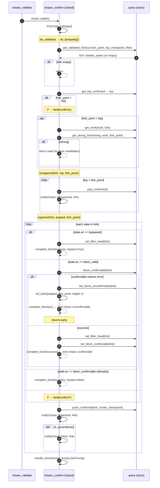

# 05 — `chaser_confirm` (chain confirmation and reorg)

> Companion to [`00-overview.md`](00-overview.md),
> [`01-event-bus.md`](01-event-bus.md),
> [`02-chaser-organize.md`](02-chaser-organize.md),
> [`03-chaser-check.md`](03-chaser-check.md),
> [`04-chaser-validate.md`](04-chaser-validate.md).
>
> `chaser_confirm` is the **only writer to the *confirmed* chain**. It
> takes the validated portion of the candidate chain (heights from the
> current confirmed top up to where validation/checkpointing/milestoning
> guarantees acceptance) and:
>
> 1. compares branch work against the current confirmed branch,
> 2. reorganises the confirmed chain (pop ⇒ push) if the candidate is
>    stronger,
> 3. runs **`query.block_confirmable(link)`** per block to do final
>    UTXO double-spend checks against the now-committed confirmed
>    chain,
> 4. persists `block_confirmable`, the filter head, and the candidate
>    state via `push_confirmed`,
> 5. emits `chase::confirmable` / `chase::unconfirmable` per block,
>    `chase::organized` / `chase::reorganized` per push/pop, and
>    `chase::block` when announcing newly-confirmed blocks to peers.
>
> The full transition from "header arrived" to "confirmed in the chain"
> goes:
>
> ```
> chaser_organize  →  chaser_check  →  chaser_validate  →  chaser_confirm
>   (header sync)      (download)      (consensus)         (UTXO + commit)
> ```
>
> Confirmation is **sequential and not cancellable** — unlike validate's
> parallel pool.

| File                                                            | Role                                                            |
| --------------------------------------------------------------- | --------------------------------------------------------------- |
| `include/bitcoin/node/chasers/chaser_confirm.hpp`               | Class declaration                                                |
| `src/chasers/chaser_confirm.cpp`                                | Implementation                                                   |

---

## 1. Operating modes

```cpp
// chaser_confirm.cpp:36-41
chaser_confirm::chaser_confirm(full_node& node) NOEXCEPT
  : chaser(node),
    filter_(node.archive().filter_enabled()),
    defer_(node.node_settings().defer_confirmation)
{
}
```

### 1.1 Defer-confirmation mode

```cpp
// chaser_confirm.cpp:43-59
code chaser_confirm::start() NOEXCEPT {
    const auto& query = archive();
    set_position(query.get_fork());
    ...
    if (!defer_) {
        SUBSCRIBE_EVENTS(handle_event, _1, _2, _3);
    }
    return error::success;
}
```

> **Invariant (Confirm-Mode-1).** `chaser_confirm` is active iff
> `defer_confirmation == false`. In deferred mode it does not subscribe
> and never confirms — the confirmed chain remains at the fork point
> for the run.

This is symmetric with `chaser_validate`'s `headers_first` gate
(`Validate-Mode-1`). The two `defer_` flags are independent — a
deployment can defer confirmation (e.g. a bootstrap node) while still
validating.

### 1.2 No parallel pool (unlike validate)

`chaser_confirm` runs on the node's network strand (the standard chaser
strand, inherited from `chaser`); no override. Confirmation cannot be
parallelised because each block depends on the cumulative UTXO state of
the chain up to its parent — strictly sequential.

> **Invariant (Confirm-Conc-1).** All confirm operations run on the
> chaser's own strand. Every `do_*` and helper has
> `BC_ASSERT(stranded())` at entry. No off-strand work.

---

## 2. State

The chaser holds *no in-memory state machine state* beyond the base
class's `position_` (read but only set in `start`).

All durable state lives in the database, specifically:

| Method                                       | Effect on store                                       |
| -------------------------------------------- | ----------------------------------------------------- |
| `query.push_confirmed(link, !under_checkpoint)` | Add to confirmed chain (strong = !under_checkpoint)  |
| `query.pop_confirmed()`                      | Remove top of confirmed chain                         |
| `query.set_block_confirmable(link)`          | Mark block as confirmed-in-chain (state transition)    |
| `query.set_block_unconfirmable(link)`        | Mark block as permanently rejected                    |
| `query.set_filter_head(link)`                | Commit BIP158 filter head record                       |

> **Invariant (Confirm-Store-1).** `chaser_confirm` and
> `chaser_organize<header>` are the only writers to the candidate /
> confirmed chain order. `chaser_confirm` is the only writer to the
> *confirmed* projection (push_confirmed / pop_confirmed); organize
> only touches *candidate*. This separation underpins the spec's
> two-projection view.

---

## 3. Bus integration (verified)

Inputs:

| Event                     | Source                       | Reaction                                                             |
| ------------------------- | ---------------------------- | -------------------------------------------------------------------- |
| `chase::start`            | `full_node`                  | `do_bump(0)` → `do_bumped({})`                                       |
| `chase::resume`           | `full_node`                  | `do_bump(0)`                                                          |
| `chase::bump`             | `chaser_organize` (or self)  | `do_bump(0)`                                                          |
| `chase::valid`            | `chaser_validate`            | `do_validated(h)` → `do_bumped({})`                                   |
| `chase::regressed`/`disorganized` | `chaser_organize`     | `do_regressed(h)` — **no-op** (only `BC_ASSERT(stranded())`)         |
| `chase::stop`             | service                      | unsubscribe                                                           |

Suspension: `handle_event` short-circuits with `return true` if
`suspended()` (`chaser_confirm.cpp:69-70`). `do_bumped` also has an
explicit early exit on `suspended()` (`chaser_confirm.cpp:141-142`).

> **Invariant (Confirm-Regress-1).** Regression events are *not acted
> upon*. The next bump-driven call to `do_bumped` will use
> `query.get_validated_fork` against the current candidate chain, which
> reflects the regression. So the chaser naturally tracks rollbacks
> without explicit handling.

Outputs (all from `chaser_confirm.cpp`, all stranded):

| Event              | Site                            | Payload      | Trigger                                                                 |
| ------------------ | ------------------------------- | ------------ | ----------------------------------------------------------------------- |
| `chase::reorganized` | `:363` (in `set_reorganized`) | `header_t`   | Each `pop_confirmed` during a reorg                                     |
| `chase::organized` | `:396` (in `set_organized`)     | `header_t`   | Each `push_confirmed` during a reorg                                    |
| `chase::block`     | `:427` (in `announce`)          | `header_t`   | Each `set_organized` *if the confirmed chain is current*                |
| `chase::unconfirmable` | `:338` (in `complete_block`)| `header_t`   | Block failed `block_confirmable` check                                  |
| `chase::confirmable` | `:345` (in `complete_block`)  | `header_t`   | Block passed                                                            |

⚠ This differs from `chase.hpp`'s comment claim that `chase::block` is
"Issued by 'transaction'" — verified issuer is `chaser_confirm`. See
[`01-event-bus.md §2.6`](01-event-bus.md#26-confirm-chain-and-mining).

---

## 4. The confirmation algorithm — overall flow



---

## 5. The confirm state machine

```mermaid
stateDiagram-v2
    [*] --> IDLE: start (subscribed only if !defer_)
    IDLE --> COMPUTE_FORK: do_bumped
    COMPUTE_FORK: get_validated_fork(out fork_point)
    COMPUTE_FORK --> IDLE: fork empty
    COMPUTE_FORK --> CHECK_BOUNDS: fork non-empty
    CHECK_BOUNDS: top = get_top_confirmed\nfork_point > top?
    CHECK_BOUNDS --> F_confirm1: yes → fault
    CHECK_BOUNDS --> WORK_CHECK: no

    WORK_CHECK: fork_point < top?
    WORK_CHECK --> REORG: equal (no work check needed)
    WORK_CHECK --> COMPARE_WORK: yes
    COMPARE_WORK: get_work; get_strong_fork
    COMPARE_WORK --> F_confirm2: work fetch failed
    COMPARE_WORK --> F_confirm3: strong fetch failed
    COMPARE_WORK --> IDLE: !strong (wait)
    COMPARE_WORK --> REORG: strong

    REORG: reorganize(fork, top, fork_point)\nPop confirmed top down to fork_point
    REORG --> F_confirm4: to_confirmed(top) terminal
    REORG --> F_confirm5: pop_confirmed failed

    REORG --> ORG_LOOP: pop complete

    ORG_LOOP: organize(fork, popped, fork_point)\nFor each state in fork:

    ORG_LOOP --> BYPASS_PATH: state.ec == bypassed
    BYPASS_PATH: set_filter_head
    BYPASS_PATH --> F_confirm6: failed
    BYPASS_PATH --> PUSH_NEXT: success → complete_block(true)

    ORG_LOOP --> CONFIRM_BLOCK: state.ec == block_valid
    CONFIRM_BLOCK: query.block_confirmable(link)
    CONFIRM_BLOCK --> UNCONFIRMABLE_PATH: ec != success
    CONFIRM_BLOCK --> SUCCESS_PATH: success

    UNCONFIRMABLE_PATH: set_block_unconfirmable
    UNCONFIRMABLE_PATH --> F_confirm9: failed
    UNCONFIRMABLE_PATH --> ROLL_BACK: success
    ROLL_BACK: roll_back(popped, fork_point, h-1)
    ROLL_BACK --> F_confirm10: failed
    ROLL_BACK --> COMPLETE_UNCONF: success
    COMPLETE_UNCONF: complete_block(ec) → emit chase::unconfirmable; return

    SUCCESS_PATH: set_filter_head; set_block_confirmable
    SUCCESS_PATH --> F_confirm11: filter_head failed
    SUCCESS_PATH --> F_confirm12: set_block_confirmable failed
    SUCCESS_PATH --> COMPLETE_CONF: success
    COMPLETE_CONF: complete_block(success) → emit chase::confirmable

    ORG_LOOP --> PREV_CONFIRMABLE: state.ec == block_confirmable
    PREV_CONFIRMABLE: complete_block(success, bypass=false)

    ORG_LOOP --> F_confirm7: anything else

    COMPLETE_CONF --> PUSH_NEXT
    PREV_CONFIRMABLE --> PUSH_NEXT
    PUSH_NEXT: set_organized: push_confirmed + emit chase::organized\n[+ chase::block if current]
    PUSH_NEXT --> F_confirm8: push_confirmed failed
    PUSH_NEXT --> ORG_LOOP: next state in fork
    PUSH_NEXT --> SELF_BUMP: fork exhausted

    SELF_BUMP: handle_event(chase::bump) [internal]
    SELF_BUMP --> IDLE

    COMPLETE_UNCONF --> IDLE

    F_confirm1 --> IDLE
    F_confirm2 --> IDLE
    F_confirm3 --> IDLE
    F_confirm4 --> IDLE
    F_confirm5 --> IDLE
    F_confirm6 --> IDLE
    F_confirm7 --> IDLE
    F_confirm8 --> IDLE
    F_confirm9 --> IDLE
    F_confirm10 --> IDLE
    F_confirm11 --> IDLE
    F_confirm12 --> IDLE
```

---

## 6. The three confirmation paths

`organize` (`chaser_confirm.cpp:222-280`) is a switch on the
*candidate-side state* of each block in the fork:

### 6.1 `database::error::bypassed`

```cpp
// chaser_confirm.cpp:234-244
if (!query.set_filter_head(state.link)) { fault(confirm6); return; }
complete_block(error::success, state.link, height, true);    // bypass=true
```

A block previously marked as bypass (under checkpoint or milestone in
validate). Skip confirmation work, just persist filter head, mark
"confirmed" (via `set_organized` below).

### 6.2 `database::error::block_valid`

The normal path — block was validated, must now be confirmed against the
*current* confirmed chain.

```cpp
// chaser_confirm.cpp:282-319 (confirm_block)
if (const auto ec = query.block_confirmable(link)) {
    // UTXO double-spend check failed against confirmed chain
    if (!query.set_block_unconfirmable(link)) { fault(confirm9); return false; }
    if (!roll_back(popped, fork_point, height-1)) { fault(confirm10); return false; }
    return complete_block(ec, link, height, false);          // emits chase::unconfirmable
}
if (!query.set_filter_head(link))         { fault(confirm11); return false; }
if (!query.set_block_confirmable(link))   { fault(confirm12); return false; }
return complete_block(error::success, link, height, false);  // emits chase::confirmable
```

`query.block_confirmable(link)` (in libbitcoin-database) is the
**UTXO-availability check across the confirmed chain** — the spend
of every input must reference an unspent output present in the
currently-confirmed UTXO set. This is the deepest correctness obligation
in the whole node.

> **Invariant (Confirm-Order-1).** `set_filter_head` precedes
> `set_block_confirmable`. Symmetric with validate's ordering: state
> bit is the last write so it never advances over an incomplete record.

> **Invariant (Confirm-Rollback-1).** A `block_confirmable` failure
> triggers `roll_back(popped, fork_point, height-1)` which:
> 1. Pops the confirmed top back to `fork_point` (reversing
>    confirmations completed for this fork before the failing block).
> 2. Re-pushes the originally-popped blocks (restoring the previous
>    confirmed chain).
>
> Implementation: `chaser_confirm.cpp:405-419`. Post-condition: confirmed
> chain == its state before this `do_bumped` call.

### 6.3 `database::error::block_confirmable`

```cpp
// chaser_confirm.cpp:253-258
// Previously confirmable is not considered bypass.
complete_block(error::success, state.link, height, false);
```

Already-confirmed previously (e.g. during prior session). Just emit
`chase::confirmable` and continue. The block was confirmed in a previous
run; `push_confirmed` here re-establishes its position on the confirmed
chain after a previous shutdown/restart.

### 6.4 All other states → fault

```cpp
// chaser_confirm.cpp:259-266
// error::unassociated, error::unknown_state, error::block_unconfirmable
default:
    fault(error::confirm7);
    return;
```

> **Invariant (Confirm-State-1).** `get_validated_fork` should not
> include blocks in states `unassociated`, `unknown_state`, or
> `block_unconfirmable`. If it does, the store is inconsistent and the
> chaser faults — proof obligation for libbitcoin-database.

---

## 7. Side-effect summary table

For each fork-element state, listing observable effects:

| Block state on entry      | DB writes                                                                                                | Bus emits                                  |
| ------------------------- | -------------------------------------------------------------------------------------------------------- | ------------------------------------------ |
| `bypassed`                | `set_filter_head`, `push_confirmed`                                                                      | `chase::confirmable`, `chase::organized`, optionally `chase::block` |
| `block_valid` (success)   | `set_filter_head`, `set_block_confirmable`, `push_confirmed`                                             | `chase::confirmable`, `chase::organized`, optionally `chase::block` |
| `block_valid` (fail)      | `set_block_unconfirmable`, plus rollback writes (`pop_confirmed` × N then `push_confirmed` × M to restore) | `chase::unconfirmable`, plus per-pop `chase::reorganized` and per-restore `chase::organized` |
| `block_confirmable`       | `push_confirmed` only                                                                                    | `chase::confirmable`, `chase::organized`, optionally `chase::block` |

Per pop during reorg:
- `pop_confirmed`
- `chase::reorganized(link)`

> **Invariant (Confirm-Emit-1).** Reorg emits `chase::reorganized` per
> popped link before any `chase::organized` for newly-confirmed links.
> Order matters for subscribers that maintain auxiliary indexes.

> **Invariant (Confirm-Announce-1).** `chase::block(link)` is emitted
> only when `is_current(true)` (confirmed chain is current to the wall
> clock per node settings) — `chaser_confirm.cpp:421-428`. Peers don't
> get announcements for catch-up blocks.

---

## 8. Error inventory

All terminal (call `fault`, suspend network).

| Code                  | Site                                  | Cause                                                                                                            |
| --------------------- | ------------------------------------- | ---------------------------------------------------------------------------------------------------------------- |
| `confirm1`            | `chaser_confirm.cpp:157`              | `fork_point > top` — fork above confirmed top (inconsistent store)                                              |
| `confirm2`            | `chaser_confirm.cpp:168`              | `get_work(fork)` failed                                                                                          |
| `confirm3`            | `chaser_confirm.cpp:176`              | `get_strong_fork(strong, work, fork_point)` failed                                                              |
| `confirm4`            | `chaser_confirm.cpp:202`              | `to_confirmed(top)` returned terminal during pop                                                                |
| `confirm5`            | `chaser_confirm.cpp:209`              | `pop_confirmed()` failed in `set_reorganized`                                                                   |
| `confirm6`            | `chaser_confirm.cpp:238`              | `set_filter_head` failed in bypassed path                                                                       |
| `confirm7`            | `chaser_confirm.cpp:264`              | Unexpected block state in fork (unassociated / unknown_state / block_unconfirmable)                             |
| `confirm8`            | `chaser_confirm.cpp:272`              | `set_organized` (push_confirmed) failed                                                                          |
| `confirm9`            | `chaser_confirm.cpp:292`              | `set_block_unconfirmable` failed after `block_confirmable` returned error                                       |
| `confirm10`           | `chaser_confirm.cpp:298`              | `roll_back` failed                                                                                              |
| `confirm11`           | `chaser_confirm.cpp:308`              | `set_filter_head` failed before `set_block_confirmable`                                                         |
| `confirm12`           | `chaser_confirm.cpp:314`              | `set_block_confirmable` failed                                                                                  |
| `suspended_channel`   | `chaser_confirm.cpp:379` (NDEBUG-only)| `confirmed_height != top+1` in `set_organized` — sequencing bug                                                  |
| `suspended_service`   | `chaser_confirm.cpp:387` (NDEBUG-only)| `to_parent(link) != to_confirmed(previous_height)` — parent mismatch                                            |

> **Spec obligation list.** As with organize/validate, every `confirmN`
> is unreachable under store-consistency invariants plus the strand
> discipline. The non-trivial ones are:
> - `confirm1`: `get_validated_fork` returns a fork whose `fork_point`
>   sits below `get_top_confirmed`.
> - `confirm7`: fork only contains valid/confirmable/bypassed entries.
> - `confirm10`: `roll_back` succeeds whenever the inputs are
>   consistent with what was popped above.

---

## 9. Coupling diagram

```mermaid
flowchart LR
    VAL[chaser_validate] -- "chase::valid (h)" --> CNF[chaser_confirm]
    ORG[chaser_organize] -- "chase::regressed/disorganized\n(no-op handler)" --> CNF
    FN[full_node] -- "chase::start, resume" --> CNF
    SELF[chaser_confirm self-bump\nafter fork drained] --> CNF

    CNF -- "chase::confirmable (link)" --> SNP_X["chaser_snapshot\n(arm currently commented out)"]
    CNF -- "chase::unconfirmable (link)" --> ORG_in[chaser_organize\n(do_disorganize)]
    CNF -- "chase::organized (link)" --> X[(no live consumer)]
    CNF -- "chase::reorganized (link)" --> Y[(no live consumer)]
    CNF -- "chase::block (link)" --> SNP[chaser_snapshot]
    CNF -- "chase::block (link)" --> POUT[protocol_block_out_106]
    CNF -- "chase::block (link)" --> HOUT[protocol_header_out_70012]

    CNF -.->|"reads: get_validated_fork, get_top_confirmed,\nget_work, get_strong_fork, to_confirmed, to_parent,\nblock_confirmable"| STORE[(database query)]
    CNF -.->|"writes: pop_confirmed, push_confirmed,\nset_block_confirmable, set_block_unconfirmable,\nset_filter_head"| STORE
```

---

## 10. Spec view

### 10.1 Process abstraction

```
chaser_confirm : Process
  state: {
    position : ℕ,                     -- baseline; written in start
    chain_confirmed : ℕ              -- abstract: store-derived top
  }
  inputs:  chase::{start, resume, bump, valid, regressed, disorganized, stop}
  outputs: chase::{confirmable, unconfirmable, organized, reorganized, block}
  effects: store mutations as in §7
```

### 10.2 Safety properties

1. **Confirmed monotonicity** (modulo reorgs): after each successful
   `set_organized`, `top_confirmed` increases by exactly one. After
   each successful `set_reorganized`, it decreases by exactly one.

2. **Reorg atomicity** (Confirm-Rollback-1): if `confirm_block` fails
   mid-fork, the post-rollback state equals the pre-`do_bumped` state.
   Either the whole fork commits or no part of it does.

3. **State-bit ordering** (Confirm-Order-1): `set_block_confirmable` is
   the last write per block. A reader observing
   `get_block_state(link) == block_confirmable` is guaranteed that
   `set_filter_head` and (eventually) `push_confirmed` have completed.

4. **Work monotonicity at switch** (`get_strong_fork`): the confirmed
   chain only changes when the candidate's work strictly exceeds the
   current confirmed work above the fork point. This is the consensus
   "longest chain" rule for switching.

5. **Bypassed soundness**: blocks confirmed in bypass mode were
   previously gated by `is_under_checkpoint(height) ∨
   query.is_milestone(link)` in validate — a checkpoint/milestone is
   the upstream proof of consensus correctness, transitively used here.

### 10.3 Liveness

- Provided validate keeps emitting `chase::valid`, every block on the
  candidate chain with `state == block_valid` eventually receives a
  `do_bumped` call that includes it in the fork.
- The self-bump after fork drain (`chaser_confirm.cpp:279`) ensures
  no stall when `chase::valid` arrived during the in-progress
  iteration.

### 10.4 The UTXO oracle

`query.block_confirmable(link)` is the UTXO double-spend check. Its
correctness is the responsibility of libbitcoin-database. For a formal
model, treat it as:

```
block_confirmable(link, store_state) →
    Right(())               if every input refers to a UTXO present in store_state,
                            and double-spend checks pass
    Left(error_code)        otherwise
```

The chaser sequences calls so that `store_state` at the moment of
`block_confirmable(link)` reflects all blocks confirmed below `link`'s
height in this fork (because `set_block_confirmable` for prior heights
has already run by the loop ordering at `chaser_confirm.cpp:230-275`).

---

## 11. Notes for the Lisp port

- Sequential confirmation maps directly to a single-threaded function.
  No parallelism to model.
- The reorg / rollback structure is a clean two-phase commit:
  pop-confirmed-down-to-fork-point, then push-new-tops; on per-block
  failure, run roll-back.
- The fork is returned by `get_validated_fork` as a list of
  `header_state` records. Iterate forward.
- Three state arms (bypassed, block_valid, block_confirmable) and one
  fault arm — easy `case` form.

---

## 12. Notes for the formal model

- The entire chaser is **strand-confined** (`Confirm-Conc-1`).
  Single-threaded reasoning suffices.
- The most subtle property is the **rollback**: prove that if
  `confirm_block` fails at height `h` after `j` prior successful
  pushes in this fork, then `roll_back(popped, fork_point, h-1)` is
  equivalent to undoing those `j` pushes and re-pushing the original
  `popped`.
- The "current chain" gate on `chase::block` (`Confirm-Announce-1`) is
  purely about peer-announcement filtering; not a safety property.

---

## Cross-references

- [`00-overview.md`](00-overview.md) §5 (pipeline overview), §9 (error
  categories — confirmN listed)
- [`01-event-bus.md`](01-event-bus.md) §2.5, §2.6 (confirm events:
  `confirmable`, `unconfirmable`, `organized`, `reorganized`, `block`)
- [`02-chaser-organize.md`](02-chaser-organize.md) §5 (`chase::unvalid`
  / `unconfirmable` trigger disorganize, which is how *this* chaser's
  output flows back upstream)
- [`04-chaser-validate.md`](04-chaser-validate.md) §3 (issuer of
  `chase::valid` consumed here)
- Upcoming: `06-chaser-snapshot-storage.md` (consumer of `chase::block`)
- Upcoming: `09-protocol-block-out.md` and `10-protocol-header-out.md`
  (consumers of `chase::block` for peer announcements)
