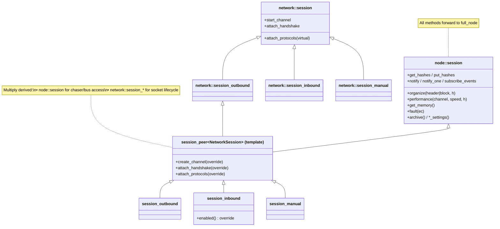
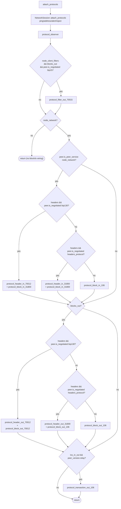
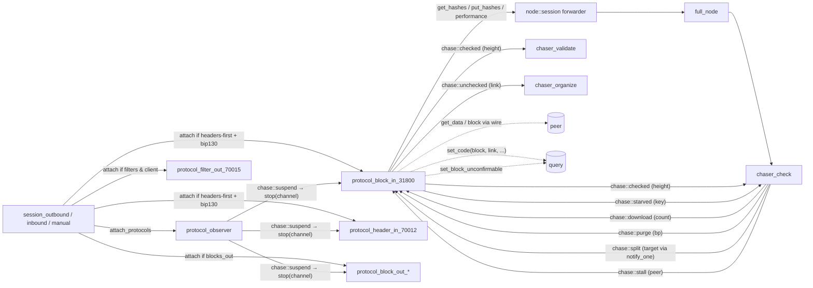

# 06 — Sessions and the block-in protocol

> Companion to [`00-overview.md`](00-overview.md),
> [`01-event-bus.md`](01-event-bus.md), and the chaser docs
> [`02`](02-chaser-organize.md)–[`05`](05-chaser-confirm.md).
>
> This doc covers:
>
> 1. **Session layer** — how `full_node` wires the node's chasers into
>    libbitcoin-network's session machinery via a thin mixin, and the
>    decision tree that determines which P2P protocols attach to a new
>    channel.
> 2. **`protocol_block_in_31800`** — the heaviest peer-side class. It
>    is the counterpart of `chaser_check` on the wire side: pulls
>    download maps from `chaser_check`, sends `getdata`, receives
>    blocks, checks and archives them, and emits `chase::checked` per
>    block.
>
> The supporting bases `protocol`, `protocol_observer`,
> `protocol_performer` are described where they matter.

| File                                                                    | Role                                                              |
| ----------------------------------------------------------------------- | ----------------------------------------------------------------- |
| `include/bitcoin/node/sessions/session.hpp` + `src/sessions/session.cpp`| `node::session` mixin (sibling to `network::session`)              |
| `include/bitcoin/node/sessions/session_peer.hpp` + `.../impl/...ipp`    | CRTP template combining mixin with `network::session_*`            |
| `include/bitcoin/node/sessions/session_{inbound,outbound,manual}.hpp`   | Trivial typedefs of `session_peer<NetworkSession>`                  |
| `include/bitcoin/node/protocols/protocol.hpp` + `src/protocols/protocol.cpp` | `node::protocol` base — sibling of `network::protocol`        |
| `src/protocols/protocol_observer.cpp`                                   | Universal channel observer (handles `chase::suspend`)             |
| `src/protocols/protocol_performer.cpp`                                  | Mixin providing the speed-reporting loop                          |
| `src/protocols/protocol_block_in_31800.cpp`                             | Block download workhorse                                          |

---

## 1. The class hierarchy

libbitcoin-node deliberately avoids diamond inheritance: `node::session`
is **a sibling**, not a parent, of `network::session`. The same applies
to protocols.

### 1.1 Session hierarchy



The `node::session` mixin (`src/sessions/session.cpp:35-160`) is **pure
forwarding**: every method delegates to the held `full_node&`. So at the
session layer, there is *no node-specific state*; the mixin's only role
is to give protocols a typed handle on the node.

### 1.2 Per-concrete-session specialisation

```cpp
// session_outbound.hpp:28-35, session_manual.hpp:28-35:
class session_outbound : public session_peer<network::session_outbound> { ... };
class session_manual   : public session_peer<network::session_manual>  { ... };
// session_inbound.hpp:28-38 — only override:
class session_inbound  : public session_peer<network::session_inbound>  {
public:
    ...
protected:
    bool enabled() const NOEXCEPT override;   // see §1.3
};
```

### 1.3 Inbound `enabled()` gate

```cpp
// src/sessions/session_inbound.cpp:26-29
bool session_inbound::enabled() const NOEXCEPT
{
    return !node_settings().delay_inbound || is_recent();
}
```

> **Invariant (Session-Inbound-1).** Inbound connection attempts are
> rejected (the network layer disables the listener) until either
> `delay_inbound == false` *or* the confirmed chain is "recent". The
> definition of "recent" is the same as `full_node::is_recent` — top
> equals configured max height *or* top timestamp is within the
> `currency_window` (`src/full_node.cpp:415-425`). This prevents a
> not-yet-caught-up node from serving stale data.

This is implemented via `enabled()` rather than the bus
`suspend`/`resume` mechanism so that the listener has independent
control flow.

---

## 2. Channel construction and protocol attach

The CRTP template `session_peer<NetworkSession>` overrides three hooks
that the network layer calls per accepted/connected channel.

### 2.1 `create_channel(socket)` — line `session_peer.ipp:29-39`

```cpp
const auto channel = system::emplace_shared<channel_t>(
    this->get_memory(),            // ← block arena from full_node
    this->log, socket, this->create_key(),
    this->node_config(), this->options());
```

Returns a `node::channel_peer` (the node's channel subclass) upcast to
`network::channel`. Critical: the channel is allocated against the
**node's block memory arena**, which gates block lifetime (see
[`00-overview.md §8`](00-overview.md#8-memory-model-the-block-arena)).

### 2.2 `attach_handshake(channel, handler)` — line `session_peer.ipp:41-55`

Runs *before* the version handshake. Sets the channel's `start_height`
from `query.get_top_confirmed()` so the outgoing `version` message
carries the right height to the peer:

```cpp
const auto top = this->archive().get_top_confirmed();
const auto peer = std::dynamic_pointer_cast<channel_t>(channel);
peer->set_start_height(top);
NetworkSession::attach_handshake(channel, std::move(handler));
```

The base then runs the standard version exchange from
libbitcoin-network.

### 2.3 `attach_protocols(channel)` — line `session_peer.ipp:57-161`

After handshake succeeds, this method decides **which P2P protocols run
on the channel** based on negotiated peer features and node
configuration. This is the central network-layer decision tree.



### 2.4 Predicate definitions

| Predicate                  | Definition (file:line)                                                                |
| -------------------------- | ------------------------------------------------------------------------------------- |
| `delay`                    | `node_settings.delay_inbound` (`session_peer.ipp:70`)                                  |
| `headers`                  | `node_settings.headers_first` (`session_peer.ipp:71`)                                  |
| `relay`                    | `network_settings.enable_relay` (`session_peer.ipp:69`)                                |
| `node_network`             | `services_maximum & service::node_network` (`session_peer.ipp:72-76`)                  |
| `node_client_filters`      | `services_maximum & service::node_client_filters` (`session_peer.ipp:77-81`)           |
| `blocks_out`               | `!delay || is_recent()` (`session_peer.ipp:90`)                                        |
| `txs_in_out`               | `relay && peer.is_negotiated(bip37) && (!delay || is_current(true))` (`session_peer.ipp:111-112`) |

`peer.is_negotiated(level)` consults the handshake-negotiated protocol
level. `peer.is_peer_service(service::node_network)` checks the peer's
advertised service bits.

> **Invariant (Attach-1).** Every channel receives `protocol_observer`
> (`session_peer.ipp:87`), so every channel is subject to
> `chase::suspend` (and stop). Without this, suspend would not reach
> all channels.

> **Invariant (Attach-2).** `protocol_block_in_31800` is attached
> exactly when the peer advertises `node_network` *and* either `bip130`
> or `headers_protocol` is negotiated *and* headers-first mode is on.
> The legacy `protocol_block_in_106` path is only for peers below
> protocol level 31800.

> **Note for the port.** Future P2P protocol additions slot into this
> tree by adding new conditional branches. A spec can model the result
> as a *static* set of protocols per channel decided at handshake; the
> set never changes during the channel's lifetime.

---

## 3. `node::protocol` base — sibling pattern

`include/bitcoin/node/protocols/protocol.hpp:33-99`:

`node::protocol` does **not** inherit from `network::protocol`. Instead,
concrete protocols multiply-inherit from both
`network::protocol_xxx` (the wire-level base) *and* `node::protocol`
(the node-aware mixin). The `subscribe_events` machinery uses
`shared_from_sibling` to get a `shared_ptr<node::protocol>` out of a
`network::protocol&` — see `protocol.cpp:74-84`.

### 3.1 Event subscription protocol

```cpp
// src/protocols/protocol.cpp:72-84
void protocol::subscribe_events(event_notifier&& handler) NOEXCEPT {
    const auto self = dynamic_cast<network::protocol&>(*this)
        .shared_from_sibling<node::protocol, network::protocol>();

    event_completer completer = std::bind(&protocol::handle_subscribed,
        self, _1, _2);

    session_->subscribe_events(std::move(handler),
        std::bind(&protocol::handle_subscribe,
            self, _1, _2, std::move(completer)));
}
```

The chain: protocol → session → full_node → posts to node strand →
subscribes → completer fires → `handle_subscribe` stores the `key_` →
calls `handle_subscribed` → posts back to channel strand → calls the
override `subscribed(ec, key)` for any protocol-specific init.

> **Invariant (Protocol-Sub-1).** Each protocol may have *at most one
> active subscription*. Enforced by `BC_ASSERT_MSG(is_zero(key_),
> "unsafe access")` in `handle_subscribe` (`protocol.cpp:91`).

> **Invariant (Protocol-Sub-2).** `unsubscribe_events` must be called
> from the protocol's `stopping(...)` override
> (`include/bitcoin/node/protocols/protocol.hpp:80-81`). The base
> `subscribed` calls it on early failure (`protocol.cpp:114-121`).

### 3.2 `protocol_observer` — channel-suspend listener

Every channel has one. Its job is two-fold
(`src/protocols/protocol_observer.cpp`):

1. **Translate `chase::suspend` to channel stop.** When the bus
   broadcasts `suspend`, every `protocol_observer` calls
   `stop(error::suspended_channel)` on its channel
   (`protocol_observer.cpp:77-80`). Result: a `suspend` event tears
   down every peer connection.
2. **Hygiene: drop peers that send unrequested tx inventories** if
   relay is disallowed (`protocol_observer.cpp:101-127`). This is a
   defensive check.

> **Invariant (Observer-Suspend-1).** A single `chase::suspend`
> emission drops *all* channels via the per-channel observer. The base
> `network::net` also suspends its listeners (see
> [`00-overview.md §6.2`](00-overview.md#62-suspend--resume--fault)), so
> the combined effect is "stop all current and refuse new".

---

## 4. `protocol_performer` — speed reporting loop

`src/protocols/protocol_performer.cpp`. This is a mixin used by
`protocol_block_in_31800` to drive the speed-reporting cycle.

```mermaid
stateDiagram-v2
    [*] --> IDLE
    IDLE --> RUNNING: start_performance\n(start_=now; bytes_=0; timer)
    RUNNING --> RUNNING: count(bytes)\nbytes_ += bytes
    RUNNING --> TICK: timer fires
    TICK --> SEND_RATE: !is_idle\nrate = bytes_ / elapsed_seconds
    TICK --> PAUSED: is_idle (exhausted)\nsend_performance(max_uint64)
    SEND_RATE --> APPLY: performance(rate, ...)
    APPLY: do_handle_performance(ec)
    APPLY --> IDLE: ec == exhausted → return
    APPLY --> STOPPED: ec ∈ {stalled, slow} → stop
    APPLY --> RUNNING: ec == success → start_performance
    PAUSED --> [*]: (timer stopped until next chase::download)
    STOPPED --> [*]
```

Key code paths:

- `start_performance()` (`protocol_performer.cpp:35-46`): start clock,
  reset byte counter, arm the timer.
- `handle_performance_timer(ec)` (`:48-76`): on tick, if idle ⇒
  `pause_performance` (sends `max_uint64`); else compute rate in bytes/s
  and `send_performance`.
- `send_performance(rate)` (`:90-113`): dispatches based on
  configuration:
  - If `deviation_` is enabled: send via the
    `performance(rate, handler)` RPC → chaser_check → maybe
    `error::slow_channel`.
  - Else: only stalled/exhausted detection (no σ analysis).
- `do_handle_performance(ec)` (`:123-152`): the dispatch table:

| Reply code         | Reaction                                                        |
| ------------------ | --------------------------------------------------------------- |
| `exhausted_channel`| Stop the timer; wait for `chase::download` to restart           |
| `stalled_channel`  | `stop(ec)` — drop the channel                                   |
| `slow_channel`     | `stop(ec)` — drop the channel                                   |
| other error        | `stop(ec)`                                                      |
| `success`          | `start_performance()` — go again                                 |

> **Invariant (Performer-1).** `count(bytes)` accumulates incoming
> block bytes between ticks; `bytes_` is reset at every
> `start_performance`. So `rate = bytes_/elapsed` is bytes/sec since
> the last tick boundary.

> **Invariant (Performer-2).** A channel that returns
> `exhausted_channel` is NOT dropped; only the timer is paused. It
> resumes on the next `chase::download` event (via
> `protocol_block_in_31800::do_get_downloads` calling
> `start_performance`, see §5.2).

---

## 5. `protocol_block_in_31800` — the block-download protocol

This class is the on-the-wire counterpart of `chaser_check`. The
chaser holds the *queue of pending downloads* (per [`03`](03-chaser-check.md));
this protocol holds *one map of in-flight items per channel* and
shuttles between them.

### 5.1 Per-channel state

```cpp
// (private members; signatures from the .cpp)
map_ptr     map_;        // current download map; empty ⇒ idle
job::ptr    job_;        // shared race_all barrier (held while in flight)
size_t      bytes_;      // bytes received this performance window (inherited)
```

Plus inherited from `protocol_performer`, `protocol_peer`, and
`protocol`.

### 5.2 Lifecycle

```cpp
// protocol_block_in_31800.cpp:45-56
void start() {
    if (started()) return;
    subscribe_events(BIND(handle_event, _1, _2, _3));
    SUBSCRIBE_CHANNEL(block, handle_receive_block, _1, _2);
    protocol_performer::start();
}

// :59-77 — subscribed (called after event subscription completes)
void subscribed(ec, key) {
    if (stopped(ec)) { unsubscribe_events(); return; }
    if (is_current(false)) {
        start_performance();
        get_hashes(BIND(handle_get_hashes, _1, _2, _3));
    }
}

// :80-88 — stopping
void stopping(ec) {
    restore(map_);                       // return any unfinished work
    map_ = chaser_check::empty_map();
    stop_performance();
    unsubscribe_events();
    protocol_performer::stopping(ec);
}
```

> **Invariant (BlockIn-Lifecycle-1).** On stop, the protocol *returns
> its current map* via `put_hashes`, so the chaser can re-queue the
> work for another channel. `restore` is a no-op if the map is empty
> (`protocol_block_in_31800.cpp:386-390`).

> **Invariant (BlockIn-Lifecycle-2).** Initial download only starts if
> the candidate chain is *current* at subscription time
> (`:72-76`). Otherwise the protocol waits for `chase::download`
> events to kick it (see §5.3).

### 5.3 Bus event handling

```mermaid
stateDiagram-v2
    [*] --> IDLE: start (map_ = empty, performance timer started)

    IDLE --> RECV: chase::download\nif is_idle: start_performance, get_hashes
    RECV --> SENDING: send_get_data(map, job)\nSEND get_data message
    SENDING --> RECEIVING: peer ack
    RECEIVING --> RECEIVING: handle_receive_block(block)\ncheck → set_code → emit chase::checked\nerase from map_
    RECEIVING --> NEED_MORE: map_ empty\nget_hashes again
    NEED_MORE --> IDLE: handle_get_hashes\nif map empty: emit chase::starved
    NEED_MORE --> SENDING: handle_get_hashes\ngot work: send_get_data

    IDLE --> SPLIT_OFF: chase::stall\nif map_.size > 1: split half + restore both + stop
    RECEIVING --> SPLIT_OFF: chase::stall\nsame
    IDLE --> SPLIT_OFF: chase::split (notify_one)\nsame as stall but targeted
    RECEIVING --> SPLIT_OFF: chase::split (notify_one)\nsame
    SPLIT_OFF: stop(sacrificed_channel)

    IDLE --> PURGED: chase::purge\nclear map; stop
    RECEIVING --> PURGED: chase::purge\nsame
    SENDING --> PURGED: chase::purge\nsame
    PURGED: stop(sacrificed_channel)

    IDLE --> [*]: chase::stop, channel stop, etc.
    RECEIVING --> [*]
    SENDING --> [*]
    NEED_MORE --> [*]
```

The mapping of bus events → handlers
(`protocol_block_in_31800.cpp:99-156`):

| Event              | Handler           | Effect                                                                                          |
| ------------------ | ----------------- | ----------------------------------------------------------------------------------------------- |
| `chase::download`  | `do_get_downloads`| If idle: `start_performance` + `get_hashes`                                                      |
| `chase::split`     | `do_split`        | If map_ > 1 item: split half, return both halves, stop with `sacrificed_channel`               |
| `chase::stall`     | `do_stall`        | Same as split (split if divisible work, else no-op)                                              |
| `chase::purge`     | `do_purge`        | Clear map_, stop with `sacrificed_channel`                                                       |
| `chase::report`    | `do_report`       | LOG only — current map size                                                                      |
| `chase::stop`      | (return false)    | Unsubscribe                                                                                      |

### 5.4 The download cycle (handle_get_hashes → send_get_data → handle_receive_block)

```mermaid
sequenceDiagram
    autonumber
    participant CHK as chaser_check
    participant PB as protocol_block_in_31800
    participant P as Peer
    participant Q as query
    participant Bus as event bus

    Note over PB: idle (map_ empty)
    PB->>CHK: get_hashes(handle_get_hashes)
    CHK-->>PB: (success, map, job)
    alt map empty
        PB->>Bus: notify(chase::starved, events_key)
    else
        PB->>PB: send_get_data(map, job)\nmap_ = map; job_ = job
        PB->>P: getdata(items)
        loop per block sent by peer
            P->>PB: block message
            PB->>PB: handle_receive_block(block)
            alt hash not in map_
                Note over PB: ignore (unrequested), return true
            else
                PB->>PB: check(block, ctx, bypass)
                alt malleated / commitment failure
                    PB->>P: stop(invalid_commitment) ← drops channel
                else other check failure
                    PB->>Q: set_block_unconfirmable(link)
                    PB->>Bus: notify(chase::unchecked, link)
                    PB->>P: stop(ec)
                else success
                    PB->>Q: set_code(block, link, checked, bypass, height)
                    PB->>Bus: notify(chase::checked, height)
                    PB->>PB: count(serialized_size); map_.erase(it)
                    alt map_ now empty
                        PB->>PB: job_.reset() (release barrier)
                        PB->>CHK: get_hashes(...)
                    end
                end
            end
        end
    end
```

### 5.5 The `check` function and bypass

```cpp
// protocol_block_in_31800.cpp:365-381
code check(const chain::block& block, const chain::context& ctx,
           bool bypass) const NOEXCEPT
{
    if (bypass) {
        if ((ec = block.identify())) return ec;
        if ((ec = block.identify(ctx))) return ec;
    } else {
        if ((ec = block.check())) return ec;
        if ((ec = block.check(ctx))) return ec;
    }
    return error::success;
}
```

- `block.identify` (libbitcoin-system): cheap surface checks — header
  match, transaction commitment, witness commitment.
- `block.check`: full check (identify + size limits + tx checks +
  sigops + …).

`bypass = is_under_checkpoint(height) || query.is_milestone(link)`
(`:296-297`).

> **Invariant (BlockIn-Check-1).** Under bypass, only identity is
> verified at receive time. Full consensus checks are skipped (the
> upstream checkpoint/milestone is the proof). Note: identity
> failure (`invalid_witness_commitment`,
> `invalid_transaction_commitment`) is interpreted as **malleation** —
> stop the peer but do *not* mark the block unconfirmable
> (`protocol_block_in_31800.cpp:303-314`). A different peer may yet
> deliver the canonical block.

> **Invariant (BlockIn-Check-2).** Non-malleation check failure ⇒
> `set_block_unconfirmable(link)` is called AND `chase::unchecked`
> is emitted (`:316-327`). `chaser_organize` will then disorganize
> down to this link.

### 5.6 Storage write

```cpp
// :333-340
if (const auto code = query.set_code(*block, link, checked, bypass, height)) {
    LOGF("Failure storing block ...");
    stop(fault(code));
    return false;
}
```

`query.set_code` associates the block body with its header link in the
store. Failure here is a node fault (suspends the network via
`fault(code)`).

> **Invariant (BlockIn-Store-1).** A `chase::checked(height)` event is
> emitted *only after* `set_code` succeeded (`:333-348`). So consumers
> of `chase::checked` can rely on the block being durably associated.

### 5.7 Self-stall detection

```cpp
// :421-424 in handle_get_hashes
if (map->empty()) {
    notify(error::success, chase::starved, events_key());
    return;
}
```

If the chaser hands the protocol an empty map, this protocol is *out of
work*. Emitting `chase::starved` causes `chaser_check::do_starved` to
either pick the slowest channel and signal a `split` (rerouting its
work to here) or — if no channels are tracked — broadcast `stall`
(asking *any* channel with divisible work to split).

> **Invariant (BlockIn-Starve-1).** `chase::starved` is emitted with
> the protocol's own subscription key (`events_key()`). The chaser
> uses this key to *avoid* asking the starved peer to split its own
> (empty) work (`chaser_check.cpp:219-221`).

---

## 6. Coupling diagram



---

## 7. Error / outcome inventory for `protocol_block_in_31800`

The protocol returns/uses these codes; only `protocol1` is a node-fault.

| Code                                  | Site                                       | Trigger                                                                        |
| ------------------------------------- | ------------------------------------------ | ------------------------------------------------------------------------------ |
| `system::error::invalid_transaction_commitment` | `:305-313`                       | Malleation in tx commitment — peer dropped; block left unmarked                |
| `system::error::invalid_witness_commitment`     | `:305-313`                       | Same, witness                                                                  |
| any other consensus error             | `:316-327`                                 | `set_block_unconfirmable`; emit `chase::unchecked`; stop peer                  |
| `node::error::protocol1`              | `:318`                                     | `set_block_unconfirmable` itself failed — node fault                            |
| `network::error::sacrificed_channel`  | `:188, :202, :216`                         | Self-sacrifice on `purge`/`stall`/`split`                                       |
| any database error code               | `:336-339`                                 | `set_code` failure — node fault                                                 |

---

## 8. Spec view

### 8.1 Sessions as protocol selectors

The session layer's only consensus-relevant action is the **attach
tree** (§2.3). A spec can model:

```
attach(channel, peer, settings) : Set Protocol =
    { observer } ∪ filters(...) ∪ block_in_set(...) ∪ block_out_set(...) ∪ tx_set(...)
```

Once `start_channel` succeeds and `attach_protocols` runs, the set is
fixed for that channel's lifetime.

### 8.2 `protocol_block_in_31800` as a process

- **State**: `map ∈ MaybeQueue (HashPair)`, `job ∈ MaybeJobBarrier`,
  `bytes ∈ ℕ`.
- **Inputs** (channel strand):
  - peer `block` messages
  - bus events listed in §5.3
  - performance timer ticks
- **Inputs** (chaser strand, via RPC results):
  - `handle_get_hashes(ec, map, job)`
  - `handle_put_hashes(ec, count)`
- **Outputs**:
  - peer `getdata` messages
  - bus events `chase::checked`, `chase::unchecked`, `chase::starved`
  - store mutations: `set_code(...)`, `set_block_unconfirmable(...)`
  - `chase::valid` is *not* emitted by this protocol (it only emits
    `chase::checked`); validation comes from `chaser_validate`.

### 8.3 Safety properties

1. **Store-precedes-bus** (BlockIn-Store-1): `chase::checked(h)` ⇒
   the block is durably stored at the link `to_candidate(h)`.
2. **No silent invalidation**: every `chase::unchecked(link)` is
   preceded by a successful `set_block_unconfirmable(link)`. Failure
   path goes to fault, not silent drop (BlockIn-Check-2).
3. **Map ownership**: at any time, a given map entry is in exactly
   one place: in `chaser_check.maps_`, in some channel's `map_`, or
   in flight as a returned `restore` to the chaser. Proving this
   requires reasoning about the asynchronous `restore` callback.
4. **Job barrier completeness**: while any channel holds `job_`, the
   chaser's `race_all` is not complete. So the chaser cannot enter
   `purging` state during a request → response cycle without an
   explicit `chase::purge` first.

### 8.4 Liveness

- Each channel either keeps progressing (`chase::checked` per block) or
  emits `chase::starved` when its map drains, prompting the chaser to
  rebalance.
- A persistently slow channel is dropped via `slow_channel`; a
  persistently stuck channel via `stalled_channel`.

---

## 9. Notes for the Lisp port

- **Sessions**: a Lisp port can collapse all three session subclasses
  into one (`enabled` for inbound is the only customisation). The
  attach tree (§2.3) is the only behavioural component.
- **`node::protocol` sibling pattern**: this is a workaround for C++
  multiple inheritance; in Lisp there is no analogue needed. Wire
  protocols can simply contain a reference to the node.
- **`protocol_block_in_31800`**: model it as an actor with one mailbox
  for peer messages and one for chaser events. The interleaving on the
  channel strand makes it inherently single-threaded per channel; one
  Lisp actor per channel suffices.
- **`protocol_performer`**: implementable as a recurring scheduled
  task that snapshots `bytes_` and computes a rate.
- The **block arena** lifetime contract on `block::cptr` is the one
  C++-specific subtlety that must be replaced by GC ownership in Lisp.

---

## 10. Notes for the formal model

- The session layer adds no shared state — it is a static dispatch
  from configuration + handshake state to a finite protocol set.
- `protocol_block_in_31800` is strand-confined; its only off-strand
  interactions are `get_hashes`/`put_hashes`/`performance` RPCs which
  post to the chaser strand. The full system can be modelled as one
  chaser strand + N independent channel strands communicating only by
  the bus and these three RPCs.
- The **map-ownership** property (§8.3-3) is the non-trivial
  correctness obligation here; an exchange protocol proof can be
  modelled with a token-passing semantics.

---

## Cross-references

- [`00-overview.md`](00-overview.md) §7 (network layer at a glance)
- [`01-event-bus.md`](01-event-bus.md) §2.1 (work-shuffling events
  emitted/consumed here), §2.3 (`checked`/`unchecked`)
- [`03-chaser-check.md`](03-chaser-check.md) §6 (the chaser side of
  performance and starved/split/stall), §9 (coupling diagram —
  upstream pair of this doc's §6)
- Upcoming: `07-protocol-block-out.md` (block-serving counterpart)
- Upcoming: `08-protocol-header-in-out.md` (header sync protocols)
- Upcoming: `09-protocol-filter-out-70015.md` (BIP158 filter serving)
- libbitcoin-network docs (external): the base `network::session_*`,
  `network::protocol`, and channel/timer primitives.
