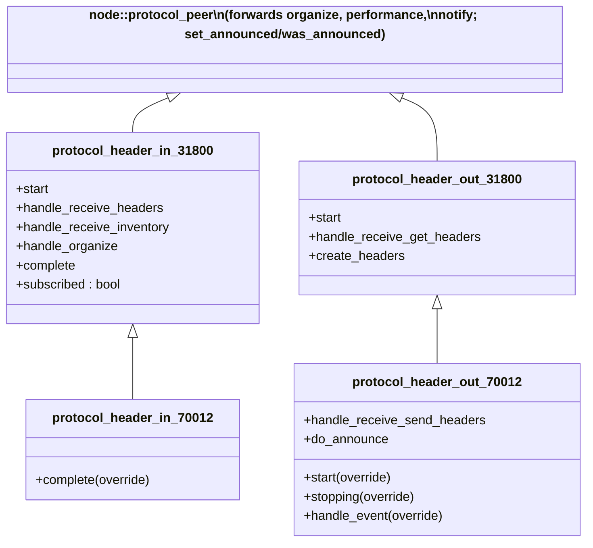
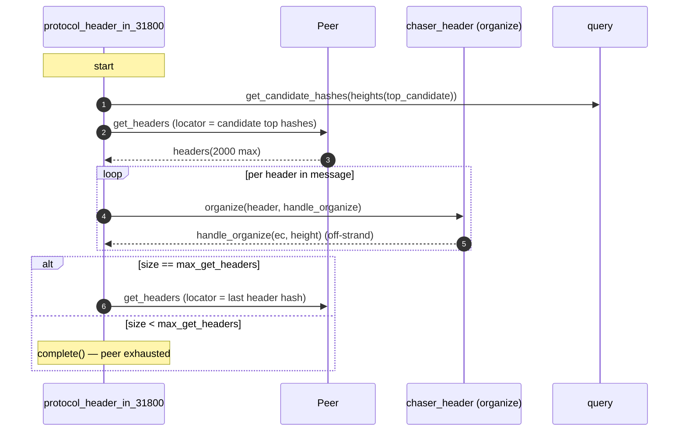
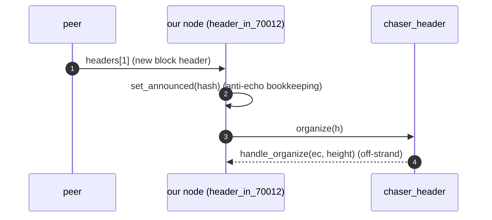
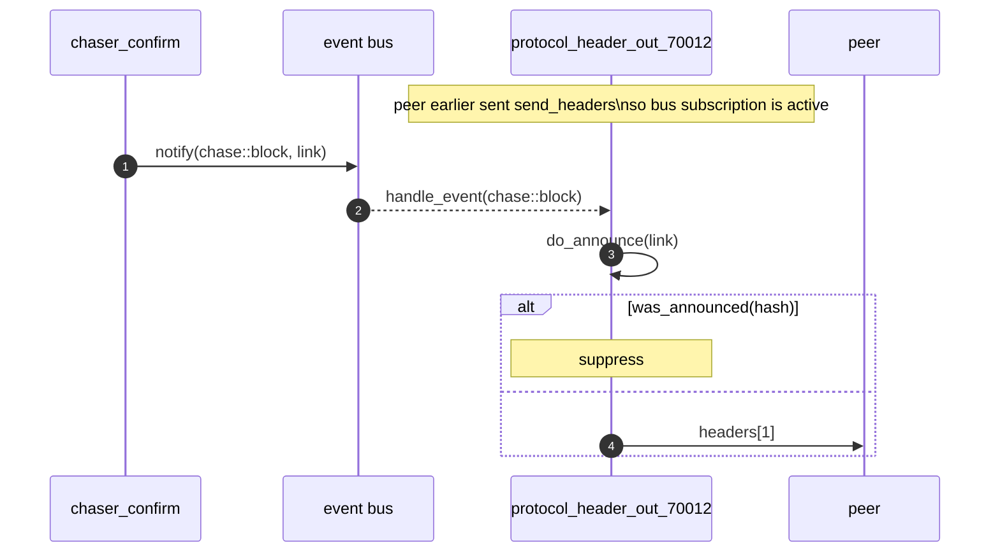
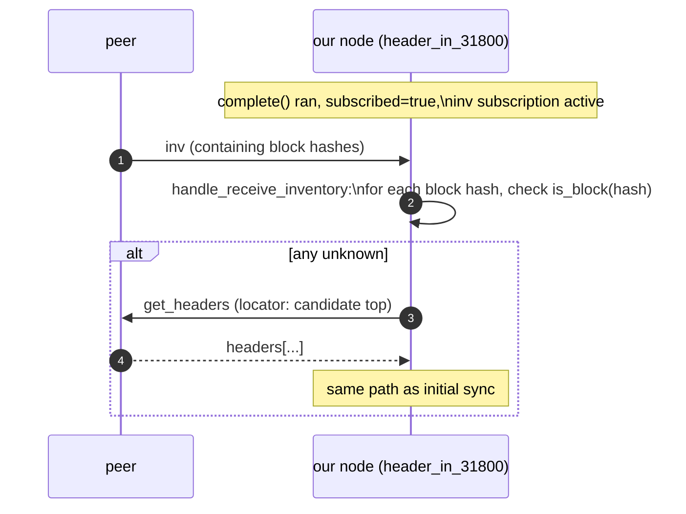

# 07 — Header protocols (in/out, 31800 / 70012)

> Companion to [`06-sessions-and-protocols.md`](06-sessions-and-protocols.md)
> and [`02-chaser-organize.md`](02-chaser-organize.md).
>
> The header protocols are the wire-side of `chaser_header`: they sync
> headers from peers (`protocol_header_in_*`) and serve headers to peers
> (`protocol_header_out_*`). There are two versioned pairs:
>
> - **31800**: classic. Sync via `get_headers`/`headers`; announcements
>   discovered indirectly via `inv` messages.
> - **70012** (BIP130): adds `sendheaders` — peers announce new blocks
>   directly with `headers` messages, bypassing `inv`.
>
> 70012 *inherits* from 31800 in both directions — it's an extension,
> not a replacement.

| File                                             | Lines | Role                                                                 |
| ------------------------------------------------ | ----- | -------------------------------------------------------------------- |
| `src/protocols/protocol_header_in_31800.cpp`     | 218   | Inbound sync + inv-based announcement detection                       |
| `src/protocols/protocol_header_in_70012.cpp`     |  47   | Adds `sendheaders` request after initial sync                         |
| `src/protocols/protocol_header_out_31800.cpp`    |  90   | Reply to `get_headers`                                                |
| `src/protocols/protocol_header_out_70012.cpp`    | 141   | Adds `chase::block` → announce new blocks via `headers`                |

---

## 1. Inheritance and overrides



> **Invariant (HeaderProto-Inherit-1).** 70012 protocols *augment*
> 31800. Sync (in) and serve (out) work identically; 70012 only adds
> the announcement-via-headers path on top.

---

## 2. `protocol_header_in_31800` — inbound sync

### 2.1 Sync algorithm



Source:
- `start` at `protocol_header_in_31800.cpp:40-50`
- `handle_receive_headers` at `:57-97`
- `handle_organize` at `:100-128` (logs only)
- `complete` at `:132-143`

### 2.2 The locator

`create_get_headers()` (`:177-185`) builds the locator from the
*archived candidate chain*. The heights used are
`get_headers::heights(top_candidate)` — the standard exponential-back
locator. The peer uses this to find the highest common ancestor and
replies with up to `max_get_headers` (typically 2000) consecutive
headers above that.

> **Invariant (HeaderIn-Sync-1).** Each channel syncs *independently*
> from the candidate top. The locator is recomputed from the store on
> every `get_headers` send. With many parallel channels, each will
> converge to the same head — duplicates are dropped by
> `chaser_organize::do_organize` (returns `error::duplicate_header`,
> ignored by `handle_organize`).

> **Invariant (HeaderIn-Sync-2).** A response of fewer than
> `max_get_headers` headers means the peer is caught up (no more
> headers to send). The protocol transitions to "announcement mode"
> via `complete()`.

### 2.3 `complete()` — switching to announcement mode

```cpp
// :132-143
void protocol_header_in_31800::complete() NOEXCEPT
{
    if (!subscribed && is_current(true)) {
        subscribed = true;
        SUBSCRIBE_CHANNEL(inventory, handle_receive_inventory, _1, _2);
    }
}
```

After initial sync, the protocol subscribes to **inventory** messages
to detect new block announcements indirectly (no `sendheaders` at
31800).

`handle_receive_inventory` (`:149-172`): for each block-typed `inv`
item, if `query.is_block(hash)` is false (we don't have it), send a
fresh `get_headers` to learn about the new branch.

> **Invariant (HeaderIn-Subscribe-1).** Announcement subscription is
> gated on `is_current(true)` — confirmed chain is recent. Until then,
> the protocol does only initial sync. This prevents announcement
> traffic during catch-up.

> **Invariant (HeaderIn-Subscribe-2).** `subscribed` is one-shot:
> latched true on first successful `complete()`, never reset. Each
> channel subscribes at most once.

### 2.4 `set_announced` hookup

Inside `handle_receive_headers` (`:74-75`):

```cpp
if (subscribed)
    set_announced(ptr->get_hash());
```

Headers received *after* subscription are recorded as
"announced-from-this-peer", to be checked by
`protocol_header_out_70012` so we don't echo them back. See §4.

---

## 3. `protocol_header_in_70012` — adds `sendheaders`

47 lines. Only override: `complete()`.

```cpp
// :31-44
void protocol_header_in_70012::complete() NOEXCEPT
{
    if (!subscribed) {
        subscribed = true;
        SEND(send_headers{}, handle_send, _1);   // ← BIP130
    }
    protocol_header_in_31800::complete();
}
```

> **Invariant (HeaderIn-70012-1).** Order matters:
> `subscribed = true` is set *before* `protocol_header_in_31800::complete()`
> runs, so the base's `complete()` finds `subscribed == true` and
> *skips* the `inv` subscription. At 70012 the announcements arrive as
> `headers` messages directly — no `inv` round-trip — so the inv path
> is unnecessary.

The peer, upon receiving `sendheaders`, will announce new blocks by
sending `headers` messages instead of `inv`. The base
`handle_receive_headers` handles them on the same code path as initial
sync — they flow into `organize` exactly the same way.

---

## 4. `protocol_header_out_31800` — serve `get_headers`

```cpp
// :40-50
void start() NOEXCEPT {
    SUBSCRIBE_CHANNEL(get_headers, handle_receive_get_headers, _1, _2);
    protocol_peer::start();
}

// :54-67
bool handle_receive_get_headers(ec, message) NOEXCEPT {
    SEND(create_headers(*message), handle_send, _1);
    return true;
}

// :72-84
network::messages::peer::headers create_headers(get_headers& locator) {
    if (!is_current(true))
        return {};
    return { archive().get_headers(locator.start_hashes, locator.stop_hash,
                                   max_get_headers) };
}
```

> **Invariant (HeaderOut-Serve-1).** Header serving requires
> `is_current(true)` — empty reply otherwise. A node that isn't
> current sends an empty `headers` reply, which the requester
> interprets as "peer exhausted" (HeaderIn-Sync-2). This prevents
> propagating stale data.

> **Invariant (HeaderOut-Serve-2).** The reply is built from
> `archive().get_headers(start_hashes, stop_hash, max_get_headers)` —
> standard libbitcoin-database query. Result is at most
> `max_get_headers` headers consecutively above the highest match.

No bus subscription; this protocol is pure request/response.

---

## 5. `protocol_header_out_70012` — announce via `headers`

This is the only header protocol that **subscribes to the bus**. It
adds:

1. A handler for the peer's `sendheaders` message: lazily activates the
   bus subscription.
2. A handler for `chase::block`: posts `do_announce(link)`, which sends
   a 1-header `headers` message to announce the newly-confirmed block.

### 5.1 Lifecycle

```cpp
// :39-49
void start() NOEXCEPT {
    SUBSCRIBE_CHANNEL(send_headers, handle_receive_send_headers, _1, _2);
    protocol_header_out_31800::start();   // (sets up get_headers serving)
}

// :51-57
void stopping(ec) NOEXCEPT {
    unsubscribe_events();
    protocol_header_out_31800::stopping(ec);
}
```

The bus subscription is *not* set up in `start()` — it's deferred until
the peer sends `sendheaders` (the BIP130 opt-in).

### 5.2 Activation via `sendheaders`

```cpp
// :124-135
bool handle_receive_send_headers(ec, message) NOEXCEPT {
    subscribe_events(BIND(handle_event, _1, _2, _3));
    return false;        // ← one-shot: stop receiving send_headers
}
```

`return false` from a `SUBSCRIBE_CHANNEL` handler unsubscribes from
that message. `sendheaders` is a one-time signal from the peer.

> **Invariant (HeaderOut-70012-1).** Bus subscription for header
> announcements is *lazy* and *peer-driven*. A peer that doesn't send
> `sendheaders` never triggers it; the channel stays purely
> request/response (like 31800).

### 5.3 The announce loop

```cpp
// :62-85, handle_event
case chase::block:
    POST(do_announce, std::get<header_t>(value));
    break;

// :90-119, do_announce
bool do_announce(header_t link) NOEXCEPT {
    const auto hash = query.get_header_key(link);
    if (was_announced(hash))            // ← anti-echo
        return true;
    const auto ptr = query.get_header(link);
    if (!ptr) return true;              // (logged but suppressed)
    SEND(headers{ { ptr } }, handle_send, _1);
    return true;
}
```

> **Invariant (HeaderOut-70012-2).** A block is *not* announced back
> to the peer that announced it. Enforced by `was_announced(hash)`
> check at `:100`. Prevents announcement loops.

> **Invariant (HeaderOut-70012-3).** `chase::block` is emitted by
> `chaser_confirm::announce` (`chaser_confirm.cpp:421-428`) only when
> the confirmed chain is current. So this protocol only announces
> "live" blocks, not catch-up state. See
> [`05-chaser-confirm.md §7`](05-chaser-confirm.md#7-side-effect-summary-table).

---

## 6. End-to-end header-flow scenarios

### 6.1 Initial sync on outbound connect (70012 peer)

```mermaid
sequenceDiagram
    autonumber
    participant US as our node (header_in_70012)
    participant PEER as peer
    participant ORG as chaser_header
    participant CHK as chaser_check

    US->>PEER: get_headers (locator: candidate top hashes)
    PEER-->>US: headers[2000]
    US->>ORG: organize(h_1) ... organize(h_2000)
    ORG->>US: notify(chase::headers, branch_point) → CHK
    ORG->>US: notify(chase::bump, branch_point) → VAL etc.
    US->>PEER: get_headers (locator: last hash)
    PEER-->>US: headers[N < 2000]
    US->>ORG: organize(h_2001) ... organize(h_2000+N)
    Note over US: complete() — peer exhausted
    US->>PEER: sendheaders (BIP130 opt-in)
    Note over US: bus subscription not active here
    Note over US: subscribed = true; suppresses inv-listening path
```

### 6.2 Future block announcement (70012 ← peer)



### 6.3 Future block announcement (us → peer, 70012)



### 6.4 Block announcement at 31800 (no BIP130)



---

## 7. Bus integration summary

Only **`protocol_header_out_70012`** subscribes to the bus. Its single
consumed event:

| Event         | Source             | Reaction                                |
| ------------- | ------------------ | --------------------------------------- |
| `chase::block`| `chaser_confirm`   | `do_announce(link)`: emit `headers[1]`  |

The header *in* protocols never emit bus events directly — they call
`session_->organize(header, ...)` which goes through
`chaser_organize::do_organize`. The chaser, in turn, emits
`chase::headers`, `chase::bump`, `chase::regressed`, `chase::disorganized`
(see [`02-chaser-organize.md §3`](02-chaser-organize.md#3-do_organize-the-forward-state-machine)).

> **Invariant (HeaderBus-1).** No header-in protocol emits any
> `chase::*` event. They only feed the `organize` pipeline through
> the session-level RPC.

---

## 8. Anti-echo mechanism (`set_announced` / `was_announced`)

Lives on `node::channel_peer` (referenced from `protocol_peer.cpp:78-86`).
Each channel maintains a small per-channel set of recently-announced
hashes.

- `set_announced(hash)`: called by header-in 70012 (and tx-in 106, etc.)
  when receiving an announcement.
- `was_announced(hash)`: called by header-out 70012 (and the
  corresponding block-out paths) before sending an announcement.

This is **not** a global state; it's per-channel — exactly what's
needed to break the local A↔B echo. Cross-peer dedup happens at a
higher layer (organize sees duplicates).

> **Invariant (Anti-Echo-1).** The pair `(set_announced, was_announced)`
> guarantees a peer that announced X to us is never sent X back, *on
> that channel*. It does not guarantee global no-duplication; multiple
> peers may announce the same block and our node will announce it to
> all peers except those that announced it.

---

## 9. Error / outcome inventory

| Event                                  | Site                                    | Effect                                                          |
| -------------------------------------- | --------------------------------------- | --------------------------------------------------------------- |
| organize returns `service_stopped`     | `protocol_header_in_31800.cpp:104-106`  | silently ignored                                                |
| organize returns `duplicate_header`    | same                                    | silently ignored                                                |
| organize returns any other code        | `:108-123`                              | `stop(ec)` — channel dropped                                    |
| `get_header(link)` returns null in out_70012 | `protocol_header_out_70012.cpp:108-113` | log warning; do not announce; do not stop (defensive)        |

None of these are node-faults — header protocol failures only affect
that one channel. (Contrast with `protocol_block_in_31800` which can
emit `protocol1` fault.)

---

## 10. Configuration interactions

From [`06-sessions-and-protocols.md §2.3`](06-sessions-and-protocols.md#23-attach_protocolschannel----line-session_peeripp57-161),
the attach tree determines which header protocol runs per channel:

- `headers_first = false` ⇒ no header-in protocol attached. The node
  relies on `protocol_block_in_106` for legacy blocks-first sync.
- `headers_first = true, BIP130 negotiated` ⇒ `protocol_header_in_70012` +
  `protocol_header_out_70012`.
- `headers_first = true, headers_protocol negotiated but no BIP130` ⇒
  `protocol_header_in_31800` + `protocol_header_out_31800`.
- `headers_first = true, neither` ⇒ no header protocols; legacy
  blocks-first path.

> **Invariant (HeaderAttach-1).** A channel never runs both 31800 and
> 70012 simultaneously for the same direction. The attach tree is a
> strict `if/else if/else`.

---

## 11. Spec view

### 11.1 As processes

Both directions are stateless transducers over the channel + store
(plus the per-channel `subscribed` latch and the announce set).

```
header_in : Process
  state: subscribed ∈ {false, true}
  inputs:  peer.headers, peer.inv (31800 only), peer.sendheaders (70012)
  outputs: peer.get_headers, peer.sendheaders (70012 only),
           organize(header) RPC (one per received header)

header_out : Process
  state: events_subscribed ∈ {false, true} (70012 only)
  inputs:  peer.get_headers, peer.send_headers (70012 only), bus chase::block (70012 only)
  outputs: peer.headers
```

### 11.2 Safety properties

1. **No echo within a channel** (Anti-Echo-1).
2. **Sync convergence**: assuming a peer's header chain extends ours,
   each `get_headers` reply strictly extends the candidate chain (or
   is empty). Convergence after ⌈Δ/2000⌉ round-trips where Δ is the
   gap.
3. **Announcement liveness gate** (HeaderIn-Subscribe-1): no
   announcement subscription until `is_current(true)`. This is a
   liveness *delay*, not a safety constraint.

### 11.3 Liveness

- Each channel makes progress as long as the peer responds to
  `get_headers`.
- After `complete()`, the channel quiesces until the peer sends a
  `headers` (70012) or `inv` (31800) message.

---

## 12. Notes for the Lisp port

- Header-in/out at 31800 are pure transducers; ideal for a functional
  implementation.
- The `complete()` state transition is a one-shot latch — a single
  Boolean.
- BIP130 is a strict extension over 31800; mirror that with a class
  hierarchy or trait composition.
- `set_announced`/`was_announced` is a per-channel finite set; an
  LRU cache is sufficient.

---

## 13. Notes for the formal model

- These protocols are stateful only in `subscribed` (one bit per
  channel) and the per-channel announce set. The rest is computed
  from message + store state.
- A full model can use a single labelled transition system per channel
  for each direction; the announce set is a finite oracle that returns
  `was_announced(hash)`.
- The end-to-end "candidate chain converges to peer's tip" property
  requires reasoning across multiple channels — out of scope of a
  per-protocol spec but provable given `chaser_organize`'s safety
  properties.

---

## Cross-references

- [`02-chaser-organize.md`](02-chaser-organize.md) — the consumer of
  headers organized by these protocols
- [`05-chaser-confirm.md`](05-chaser-confirm.md) §7 — emits
  `chase::block`, the only bus event consumed here
- [`06-sessions-and-protocols.md`](06-sessions-and-protocols.md) §2 —
  attach tree; §3 — `node::protocol_peer` base
- Upcoming: `08-block-out-and-filter-out.md` (block serving, filters)
- Upcoming: `09-tx-protocols.md` (transaction in/out)
