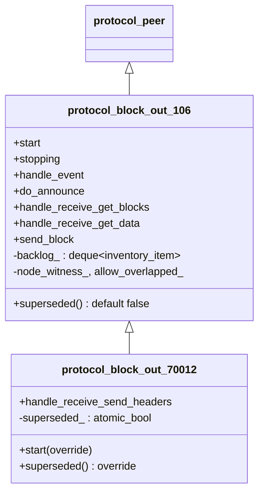
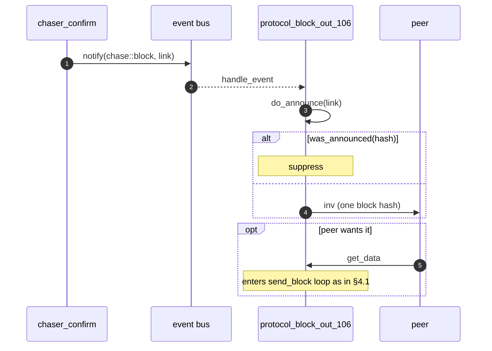
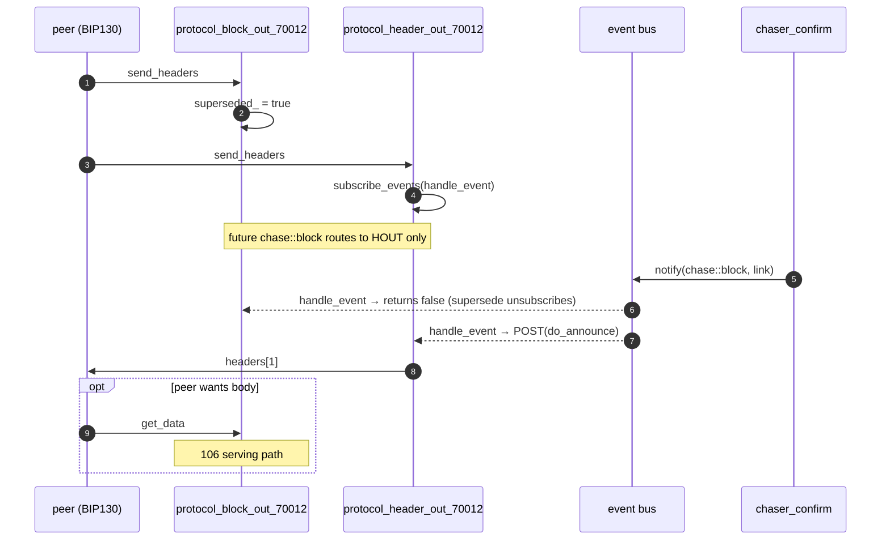

# 08 — Block-out protocols (106 / 70012)

> Companion to [`06-sessions-and-protocols.md`](06-sessions-and-protocols.md)
> and [`07-header-protocols.md`](07-header-protocols.md).
>
> Block-out is the **block-serving** side: respond to peer requests
> (`get_blocks`, `get_data`) with inventory / block bodies, and announce
> newly-confirmed blocks via `inv` so peers know to come ask. Two
> versions:
>
> - **106** (`protocol_block_out_106`) — full implementation: serves
>   `get_blocks`/`get_data`, announces new blocks via `inv`.
> - **70012** (`protocol_block_out_70012`) — minimal extension that
>   *suppresses* inv-based announcement when the peer has opted into
>   `sendheaders` (BIP130). The header-out path takes over announcement;
>   this protocol then only serves data on request.
>
> A common confusion: 70012 is **not** BIP152 (compact blocks). BIP152
> is *not* implemented in this repo (see
> `session_peer.ipp:92-97` comment). The 70012 number reflects the
> handshake level at which BIP130 attaches, nothing more.

| File                                          | Lines | Role                                                            |
| --------------------------------------------- | ----- | --------------------------------------------------------------- |
| `src/protocols/protocol_block_out_106.cpp`    | 262   | Full block-serving + inv announcement                            |
| `src/protocols/protocol_block_out_70012.cpp`  |  75   | Adds `sendheaders` handler → sets `superseded_` flag             |

---

## 1. Inheritance and override surface



> **Invariant (BlockOut-Inherit-1).** 70012 is a strict superset of
> 106. All 106 behaviour remains in effect; 70012 only adds the
> "supersede" gate on outbound announcement.

---

## 2. `protocol_block_out_106` — the workhorse

### 2.1 Subscriptions

```cpp
// :41-53
void start() {
    subscribe_events(BIND(handle_event, _1, _2, _3));      // bus
    SUBSCRIBE_CHANNEL(get_data,   handle_receive_get_data,   _1, _2);
    SUBSCRIBE_CHANNEL(get_blocks, handle_receive_get_blocks, _1, _2);
    protocol_peer::start();
}

// :55-61
void stopping(ec) {
    unsubscribe_events();
    protocol_peer::stopping(ec);
}
```

The protocol does *three* things:
1. Listens for `chase::block` from the bus → emit `inv` to peer.
2. Listens for `get_blocks` from peer → reply with `inv`.
3. Listens for `get_data` from peer → start a streaming send of blocks.

### 2.2 Outbound announcement (`do_announce`)

```cpp
// :99-121
bool do_announce(header_t link) {
    const auto hash = archive().get_header_key(link);
    if (was_announced(hash))           // anti-echo
        return true;
    if (hash == null_hash) return true;    // store inconsistency; logged only
    SEND(inventory{ { { type_id::block, hash } } }, handle_send, _1);
    return true;
}
```

> **Invariant (BlockOut-Announce-1).** A block is announced only if
> (a) it wasn't received from this peer (`was_announced` returns
> false), and (b) `get_header_key(link)` returned a non-null hash.
> Anti-echo discipline matches `protocol_header_out_70012`
> ([`07 §5.3`](07-header-protocols.md#53-the-announce-loop)).

> **Invariant (BlockOut-Announce-2).** Announcement is via a single
> `inv` containing `{ type_id::block, hash }`. The peer then sends
> `get_data` to retrieve the block body if it wants it. See the
> get-data path in §2.4.

> **Note for the spec.** `chase::block` is consumed by *three*
> protocols (`chaser_snapshot`, `protocol_block_out_106`, and
> `protocol_header_out_70012` — see
> [`01-event-bus.md §2.6`](01-event-bus.md#26-confirm-chain-and-mining)).
> All three react independently; per-channel anti-echo prevents
> duplicate sends.

### 2.3 Inbound `get_blocks` (peer asks for hashes)

```cpp
// :126-138
bool handle_receive_get_blocks(ec, message) {
    SEND(create_inventory(*message), handle_send, _1);
    return true;
}

// :244-256
inventory create_inventory(get_blocks& locator) {
    if (!is_current(true)) return {};
    return inventory::factory
    (
        archive().get_blocks(locator.start_hashes, locator.stop_hash,
                             messages::peer::max_get_blocks),
        type_id::block
    );
}
```

> **Invariant (BlockOut-Serve-1).** Like header-out, block-out is
> gated on `is_current(true)` — non-current nodes reply empty
> (HeaderOut-Serve-1 mirror). This prevents propagating stale block
> sets.

### 2.4 Inbound `get_data` (peer asks for block bodies)

This is the streaming path with a per-channel backlog. The reasoning is
documented inline (`:170-181`):

> *"Satoshi sends overlapping get_data requests, but assumes that the
> recipient is blocking all traffic until the previous is completed.
> So to prevent frequent drops of satoshi peers, and not let one
> protocol block all others, we must accumulate the requests into a
> backlog. If the backlog exceeds the individual message limit we drop
> the peer."*

```cpp
// :143-191
bool handle_receive_get_data(ec, message) {
    if (!node_witness_ && message->any_witness()) {
        stop(network::error::protocol_violation);                // ← A
        return false;
    }
    const auto size = message->count(get_data::selector::blocks);
    if (is_zero(size)) return true;                              // no blocks; ignore

    const auto total = ceilinged_add(backlog_.size(), size);
    if (total > network::messages::peer::max_inventory) {
        stop(network::error::protocol_violation);                // ← B
        return false;
    }

    const auto idle = backlog_.empty();
    if (!allow_overlapped_ && !idle) {
        stop(network::error::protocol_violation);                // ← C
        return false;
    }

    merge_inventory(message->items);     // append block-typed items only

    if (idle)
        send_block(error::success);      // kick off send loop

    return true;
}
```

Three peer-drop conditions:

- **A** — peer requested witness data but node doesn't advertise
  witness service.
- **B** — total queued requests exceed `max_inventory` (= upper bound
  for a single `inv` message; reused here as a defensive bound).
- **C** — overlapping request when `allow_overlapped == false`.

> **Invariant (BlockOut-Backlog-1).** `backlog_.size() ≤
> max_inventory` always. Once `merge_inventory` would push it over,
> the peer is dropped first. The bound is therefore strict, not
> "eventually consistent".

> **Invariant (BlockOut-Backlog-2).** `merge_inventory` discards
> non-block items (`:236-242`). The deque holds only block requests.

### 2.5 The send loop (`send_block`)

```cpp
// :196-231
void send_block(ec) {
    if (stopped(ec)) return;
    if (backlog_.empty()) return;

    const auto& item = backlog_.front();
    const auto witness = item.is_witness_type();
    if (!node_witness_ && witness) {
        stop(network::error::protocol_violation);
        return;
    }

    const auto link = query.to_header(item.hash);
    node::messages::block out{ query.get_wire_block(link, witness), witness };
    if (out.block_data.empty()) {
        stop(system::error::not_found);
        return;
    }

    backlog_.pop_front();
    span<microseconds>(events::block_usecs, start);
    SEND(std::move(out), send_block, _1);     // ← recursive: callback is send_block
}
```

The continuation is `send_block` itself: each completed `SEND` triggers
the next iteration. The loop terminates when `backlog_` is empty (or
on error / stop).

> **Invariant (BlockOut-Stream-1).** At any time, at most one
> `SEND(block, ...)` is in flight per channel. The next is started
> only from the previous's completion callback. This is the natural
> back-pressure: a slow peer slows the send rate.

> **Invariant (BlockOut-Stream-2).** A `not_found` from
> `get_wire_block` drops the peer
> (`:218-225`). The comment notes "This block could not have been
> advertised to the peer" — only blocks we (or our peer set) previously
> announced should be requested. So a `not_found` is a protocol
> violation, not a store consistency issue.

### 2.6 Witness-mode gate

Two separate witness-gating sites:

- `handle_receive_get_data` (request-time): drop if peer requests
  witness data we don't advertise.
- `send_block` (per-item): drop if a queued item turns out to want
  witness data (defensive, since `handle_receive_get_data` already
  vetted).

`node_witness_ = network_settings().witness_node()` — set at
construction (`protocol_block_out_106.hpp:39`).

> **Invariant (BlockOut-Witness-1).** A non-witness-serving node will
> drop any peer that requests witness data, at either the inv-batch
> level or the per-item level. There is no path that serves
> non-witness data in response to a witness request.

---

## 3. `protocol_block_out_70012` — the supersede gate

Only ~30 lines of substantive code.

### 3.1 Lifecycle

```cpp
// :39-48
void start() {
    SUBSCRIBE_CHANNEL(send_headers, handle_receive_send_headers, _1, _2);
    protocol_block_out_106::start();
}

// :53-63
bool handle_receive_send_headers(ec, message) {
    superseded_ = true;
    return false;                            // ← one-shot
}

// :66-69
bool superseded() const { return superseded_; }
```

### 3.2 Interaction with base's `handle_event`

The base `handle_event` checks `superseded()` first:

```cpp
// protocol_block_out_106.cpp:66-71
if (stopped() || superseded())
    return false;                            // ← unsubscribe from bus
```

When `superseded_` flips true:
1. The very next `chase::block` from the bus triggers `handle_event`.
2. `handle_event` sees `superseded() == true` and returns false.
3. The bus desubscriber removes this protocol from the event list.
4. Subsequent `chase::block` events are not delivered here at all.

> **Invariant (BlockOut-Supersede-1).** After the peer sends
> `sendheaders`, this protocol no longer emits `inv`-based block
> announcements. Header-based announcement (via
> `protocol_header_out_70012`) takes over.

> **Invariant (BlockOut-Supersede-2).** Supersede is one-way: once
> true, never reset. The peer cannot "un-opt-in" mid-channel.

> **Note for the spec.** The combined behaviour after `sendheaders`:
> - `protocol_header_out_70012`: subscribes to `chase::block`, sends
>   `headers[1]` announcement.
> - `protocol_block_out_70012` (this class): unsubscribes from
>   `chase::block`. Still serves `get_data` (block bodies) and
>   `get_blocks` (inventory locator queries).
>
> Net effect: announce via headers; serve via 106 paths.

### 3.3 Why `superseded_` is `std::atomic_bool`

`superseded_` is written in `handle_receive_send_headers` (channel
strand) and read in `handle_event` (bus subscriber's strand, which
posts back to channel strand for actual processing). In practice both
are the channel strand — see
[`06 §3.1`](06-sessions-and-protocols.md#31-event-subscription-protocol)
on subscription posting back to channel strand. The atomic is
defensive; a non-atomic `bool` would likely be sound, but the cost is
negligible.

---

## 4. End-to-end flows

### 4.1 Initial sync, peer requests blocks (legacy / 31800 path)

```mermaid
sequenceDiagram
    autonumber
    participant PEER as peer
    participant POUT as protocol_block_out_106
    participant Q as query

    PEER->>POUT: get_blocks (locator)
    POUT->>Q: get_blocks(start_hashes, stop_hash, max)
    POUT->>PEER: inv (block hashes)
    PEER->>POUT: get_data (block hashes)
    Note over POUT: backlog_ = [items]; idle so send_block()
    loop until backlog empty
        POUT->>Q: get_wire_block(link, witness)
        POUT->>PEER: block (full body)
        Note over POUT: send completion → send_block() again
    end
```

### 4.2 New block confirmed, announce to peer (31800 / pre-BIP130)



### 4.3 BIP130 peer opts into headers (70012 path)



---

## 5. Bus integration summary

| Protocol                       | Subscribes to        | Reaction                                                                                          |
| ------------------------------ | -------------------- | ------------------------------------------------------------------------------------------------- |
| `protocol_block_out_106`       | `chase::block`        | `do_announce(link)` ⇒ send `inv`                                                                  |
| `protocol_block_out_70012`     | `chase::block` (inherited) | Same as 106 until `superseded_ == true`; then `handle_event` returns false → unsubscribed       |

Both protocols also subscribe to the bus during construction (via
`protocol_block_out_106::start`). 70012 inherits that and adds a
*condition* under which it self-unsubscribes.

---

## 6. Error / outcome inventory

| Code                                  | Site                                       | Trigger                                                       |
| ------------------------------------- | ------------------------------------------ | ------------------------------------------------------------- |
| `network::error::protocol_violation`  | `:152-155, :163-168, :176-181, :206-210`    | witness/inv-limit/overlap/witness-on-send violations          |
| `system::error::not_found`            | `:218-225`                                 | requested block has no body in store                          |

No node-faults from this protocol family. Failures are per-channel.

---

## 7. Configuration knobs

| Setting (file)                          | Effect                                                                                 |
| --------------------------------------- | -------------------------------------------------------------------------------------- |
| `network.witness_node`                  | Whether to serve witness data. If false: drop peers requesting witness                  |
| `node.allow_overlapped`                 | If false: drop peer that issues overlapping `get_data` while a previous is in flight    |

---

## 8. Spec view

### 8.1 As a process (106)

```
protocol_block_out_106 : Process
  state:  backlog : Deque InventoryItem    (bounded by max_inventory)
  inputs:
    bus chase::block(link)                      → emit inv to peer (filtered by was_announced)
    peer get_blocks(locator)                     → emit inv (from get_blocks query)
    peer get_data(items)                          → enqueue items; kick send loop if idle
    send completion                               → pop one; SEND next; loop
  outputs:
    peer inv | block messages
```

### 8.2 70012 adds:

```
state:  superseded : Atomic Bool          (one-way latch)
inputs (additional):
  peer send_headers                              → superseded := true
gating:
  handle_event(chase::block) returns false       if superseded
```

### 8.3 Safety properties

1. **Anti-echo** (BlockOut-Announce-1).
2. **Backlog bounded** (BlockOut-Backlog-1): never exceeds
   `max_inventory`. Peer is dropped before overflow.
3. **One in-flight send** (BlockOut-Stream-1): no concurrent block
   sends per channel.
4. **Supersede monotone** (BlockOut-Supersede-2): once superseded,
   always superseded.

### 8.4 Liveness

- The send loop drains the backlog as long as the peer accepts data
  and the store yields block bodies.
- Stop is non-blocking; an in-flight send completes through the
  channel's stop machinery (libbitcoin-network) and the backlog is
  abandoned.

---

## 9. Notes for the Lisp port

- The async-send loop is naturally tail-recursive: `send_block` calls
  `SEND(..., send_block, ...)`. In Lisp this is straightforward; in
  C++ it relies on the callback being posted on the strand.
- The peer-drop conditions in `handle_receive_get_data` are
  straightforward `cond` cases.
- `superseded_` is a one-bit latch — a single boolean.

---

## 10. Notes for the formal model

- The protocol is strand-confined except for the `superseded_` atomic
  (and even that is realistically strand-only). Single-threaded
  reasoning suffices per channel.
- The combined "announce via headers OR inv, never both" property
  needs joint reasoning across `protocol_block_out_70012` and
  `protocol_header_out_70012`: they consume the same `chase::block`
  event, and exactly one (or zero) will issue an announcement per
  block per channel. This is enforced by the supersede flag in this
  protocol turning the header-out protocol into the sole announcer.
- A peer's behaviour (deciding to send `sendheaders` or not, when to
  issue `get_data`, etc.) is an oracle in the model.

---

## Cross-references

- [`05-chaser-confirm.md`](05-chaser-confirm.md) §7 — issues
  `chase::block` consumed here
- [`06-sessions-and-protocols.md`](06-sessions-and-protocols.md) §2.3
  — attach tree (which version attaches when)
- [`07-header-protocols.md`](07-header-protocols.md) §5 — the
  *header-out_70012* counterpart that takes over announcement when
  this one is superseded
- Upcoming: `09-filter-out-70015.md` (BIP157/158 client filters)
- Upcoming: `10-tx-protocols.md` (transaction in/out 106)
- Upcoming: `11-protocol-block-in-106.md` (legacy blocks-first)
