# 09 — `protocol_filter_out_70015` (BIP157/158 client filters)

> Companion to [`06-sessions-and-protocols.md`](06-sessions-and-protocols.md).
>
> `protocol_filter_out_70015` is the **light-client compact-block-filter
> serving protocol**, implementing BIP157 (`getcfcheckpt` /
> `getcfheaders` / `getcfilters`) over the Neutrino filter type
> (BIP158). It handles three peer requests and replies with data
> derived from the filter records persisted by `chaser_validate`
> (`set_filter_body`) and `chaser_confirm` (`set_filter_head`).
>
> The protocol is **stateless** per channel — pure request/response.
> The only stateful pattern is a *one-shot subscription* trick used to
> serialize filter-body streaming.

| File                                              | Lines | Role                                              |
| ------------------------------------------------- | ----- | ------------------------------------------------- |
| `src/protocols/protocol_filter_out_70015.cpp`     | 265   | All three BIP157 request handlers                  |

---

## 1. BIP157/158 in one paragraph

A *client filter* is a compact, deterministic summary of the
addresses/scripts in a block (BIP158: Golomb-Rice encoded set of
scriptPubKeys + spent prevout scripts). Light clients can ask any
full node for these filters, scan them locally to find blocks
relevant to their wallet, then fetch only those blocks. BIP157 is the
P2P protocol for serving them:

- **Filter checkpoint** (`getcfcheckpt`): every 1000 blocks (the
  `client_filter_checkpoint_interval`), the *filter header* (a hash
  chain over filter bodies). Used by clients to anchor trust quickly.
- **Filter headers** (`getcfheaders`): a range of filter hashes from
  `start_height` to `stop_hash`, plus the filter header at
  `start_height - 1`. Up to `max_client_filter_headers` (2000) per
  request.
- **Filters** (`getcfilters`): the actual filter bodies for a range,
  up to `max_client_filters` (1000) per request.

Only one filter type is recognised: `client_filter::type_id::neutrino`
(BIP158). Anything else is a protocol violation.

> **Invariant (Filter-Type-1).** All three request handlers reject
> any `filter_type != neutrino` with `protocol_violation`. The node
> serves Neutrino filters or nothing.

---

## 2. Where the data comes from

`protocol_filter_out_70015` is purely a *server*; it reads from the
store. The data is computed and persisted upstream by:

| Persisted by                          | Method                       | What it stores                  |
| ------------------------------------- | ---------------------------- | ------------------------------- |
| `chaser_validate::validate`           | `query.set_filter_body(link, block)` (`chaser_validate.cpp:296`) | Filter body for each validated block (always, even bypass) |
| `chaser_confirm::confirm_block`       | `query.set_filter_head(link)` (`chaser_confirm.cpp:306`)         | Filter header (running hash) for each confirmable block      |
| `chaser_confirm::organize` (bypass)   | `query.set_filter_head(link)` (`chaser_confirm.cpp:236`)         | Same, for bypass path                                          |

Read methods used here:

| Method                                              | Used by                                          |
| --------------------------------------------------- | ------------------------------------------------ |
| `query.to_header(hash) → header_link`               | All three request handlers (resolve stop hash)   |
| `query.get_height(out h, link) → bool`              | All three (validate stop_hash; get range bound)  |
| `query.get_filter_heads(out, stop_h, interval)`     | `getcfcheckpt` handler                            |
| `query.get_filter_hashes(out, prev_hdr, stop_link, count)` | `getcfheaders` handler                     |
| `query.get_ancestry(out, stop_link, count)`         | `getcfilters` handler — header_link list        |
| `query.get_filter_body(out, link)`                  | Streamed per ancestry entry                       |
| `query.get_header_key(link)`                        | Per filter body — peer expects `block_hash`       |

> **Invariant (Filter-Data-1).** All filter data is derived from
> already-persisted store records. The protocol performs **no
> computation** other than serialization; it can be modelled as a
> pure read transformer.

---

## 3. Subscriptions

```cpp
// :43-53
void start() {
    SUBSCRIBE_CHANNEL(get_client_filter_checkpoint, handle_receive_get_filter_checkpoint, _1, _2);
    SUBSCRIBE_CHANNEL(get_client_filter_headers,    handle_receive_get_filter_headers,    _1, _2);
    SUBSCRIBE_CHANNEL(get_client_filters,           handle_receive_get_filters,           _1, _2);
    protocol_peer::start();
}
```

No bus subscription. No `stopping` override (the base handles
unsubscribe).

> **Invariant (Filter-Sub-1).** Three independent message
> subscriptions; each handler is independent of the others. No
> internal state is shared between request types beyond the channel
> itself.

---

## 4. `getcfcheckpt` handler

```cpp
// :58-102
bool handle_receive_get_filter_checkpoint(ec, message) {
    if (filter_type != neutrino)              return PROTOCOL_VIOLATION;  // A

    size_t stop_height{};
    const auto stop_link = query.to_header(message->stop_hash);
    if (!query.get_height(stop_height, stop_link))
        return PROTOCOL_VIOLATION;            // B

    client_filter_checkpoint out{};
    if (!query.get_filter_heads(out.filter_headers, stop_height,
                                client_filter_checkpoint_interval))
        return PROTOCOL_VIOLATION;            // C

    out.stop_hash = message->stop_hash;
    out.filter_type = neutrino;
    span<milliseconds>(events::filterchecks_msecs, start);
    SEND(out, handle_send, _1);
    return true;
}
```

Where `PROTOCOL_VIOLATION` means `stop(network::error::protocol_violation); return false;`.

Three drop conditions:
- **A**: wrong filter type
- **B**: unknown stop hash (no height for it)
- **C**: filter head fetch failed (typically because the branch has
  never been confirmed)

> **Invariant (Filter-Checkpoint-1).** Inconsistency note from the
> comment block (`:86-88`): *"There is no guarantee that this set
> will be consistent across reorgs. However for it to be inconsistent
> there must be a ≥ 1000 block reorg."* The checkpoint interval is
> 1000; a reorg below the lowest sample makes earlier samples
> potentially stale. Spec consequence: do not treat
> `client_filter_checkpoint` as canonical across a 1000-block reorg
> window.

> **Reporting event.** `events::filterchecks_msecs` is fired per
> response (see [`00-overview.md §9`](00-overview.md#9-failure-model)
> on the metrics enum).

---

## 5. `getcfheaders` handler

```cpp
// :107-166
bool handle_receive_get_filter_headers(ec, message) {
    if (filter_type != neutrino)              return PROTOCOL_VIOLATION;
    if (!query.get_height(stop_height, stop_link))  return PROTOCOL_VIOLATION;

    const size_t start_height = message->start_height;
    if (is_subtract_overflow(stop_height, start_height))     // BIP157 "stop ≥ start"
        return PROTOCOL_VIOLATION;
    const auto count = subtract(stop_height, start_height);
    if (count >= max_client_filter_headers)                  // BIP157 "< 2000"
        return PROTOCOL_VIOLATION;

    client_filter_headers out{};
    if (!query.get_filter_hashes(out.filter_hashes, out.previous_filter_header,
                                 stop_link, count))
        return PROTOCOL_VIOLATION;

    out.stop_hash = message->stop_hash;
    out.filter_type = neutrino;
    span<milliseconds>(events::filterhashes_msecs, start);
    SEND(out, handle_send, _1);
    return true;
}
```

Additional drop conditions vs. checkpoint:

- `stop_height < start_height` (subtraction underflow) — BIP157
  validation
- `count ≥ max_client_filter_headers` (= 2000) — BIP157 validation

> **Invariant (Filter-Headers-1).** A consistent branch is assured by
> the comment at `:151-152`: *"The response is assured to represent a
> consistent branch."* Implementation relies on
> `query.get_filter_hashes` returning either a complete branch from
> `stop_link` going back `count` items, or false. No partial returns.

> **Invariant (Filter-Headers-2).** `previous_filter_header` is the
> filter header at `start_height - 1` (or all-zero if `start_height
> == 0`), and is set by the store query in a single transaction with
> the hashes list.

---

## 6. `getcfilters` handler and the streaming pattern

This is the most interesting one. Filter bodies are large, so the
response is *streamed* — one `cfilter` message per block.

### 6.1 The handler

```cpp
// :171-226
bool handle_receive_get_filters(ec, message) {
    if (filter_type != neutrino)              return PROTOCOL_VIOLATION;
    if (!query.get_height(stop_height, stop_link))  return PROTOCOL_VIOLATION;
    if (is_subtract_overflow(stop_height, start_height))     return PROTOCOL_VIOLATION;
    const auto count = subtract(stop_height, start_height);
    if (count >= max_client_filters)          return PROTOCOL_VIOLATION;  // < 1000

    const auto ancestry = std::make_shared<database::header_links>();
    if (!query.get_ancestry(*ancestry, stop_link, count))
        return PROTOCOL_VIOLATION;

    span<milliseconds>(events::ancestry_msecs, start);
    send_filter(error::success, ancestry);
    return false;                              // ← ONE-SHOT
}
```

**The `return false`** is critical — it unsubscribes the channel from
further `get_client_filters` messages. The protocol then re-subscribes
once the streaming completes (§6.2).

### 6.2 The streaming continuation

```cpp
// :228-258
void send_filter(ec, ancestry_ptr ancestry) {
    if (ancestry->empty()) {
        SUBSCRIBE_CHANNEL(get_client_filters, handle_receive_get_filters, _1, _2);
        return;                                // ← RESUBSCRIBE
    }

    const auto link = system::pop(*ancestry);  // remove one from end
    client_filter out{};
    if (!query.get_filter_body(out.filter, link)) {
        stop(network::error::protocol_violation);
        return;
    }

    out.block_hash = query.get_header_key(link);
    out.filter_type = neutrino;
    span<milliseconds>(events::filter_msecs, start);
    SEND(out, send_filter, _1, ancestry);      // ← recursive callback
}
```

This is a self-recursive async loop, identical in structure to
`protocol_block_out_106::send_block`
([`08 §2.5`](08-block-out-protocols.md#25-the-send-loop-send_block)).
The completion handler of each `SEND` is `send_filter` itself, with
the same `ancestry_ptr` shared across iterations.

> **Invariant (Filter-Stream-1).** Exactly one
> `get_client_filters` request is in progress per channel at any
> time. The handler unsubscribes (`return false`) before initiating
> streaming, and the streaming continuation re-subscribes only after
> the ancestry list is fully drained.

> **Invariant (Filter-Stream-2).** The ancestry list is consumed
> back-to-front (`system::pop`), so the wire order is
> `start_height + 0`, `start_height + 1`, …, `stop_height`. This
> matches BIP157 expected ordering (low height first).

> **Invariant (Filter-Stream-3).** A failure to fetch any filter body
> mid-stream drops the peer (`protocol_violation`). The ancestry is
> abandoned (its `shared_ptr` count drops when `send_filter` returns).
> The channel is not re-subscribed.

### 6.3 Why one-shot resubscription?

The pattern exists because of two constraints:

1. Each `get_client_filters` request triggers up to 1000 outgoing
   `cfilter` messages. Allowing concurrent requests would interleave
   their streams.
2. The libbitcoin-network channel send model is single-stream-per
   channel (back-pressure via callbacks); concurrent issuance would
   create unbounded queueing.

Unsubscribing for the duration of the stream **serializes** requests
without explicit locks: a peer's second `get_client_filters` arrives
when there is no handler for it, which the libbitcoin-network channel
treats as a *protocol violation* and drops the peer.

> **Invariant (Filter-Stream-4).** A peer that issues a second
> `get_client_filters` before the first completes will be dropped by
> the channel layer (not by this protocol). This effectively makes
> `getcfilters` request/response exclusive per channel.

---

## 7. State machine view

```mermaid
stateDiagram-v2
    [*] --> SUBSCRIBED: start()\nsubscribe to: getcfcheckpt, getcfheaders, getcfilters

    SUBSCRIBED --> SUBSCRIBED: getcfcheckpt → send cfcheckpt
    SUBSCRIBED --> SUBSCRIBED: getcfheaders → send cfheaders
    SUBSCRIBED --> STREAMING: getcfilters → unsubscribe from getcfilters\nstart send_filter loop

    STREAMING --> STREAMING: SEND cfilter; on completion, send_filter
    STREAMING --> SUBSCRIBED: ancestry empty → resubscribe to getcfilters

    SUBSCRIBED --> DROPPED: protocol_violation\n(any handler)
    STREAMING --> DROPPED: filter body fetch fails

    SUBSCRIBED --> [*]: stop
    STREAMING --> [*]: stop
    DROPPED --> [*]
```



The state space is just `{SUBSCRIBED, STREAMING}` per channel — and
`STREAMING` only differs from `SUBSCRIBED` in that the
`getcfilters` subscription is inactive.

---

## 8. Bus integration

**None.** This protocol does not subscribe to or emit any `chase`
events. Its sole inputs are peer messages; its sole outputs are peer
messages and metrics events (`events::filter_msecs`,
`events::filterhashes_msecs`, `events::filterchecks_msecs`,
`events::ancestry_msecs`).

---

## 9. Error / outcome inventory

All errors result in dropping the peer; none are node-faults.

| Site                                                          | Code                                  | Reason                                  |
| ------------------------------------------------------------- | ------------------------------------- | --------------------------------------- |
| `:67-71` (cfcheckpt), `:116-120` (cfheaders), `:180-184` (cfilters) | `protocol_violation`               | `filter_type != neutrino`                |
| `:80-84`, `:128-133`, `:191-197`                              | `protocol_violation`                  | `stop_hash` not in store                 |
| `:136-141`, `:200-205`                                        | `protocol_violation`                  | `stop_height < start_height`             |
| `:144-149`                                                    | `protocol_violation`                  | cfheaders count ≥ 2000                    |
| `:207-213`                                                    | `protocol_violation`                  | cfilters count ≥ 1000                     |
| `:90-95`                                                      | `protocol_violation`                  | `get_filter_heads` returned false        |
| `:154-159`                                                    | `protocol_violation`                  | `get_filter_hashes` returned false       |
| `:217-221`                                                    | `protocol_violation`                  | `get_ancestry` returned false            |
| `:249-252`                                                    | `protocol_violation`                  | `get_filter_body` returned false mid-stream |

> **Note for the spec.** Every `protocol_violation` here represents
> either (a) a misbehaving peer or (b) a store inconsistency. The
> protocol does not distinguish; both produce a channel drop.

---

## 10. Configuration

Attachment-gate is `node_client_filters` (a service bit on
`network.services_maximum`, see
[`06 §2.4`](06-sessions-and-protocols.md#24-predicate-definitions)):

```
if (node_client_filters && blocks_out && peer.is_negotiated(bip157))
    channel->attach<protocol_filter_out_70015>(self)->start();
```

(`session_peer.ipp:102-104`)

Plus the store-level toggle `filter_enabled()` consumed by
`chaser_validate` (`filter_ = !defer_ && archive.filter_enabled()`,
`chaser_validate.cpp:48`). If filters aren't being computed
upstream, this serving protocol will get empty results and drop
peers — so deployment must enable filters everywhere or nowhere.

> **Invariant (Filter-Deploy-1).** For `protocol_filter_out_70015` to
> serve usefully:
> - `archive.filter_enabled() == true` AND
> - `chaser_validate.filter_` is consequently `true` AND
> - peers actually want filters (advertise BIP157).
>
> Otherwise either filters aren't computed (store returns false) or
> no peers attach the protocol.

---

## 11. Spec view

### 11.1 As a process

```
protocol_filter_out_70015 : Process
  state:  streaming : Bool  (false = subscribed to all 3; true = unsubscribed from getcfilters)
  inputs:
    peer get_client_filter_checkpoint
    peer get_client_filter_headers
    peer get_client_filters
    send_filter continuation
  outputs:
    peer client_filter_checkpoint
    peer client_filter_headers
    peer client_filter (zero or more, streamed)
    drop_channel(protocol_violation)
  store reads: get_filter_heads, get_filter_hashes, get_ancestry,
               get_filter_body, get_header_key, to_header, get_height
```

### 11.2 Safety properties

1. **No data without persistence** (Filter-Data-1).
2. **Type uniformity** (Filter-Type-1): only Neutrino served.
3. **Single in-flight stream** (Filter-Stream-1).
4. **No interleaving across request types**: cfcheckpt and cfheaders
   responses are single SENDs; cfilters streams atomically because
   of the subscription gate.
5. **No state shared across channels**: no class statics, no globals
   beyond the store.

### 11.3 Liveness

- Each request handler completes in O(1) SEND for cfcheckpt/cfheaders
  and O(count) SENDs for cfilters.
- A slow peer back-pressures the stream via the send callback chain.
- The `STREAMING` state always returns to `SUBSCRIBED` on completion
  or to terminal on error.

### 11.4 Stateless modelling

Because the only state variable is `streaming` (one bit), a spec can
collapse this protocol to a pure function modulo the streaming gate:

```
F : Request × Store → Response | Violation
F(getcfcheckpt(neutrino, stop_hash), store) =
    if known(stop_hash) ∧ ∃filter_heads(stop_height, interval=1000)
    then cfcheckpt(filter_heads)
    else Violation

F(getcfheaders(neutrino, start, stop_hash), store) =
    if known(stop_hash) ∧ stop_h ≥ start ∧ (stop_h − start) < 2000
       ∧ ∃filter_hashes
    then cfheaders(prev_hdr, hashes)
    else Violation

F(getcfilters(neutrino, start, stop_hash), store) =
    if known(stop_hash) ∧ stop_h ≥ start ∧ (stop_h − start) < 1000
       ∧ ∃ancestry
    then stream(cfilter[0], cfilter[1], …, cfilter[count−1])
    else Violation
```

---

## 12. Notes for the Lisp port

- Three pure functions over the store + a tail-recursive streamer for
  cfilters.
- The one-shot subscription trick can be replaced by an explicit
  per-channel `:streaming?` flag or by serialised request dispatch.
- All BIP157 numeric bounds (1000, 2000, checkpoint interval 1000)
  should be named constants matching libbitcoin-network exposed names.

---

## 13. Notes for the formal model

- Stateless except for the streaming subscription gate.
- Drop-or-respond is a strict guard; modelling as `Maybe Response` is
  natural.
- No cross-channel state; the protocol is *fully parallelisable*
  across channels.
- The only correctness obligation tied to upstream is that
  `set_filter_body` and `set_filter_head` are called for every block
  that this protocol expects to serve — a liveness constraint owned
  by `chaser_validate` and `chaser_confirm`.

---

## Cross-references

- [`04-chaser-validate.md`](04-chaser-validate.md) §4.2 (writes
  `set_filter_body`; the only producer of filter bodies)
- [`05-chaser-confirm.md`](05-chaser-confirm.md) §6 (writes
  `set_filter_head`)
- [`06-sessions-and-protocols.md`](06-sessions-and-protocols.md) §2.3
  — `node_client_filters` attach predicate
- libbitcoin-system docs (external): BIP158 filter computation
- BIP157, BIP158 (external)
