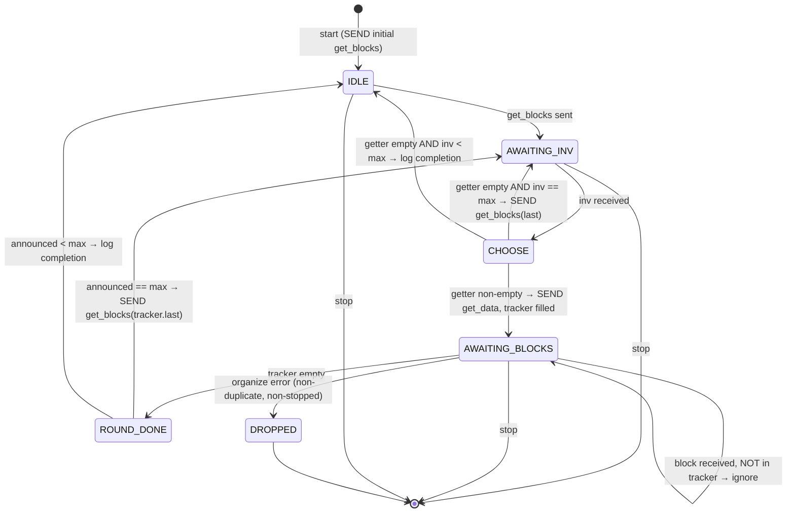

# 11 — `protocol_block_in_106` (legacy blocks-first)

> Companion to [`06-sessions-and-protocols.md`](06-sessions-and-protocols.md)
> §2.3 (attach tree) and
> [`02-chaser-organize.md`](02-chaser-organize.md) §4
> (`chaser_block::validate`).
>
> `protocol_block_in_106` is the **legacy blocks-first sync protocol**.
> It is used when a peer does not negotiate `headers_protocol` (BIP31)
> or BIP130. The protocol asks for block *inventory*, then for block
> *bodies*, organizing each block directly via `chaser_block` (the
> templated `chaser_organize<block>` instantiation).
>
> Functionally it is the predecessor of `protocol_block_in_31800` but
> sits on a completely different pipeline: no `chaser_check`, no
> `chaser_validate`, no `chase::checked`/`chase::valid` events.

| File                                                | Lines | Role                                                            |
| --------------------------------------------------- | ----- | --------------------------------------------------------------- |
| `src/protocols/protocol_block_in_106.cpp`           | 287   | Full implementation                                              |
| `include/bitcoin/node/protocols/protocol_block_in_106.hpp` |  95   | Declaration + per-channel `track` struct                          |

The file's own header comment is worth quoting (`:24-29`):

> *"The block protocol is partially obsoleted by the headers protocol.
> Both block and header protocols conflate iterative requests and
> unsolicited announcements, which introduces several ambiguities.
> Furthermore inventory messages can contain a mix of types, further
> increasing complexity. Unlike header protocol, block protocol cannot
> leave announcement disabled until current and in both cases nodes
> announce to peers that are not current."*

---

## 1. When is this attached?

From the attach tree
([`06 §2.3`](06-sessions-and-protocols.md#23-attach_protocolschannel----line-session_peeripp57-161)):

```cpp
// session_peer.ipp:115-133, the "block-in" arm:
if (headers && peer->is_negotiated(level::bip130)) {
    channel->attach<protocol_header_in_70012>(self)->start();
    channel->attach<protocol_block_in_31800>(self)->start();
}
else if (headers && peer->is_negotiated(level::headers_protocol)) {
    channel->attach<protocol_header_in_31800>(self)->start();
    channel->attach<protocol_block_in_31800>(self)->start();
}
else {
    // Very hard to find < 31800 peer to connect with.
    // Blocks-first synchronization (not base of block_in_31800).
    channel->attach<protocol_block_in_106>(self)->start();
}
```

> **Invariant (BlockIn106-Attach-1).** This protocol is attached on a
> channel iff `headers_first == false` OR the peer doesn't negotiate
> `headers_protocol`. The inline comment notes such peers are rare in
> practice ("very hard to find < 31800 peer to connect with"). The
> protocol is present for completeness and as the operational mode
> when `node.headers_first` is configured false.

> **Invariant (BlockIn106-Attach-2).** A channel never runs both
> `protocol_block_in_31800` and `protocol_block_in_106` — the
> `if/else if/else` is strict (the header explicitly states "This
> class does NOT inherit from protocol_block_in_106" at
> `protocol_block_in_31800.cpp:28`).

---

## 2. State

```cpp
// hpp:50-58
using hashmap = std::unordered_set<system::hash_digest>;

struct track {
    hashmap ids{};                 // outstanding requested block hashes
    size_t announced{};            // count from the inv that started this batch
    system::hash_digest last{};    // last hash in that inv (for the next get_blocks)
};

const type_id block_type_;         // witness_block or block (depending on node.witness)
track tracker_{};                  // strand-protected
```

Compared to `protocol_block_in_31800`:

| Feature                       | `_106`               | `_31800`                       |
| ----------------------------- | -------------------- | ------------------------------ |
| Bus subscription              | **no**               | yes (`chase::download/purge/split/stall/report`) |
| Performance reporting         | **no**               | yes (via `protocol_performer`) |
| Per-channel work tracking     | `hashmap` ids + count | `map_ptr` from `chaser_check`  |
| Counterpart chaser            | `chaser_block` (organize) | `chaser_check` (download orchestration) |
| Emits `chase::checked` etc.   | **no**               | yes                             |
| Speed/σ policing              | **no**               | yes                             |

> **Invariant (BlockIn106-State-1).** All `tracker_` access is on the
> channel strand. The header `track` struct is "protected by strand"
> per `hpp:88`.

---

## 3. Subscriptions and start

```cpp
// :49-60
void start() {
    SUBSCRIBE_CHANNEL(block, handle_receive_block, _1, _2);
    SUBSCRIBE_CHANNEL(inventory, handle_receive_inventory, _1, _2);
    SEND(create_get_inventory(), handle_send, _1);    // ← initial request
    protocol_peer::start();
}
```

No bus subscription. No `stopping` override.

> **Invariant (BlockIn106-Sub-1).** Two channel subscriptions
> (`block`, `inventory`), one initial outbound message
> (`get_blocks`). No interaction with the chase event bus.

---

## 4. The sync loop

```mermaid
sequenceDiagram
    autonumber
    participant US as protocol_block_in_106
    participant PEER as peer
    participant ORG as chaser_block (organize)
    participant Q as query

    Note over US: start
    US->>Q: get_candidate_hashes(heights(top_candidate))
    US->>PEER: get_blocks (locator)
    PEER-->>US: inv (block hashes; up to max_get_blocks = 500)
    US->>US: create_get_data: filter by !is_block(hash)
    alt all known
        opt inv.size == max_get_blocks
            US->>PEER: get_blocks(last hash)
        end
        Note over US: log completion
    else any new
        US->>US: tracker_.ids = {new hashes}; announced; last
        US->>PEER: get_data (new block hashes)
        loop per block message
            PEER-->>US: block
            alt hash not in tracker_.ids
                Note over US: log "unrequested"; ignore
            else
                US->>ORG: session.organize(block, handle_organize)
                ORG-->>US: handle_organize(ec, height) (off-strand)
                US->>US: POST do_handle_organize
                Note over US: erase hash from tracker_.ids
                alt ec error
                    US->>PEER: stop(ec)
                else
                    Note over US: log success
                    alt tracker_.ids empty
                        alt announced == max_get_blocks
                            US->>PEER: get_blocks(tracker_.last)
                        else
                            Note over US: log completion
                        end
                    end
                end
            end
        end
    end
```

---

## 5. Inventory handling — `handle_receive_inventory`

```cpp
// :66-119
bool handle_receive_inventory(ec, message) {
    if (stopped(ec)) return false;

    const auto block_count = message->count(type_id::block);
    if (is_zero(block_count)) return true;          // non-block inv; ignore

    // Work on only one block inventory at a time.
    if (!tracker_.ids.empty()) {
        // unrequested-while-busy: log and ignore
        return true;
    }

    const auto getter = create_get_data(*message);

    if (getter.items.empty()) {
        // we already have everything in the inv
        if (block_count == max_get_blocks) {
            const auto& last = message->items.back().hash;
            SEND(create_get_inventory(last), handle_send, _1);
        }
        // Otherwise: peer exhausted; just log
        return true;
    }

    // Some unknown blocks — request them
    tracker_.announced = block_count;
    tracker_.last = getter.items.back().hash;
    tracker_.ids = to_hashes(block_count, getter);
    SEND(getter, handle_send, _1);
    return true;
}
```

> **Invariant (BlockIn106-Inv-1).** Only one batch of block requests
> is in flight per channel at a time. A new inv message arriving while
> `tracker_.ids` is non-empty is dropped (logged as "unrequested with
> pending"). This serializes inventory → request cycles on a single
> channel.

> **Invariant (BlockIn106-Inv-2).** `create_get_data(inv)` filters by
> `!archive().is_block(hash)`. The node only requests blocks it
> doesn't already have. This eliminates most duplicate downloads even
> with multiple concurrent channels.

> **Invariant (BlockIn106-Inv-3).** The "max-sized inv" heuristic:
> if the peer sent back exactly `max_get_blocks` (500) hashes, more
> are expected to follow; immediately request the next round with
> `get_blocks(last)`. If fewer than max, the peer is treated as
> exhausted (no further round-trip).
>
> The header comment block notes the ambiguity case at exactly 500
> with no new blocks: completion is logged but no further round-trip
> is issued — "Completeness stalls if on 500 as empty message is
> ambiguous. This is ok, since complete is not used for anything
> essential." (`:202-205`)

---

## 6. Block handling — `handle_receive_block` and `do_handle_organize`

```cpp
// :125-146
bool handle_receive_block(ec, message) {
    if (stopped(ec)) return false;
    const auto& block_ptr = message->block_ptr;

    // Unrequested block, may not have been announced via inventory.
    if (tracker_.ids.find(block_ptr->get_hash()) == tracker_.ids.end()) {
        return true;                          // log + ignore
    }

    // organize is async; callback goes off-strand
    organize(block_ptr, BIND(handle_organize, _1, _2, block_ptr));
    return true;
}

// :149-153 (off-strand — post back to strand to access tracker_)
void handle_organize(ec, height, block_ptr) {
    POST(do_handle_organize, ec, height, block_ptr);
}

// :155-210 (stranded)
void do_handle_organize(ec, height, block_ptr) {
    if (stopped() || ec == service_stopped) return;

    tracker_.ids.erase(block_ptr->get_hash());

    if (ec == error::duplicate_block) return;           // benign
    if (ec) { stop(ec); return; }

    // Round complete?
    if (tracker_.ids.empty()) {
        if (tracker_.announced == max_get_blocks) {
            SEND(create_get_inventory(tracker_.last), handle_send, _1);
        }
        // else: log completion
    }
}
```

> **Invariant (BlockIn106-Recv-1).** Unrequested blocks are silently
> ignored. The protocol does not drop the peer for them — the comment
> notes "Many peers blindly broadcast blocks even at/above v31800,
> ugh" (`:176`).

> **Invariant (BlockIn106-Recv-2).** Errors from `organize` (other
> than `duplicate_block` and `service_stopped`) drop the channel.
> This includes orphan_block (peer sent an out-of-order block) and
> any consensus failure detected in `chaser_block::validate`.

> **Invariant (BlockIn106-Order-1).** The header comment notes
> "Order is enforced by organize" (`:164`). Out-of-order blocks
> received from the peer become orphans (parent unknown) and
> `chaser_block::do_organize` returns `error_orphan` ⇒ this channel
> is dropped. So this protocol is intolerant of out-of-order
> delivery — different from headers-first which queues headers in a
> tree.

### 6.1 The strand-hopping for tracker_ access

`handle_organize` (off-strand) only POSTs to `do_handle_organize`;
all `tracker_` access is on the channel strand. This is the same
pattern used in `chaser_validate` for back-posting from the
validation threadpool.

> **Invariant (BlockIn106-Strand-1).** `tracker_` is read/written
> only on the channel strand. The off-strand
> `handle_organize` does *no* state access; it merely POSTs.

---

## 7. Locator construction

```cpp
// :215-251
get_blocks create_get_inventory() const {
    const auto index = get_blocks::heights(query.get_top_candidate());
    return create_get_inventory(query.get_candidate_hashes(index));
}

get_blocks create_get_inventory(const hash_digest& last) const {
    return create_get_inventory(hashes{ last });
}

get_blocks create_get_inventory(hashes&& hashes) const {
    if (hashes.empty()) return {};
    return { std::move(hashes) };
}
```

Notes from the inline comments (`:217-220`):
- Sync is from the archived (strong) candidate chain.
- Will bypass blocks with candidate headers if headers-first ran
  previously — this can produce "block orphans if headers-first is
  run followed by a restart and blocks-first".

> **Invariant (BlockIn106-Locator-1).** Each channel syncs
> independently from the archived candidate top. Same logic as
> `protocol_header_in_31800::create_get_headers` but using
> `get_blocks::heights` for the locator (vs.
> `get_headers::heights`).

> **Note (BlockIn106-Mixed-Mode).** Switching from headers-first to
> blocks-first across a node restart can produce orphans because
> headers-first leaves "candidate headers without bodies" in the
> store. A blocks-first restart asks peers for blocks the headers of
> which are already on the candidate chain, but the parent linking
> may break. This is operational guidance, not a protocol
> obligation — flagged in the source at `:219-220`.

---

## 8. Difference from `protocol_block_in_31800` — full table

| Concern                                  | `_106` (this)                                              | `_31800`                                                       |
| ---------------------------------------- | ---------------------------------------------------------- | -------------------------------------------------------------- |
| Companion chaser                         | `chaser_block` (organize<block>)                            | `chaser_check` (download orchestration)                         |
| What goes through `organize`             | full block via `session.organize(block, ...)`              | nothing — block goes to store directly via `query.set_code`     |
| Validation lives where                   | `chaser_block::validate` hook (full block check + connect) | `chaser_validate` (separate strand, parallel pool)              |
| Confirmation                             | Not emitted (`chaser_block` skips `chase::valid`)          | `chaser_validate` emits `chase::valid` → `chaser_confirm`       |
| Work attribution                         | per-channel `tracker_`                                      | per-channel `map_ptr` from chaser; barrier (`job_`)              |
| Inventory ↔ batches                       | One inv → one batch → next inv (strict serialisation)      | Many maps concurrent across channels; split/stall rebalancing   |
| `chase::checked`/`unchecked` emission     | **none**                                                    | yes                                                             |
| Witness handling                         | `block_type_` set at construction                          | per-block at receive time                                       |

---

## 9. Bus integration

**None.** Like `protocol_transaction_in_106`, this protocol does not
subscribe to nor emit bus events. Its only interactions with the rest
of the node are:

- `session->organize(block, handler)` (forwarded to `chaser_block`)
- store reads in `create_get_inventory` and `create_get_data`

> **Invariant (BlockIn106-Bus-1).** Zero `chase::` events flow
> through this protocol. The blocks-first pipeline is event-bus-free
> except for `chase::start`/`resume`/`bump` arriving at
> `chaser_block` (the organize template) and the
> `chase::regressed`/`disorganized` it emits.

---

## 10. Error / outcome inventory

| Source                                | Code                                  | Behavior                                                 |
| ------------------------------------- | ------------------------------------- | -------------------------------------------------------- |
| organize returns `service_stopped`    | (no action)                           | ignored                                                  |
| organize returns `duplicate_block`    | (no action)                           | erase from tracker, ignored                              |
| organize returns any other error      | `stop(ec)`                            | channel dropped                                          |
| Unrequested block                     | (no action)                           | logged, ignored                                          |
| Unrequested inv while pending         | (no action)                           | logged, ignored                                          |

No node-faults. No `protocol_violation` drops either — this protocol
is *forgiving* of peers (matching the operational reality that BIP31
peers may be quirky).

---

## 11. State machine view



---

## 12. Spec view

### 12.1 As a process

```
protocol_block_in_106 : Process
  state:  tracker : (ids : Set hash, announced : ℕ, last : hash) | Empty
  inputs:
    peer inv(items)       → if tracker empty: enter round; else ignore
    peer block(body)      → if hash ∈ tracker.ids: organize then update tracker
  outputs:
    peer get_blocks(locator)
    peer get_data(items)
    session.organize(block, handler)
    drop_channel(ec)
  store reads:
    get_top_candidate, get_candidate_hashes, is_block(hash)
```

### 12.2 Safety properties

1. **Serial rounds per channel** (BlockIn106-Inv-1): one outstanding
   request batch at a time.
2. **No duplicate fetch within node** (BlockIn106-Inv-2): only blocks
   not already in the store are requested.
3. **Strict in-order acceptance** (BlockIn106-Order-1): out-of-order
   blocks cause channel drop via organize error.
4. **No bus emissions** (BlockIn106-Bus-1): the protocol is invisible
   on the event bus.

### 12.3 Liveness

- Progresses one round per peer reply.
- A peer that returns `max_get_blocks` keeps the channel active; one
  that returns fewer ends the channel's contribution.

### 12.4 Spec mapping to organize state machine

The validation and storage of each block flow through
`chaser_block::do_organize` (`chaser_organize<block>::do_organize`),
described in [`02 §3`](02-chaser-organize.md#3-do_organize-the-forward-state-machine).
Specifically:

- `chaser_block::validate` (`02 §4`): runs `block.check + block.accept
  + block.connect` synchronously per block. So in blocks-first mode,
  full consensus validation happens *inside* the organize call from
  this protocol.
- `chaser_block::is_storable` returns `true` always: every received
  block is archived (not just cached).

> **Spec implication.** In blocks-first mode, "checked" and
> "validated" coincide: a block that organize-returns success is
> validated. There is no separate `chase::valid` phase. The
> consensus contract is therefore concentrated in the
> `chaser_block::validate` hook, not split across check/validate
> chasers.

---

## 13. Notes for the Lisp port

- Single-stream-per-channel makes this much simpler than 31800. One
  outstanding batch, one tracker hashset per channel.
- The strand-hopping for `tracker_` (§6.1) is the only concurrency
  subtlety; modelable as posting back to a single mailbox.
- Out-of-order intolerance (BlockIn106-Order-1) simplifies the port —
  no reordering buffer needed.

---

## 14. Notes for the formal model

- Pure transducer with one small piece of state (`tracker_`).
- Single-threaded per channel modulo the strand-hop, which is
  observationally equivalent to a self-message.
- The "duplicate block" / "service stopped" exceptions are the only
  non-terminating organize-error paths.

---

## Cross-references

- [`02-chaser-organize.md`](02-chaser-organize.md) §4 — the
  `chaser_block::validate` hook that runs from this protocol's
  `organize` call
- [`06-sessions-and-protocols.md`](06-sessions-and-protocols.md) §2.3
  — attach tree (the `else` branch)
- [`06-sessions-and-protocols.md`](06-sessions-and-protocols.md) §5 —
  the modern counterpart `protocol_block_in_31800`
