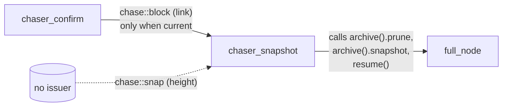

# 12 — Periphery chasers (snapshot, storage, template, transaction)

> Companion to the core-pipeline chaser docs
> [`02`](02-chaser-organize.md)–[`05`](05-chaser-confirm.md).
>
> The four chasers covered here are operationally peripheral to consensus.
> Three are **partial or stub implementations**; one (`chaser_storage`)
> is fully active. None are critical to the validate/confirm path.
>
> | Chaser              | Role                                        | Current state                     | Bus events                                                |
> | ------------------- | ------------------------------------------- | --------------------------------- | --------------------------------------------------------- |
> | `chaser_snapshot`   | Periodic store snapshots + one-shot prune    | Partially live (prune only)        | Consumes `chase::block`, `chase::snap` (dormant)           |
> | `chaser_storage`    | Disk-space recovery + reload after full      | Fully live                         | Consumes `chase::space`                                    |
> | `chaser_template`   | Mining template construction                 | Stub                                | Consumes `chase::transaction`                              |
> | `chaser_transaction`| Tx graph / mempool                            | Stub                                | Emits `chase::transaction` once (no live consumers in pipeline) |
>
> Documented together because individually they are short and the
> design intent is most clearly understood as a single "operational
> support" subsystem.

| File                                          | Lines |
| --------------------------------------------- | ----- |
| `src/chasers/chaser_snapshot.cpp`             | 290   |
| `src/chasers/chaser_storage.cpp`              | 178   |
| `src/chasers/chaser_template.cpp`             |  96   |
| `src/chasers/chaser_transaction.cpp`          | 112   |

All four inherit from the base `chaser` (
[`02 §2`](02-chaser-organize.md#2-public-interface-process-boundary)
applies to base lifecycle), run on their own strand on the network
pool, and subscribe to the bus exactly once in `start()`.

---

## 1. `chaser_snapshot`

### 1.1 Role

Two distinct operational triggers:

- **One-shot prune**: when the confirmed chain reaches its first
  current block (`chase::block` from `chaser_confirm`), perform a
  store *prune* of the prevout cache once. Latched by `pruned_`.
- **Explicit snapshot**: when a `chase::snap(height)` arrives, take
  a full store snapshot. *No issuer of `chase::snap` exists in this
  repo* — this handler is dormant
  (see [`01-event-bus.md §2.1`](01-event-bus.md#21-work-shuffling)).

### 1.2 State

```cpp
// chaser_snapshot.cpp:39-48 (live state only)
std::atomic_bool pruned_{};   // one-shot latch for chase::block-driven prune

// commented out — would gate periodic snapshots:
// const size_t snapshot_bytes_, snapshot_valid_, snapshot_confirm_;
// const bool enabled_bytes_, enabled_valid_, enabled_confirm_;
// size_t bytes_{}, valid_{}, confirm_{};
```

The commented-out fields show the **planned design**: three
threshold-driven periodic-snapshot triggers (every N bytes archived,
every N blocks validated, every N blocks confirmed). The triggers and
their event handlers (`chase::blocks`/`checked`/`valid`/`confirmable`)
are commented out at `chaser_snapshot.cpp:89-116`. Only the
`chase::block` (singular) prune trigger is live.

> **Invariant (Snapshot-State-1).** `pruned_` is set at most once per
> process lifetime. After the first successful prune, subsequent
> `chase::block` events are dropped at the handler entry
> (`chaser_snapshot.cpp:119`).

### 1.3 Live event handlers

```cpp
// :117-131
case chase::block:        // singular: from chaser_confirm.cpp:427
    if (pruned_.load()) break;
    POST(do_prune, std::get<header_t>(value));
    break;
case chase::snap:         // payload height_t — no live issuer
    POST(do_snap, std::get<height_t>(value));
    break;
```

#### `do_prune(link)` — `chaser_snapshot.cpp:144-178`

Calls the base `chaser::prune(handler)` (a wrapper around
`full_node::prune` — see
[`00-overview.md §6.2`](00-overview.md#62-suspend--resume--fault)).
The prune itself suspends the network, runs `query.prune(handler)`,
and leaves the network suspended. If prune *succeeded* and the chaser
was previously running (not suspended), this chaser **calls
`resume()` directly** to bring the network back up — and latches
`pruned_ = true`.

If prune *failed* (typically because the store wasn't yet
coalesced), the chaser leaves `pruned_` false and the next
`chase::block` will retry.

> **Invariant (Snapshot-Prune-1).** `chaser::prune` and the
> subsequent `resume()` are the cleanup of a suspend-then-resume
> sequence initiated by `full_node::prune`. The `running &&
> !is_full()` check at `:169` ensures resume only happens if the
> chaser was running before *and* the prune didn't fill the disk.

> **Invariant (Snapshot-Prune-2).** Prune is gated on
> `archive().is_coalesced()` (`:148`). If the store isn't ready, the
> handler returns silently; the next `chase::block` re-triggers it.
> Idempotency comes from the `pruned_` latch.

#### `do_snap(height)` — `chaser_snapshot.cpp:180-188`

Calls `take_snapshot(height)`, which calls the base
`chaser::snapshot(handler)`. Same suspend/resume dance as prune.

Currently unreachable — no `chase::snap` issuer in source.

### 1.4 Coupling



### 1.5 Spec view

- Process state: `pruned ∈ {false, true}` (monotone, one-way latch).
- One observable effect: a prune operation on the store, at most once
  per process lifetime, gated on `archive().is_coalesced()`.
- The `chase::snap` arm is **dead code in current builds**; an
  interpreter / formal model can either omit it or model it as
  unreachable.

---

## 2. `chaser_storage`

### 2.1 Role

Single, narrow responsibility: when the network is **suspended due to
a full-disk fault**, monitor disk free space and **reload + resume**
once space becomes available.

This is the only chaser that owns a `network::deadline` timer
directly. The timer is constructed against the chaser's own strand
(`disk_timer_ = std::make_shared<deadline>(log, strand(), seconds{1})`,
`chaser_storage.cpp:51`), which runs on the **network threadpool** —
not a separate pool. So the timer adds no new execution context; it
fires callbacks onto the chaser's existing strand.

### 2.2 State

```cpp
// chaser_storage.hpp (implied), chaser_storage.cpp:39-43, 51
const std::filesystem::path store_;    // database root path
network::deadline::ptr disk_timer_;    // 1-second tick; constructed in start()
```

### 2.3 Lifecycle

```cpp
// :48-55
code start() {
    disk_timer_ = std::make_shared<deadline>(log, strand(), seconds{1});
    SUBSCRIBE_EVENTS(handle_event, _1, _2, _3);
    return error::success;
}

// :57-71
void stopping(ec) { POST(do_stopping, ec); }
void do_stopping(ec) {
    if (disk_timer_) { disk_timer_->stop(); disk_timer_.reset(); }
}
```

### 2.4 Event handling

```cpp
// :76-100
case chase::space:                  // from full_node::fault when is_full
    POST(do_space, count_t{});
    break;
case chase::stop:
    return false;
```

`do_space` (`:105-112`) jump-starts the polling loop with an immediate
`handle_timer(success)` (no wait for the first tick).

### 2.5 The polling loop

```mermaid
stateDiagram-v2
    [*] --> IDLE: start()
    IDLE --> POLLING: chase::space → do_space → handle_timer(success)
    POLLING --> POLLING: timer fires; suspended ∧ ¬is_fault ∧ ¬have_capacity\n→ restart timer
    POLLING --> RELOAD: timer fires; have_capacity()
    RELOAD --> IDLE: do_reload → archive.reload(); resume()
    POLLING --> IDLE: !suspended OR is_fault → cancel (no action)
    POLLING --> [*]: stop
    IDLE --> [*]: stop
```

```cpp
// :117-142
void handle_timer(ec) {
    if (closed() || !disk_timer_ || ec == operation_canceled) return;
    if (ec && ec != operation_timeout) {
        LOGF(...); return;
    }
    // Network is resumed or store is failed, cancel monitoring.
    if (!suspended() || archive().is_fault()) return;

    if (!have_capacity()) {
        disk_timer_->start(BIND(handle_timer, _1));    // wait another second
        return;
    }

    // Disk now has space, reset store condition and resume network.
    do_reload();
}
```

```cpp
// :144-163
void do_reload() {
    if (const auto ec = reload([this](event_, table) NOEXCEPT { /* log */ }))
        LOGF("Reload from disk full condition failed, " << ec.message());
    else {
        resume();
        LOGN("Reload from disk full complete in ...");
    }
}
```

```cpp
// :165-173
bool have_capacity() const {
    size_t have{};
    const auto require = archive().get_space();
    return file::space(have, store_) && have >= require;
}
```

> **Invariant (Storage-Loop-1).** The polling loop exits exactly when
> either:
> - `!suspended()` (network was resumed externally) OR
> - `archive().is_fault()` (different, non-recoverable failure) OR
> - disk has capacity, triggering `do_reload + resume()`.
>
> Each exit returns the chaser to its IDLE state, ready for the next
> `chase::space`.

> **Invariant (Storage-Reload-1).** `archive().reload(handler)` is
> called only after `file::space` returns ≥ `archive().get_space()`.
> A failure here is logged but not faulted upward — the chaser will
> *not* loop on reload failure; subsequent space events would.

### 2.6 Coupling

```mermaid
flowchart LR
    FN[full_node::fault\n(when query.is_full)] -- "chase::space" --> STG[chaser_storage]
    STG -- "archive().reload\nresume()" --> NODE[full_node]
    STG -- "file::space(store_)" --> FS[(filesystem)]
```

### 2.7 Spec view

- Process state: `{IDLE, POLLING}`; timer is conceptually a self-tick
  message.
- One observable effect: clear the store's full-disk condition and
  resume the network, exactly once per `chase::space` event (assuming
  capacity is eventually restored).
- Liveness: assumes the operator adds disk space.

---

## 3. `chaser_template`

### 3.1 Role

**Stub** for mining-template construction. Currently subscribes to
`chase::transaction` and ignores it. The intended behaviour (per
TODOs at `:43, :64, :86`) is:

1. On chain top change (confirmed or candidate), recompute the
   block template.
2. On transaction graph change, update the template's tx set.
3. Emit `chase::template_(height)` to wake any external miner.

`chase::template_` has **no live issuer** in this repo
(see [`01-event-bus.md §2.6`](01-event-bus.md#26-confirm-chain-and-mining)).

### 3.2 Live code

The entire substantive body:

```cpp
// :44-48
code start() {
    SUBSCRIBE_EVENTS(handle_event, _1, _2, _3);
    return error::success;
}

// :53-84
bool handle_event(ec, event_, value) {
    if (closed()) return false;
    if (suspended()) return true;

    switch (event_) {
        case chase::transaction:
            POST(do_transaction, std::get<transaction_t>(value));
            break;
        case chase::stop:
            return false;
        default: break;
    }
    return true;
}

// :87-90
void do_transaction(transaction_t) {
    BC_ASSERT(stranded());
    // (empty body)
}
```

That's all the live code. The TODO at `:64` notes: *"also handle
confirmed/unconfirmed"* — meaning `chase::organized` and
`chase::reorganized` are the next events to wire in.

### 3.3 Spec view

- **No state**, **no observable effects** in current builds.
- A spec / port can treat this as identity (no transitions modify
  any shared state) until the chaser is implemented.
- The natural design once implemented: maintain a current `template_`
  (block template) as a function of confirmed top + selected tx set;
  emit `chase::template_(height)` after each recomputation.

---

## 4. `chaser_transaction`

### 4.1 Role

**Stub** for mempool / tx-graph management. Subscribes to the bus but
its `handle_event` switches only on `chase::stop`. The
`do_confirmed(header_t)` method (not wired to any bus event currently)
contains the one live emission of `chase::transaction(transaction_t{})`,
giving rise to the single startup-time announcement that exercises
`chaser_template`'s and `protocol_transaction_out_106`'s subscriptions
([`10 §6`](10-tx-protocols.md#6-where-chasetransaction-comes-from)).

### 4.2 Live code

```cpp
// :44-48
code start() {
    SUBSCRIBE_EVENTS(handle_event, _1, _2, _3);
    return error::success;
}

// :53-78
bool handle_event(ec, event_, value) {
    if (closed()) return false;
    // TODO: allow required messages.
    switch (event_) {
        case chase::stop:
            return false;
        default: break;
    }
    return true;
}

// :81-86 — invoked from where? not from handle_event
void do_confirmed(header_t) {
    BC_ASSERT(stranded());
    notify(error::success, chase::transaction, transaction_t{});
}

// :91-95 (stub)
void store(const transaction::cptr&) {
    // Push new checked tx into store and update DAG.
}

// :98-106 (stub)
void do_store(const transaction::cptr&) {
    BC_ASSERT(stranded());
    // TODO: validate and store transaction.
    ////notify(error::success, chase::transaction, link);   // ← commented out
}
```

### 4.3 Where is `do_confirmed` called from?

Not from `handle_event` in this file. A grep across the codebase shows
**no caller** for `chaser_transaction::do_confirmed` in this repo.
The single `chase::transaction` emission is therefore reached only
through tests or via a future caller not yet wired.

> **Invariant (TxChaser-State-1).** In a normal node run, *no*
> bus event in this repo's wiring causes `chaser_transaction` to
> emit `chase::transaction`. The protocol_transaction_out_106's bus
> subscription is therefore effectively idle in current deployments.
> This is a known design state, not a bug — the `chaser_transaction`
> is awaiting a mempool design.

### 4.4 Spec view

Same as `chaser_template`: no state, no observable effects beyond
`chase::stop`-driven unsubscribe.

The skeleton of the intended design is visible in the comments at
`:91-95` (push tx into store + update DAG + emit `chase::transaction`).
A port or spec can encode it as the obvious mempool: a partial DAG
ordered by dependencies, with insertion emitting per-tx events.

---

## 5. Summary table of bus interactions for the periphery

Reproduces and refines [`01-event-bus.md §3`](01-event-bus.md#3-verified-issuer--handler-diagram)
for these four chasers:

| Chaser              | Subscribes to (live)                 | Subscribes to (commented out)                      | Emits (live) | Emits (planned) |
| ------------------- | ------------------------------------ | -------------------------------------------------- | ------------ | --------------- |
| `chaser_snapshot`   | `chase::block`, `chase::snap`         | `chase::blocks`, `chase::checked`, `chase::valid`, `chase::confirmable` | (none)       | (none) |
| `chaser_storage`    | `chase::space`, `chase::stop`         | —                                                  | (none)       | (none) |
| `chaser_template`   | `chase::transaction`, `chase::stop`   | "also handle confirmed/unconfirmed"                | (none)       | `chase::template_` |
| `chaser_transaction`| `chase::stop` only                     | (none)                                              | `chase::transaction` (from `do_confirmed`, no live caller) | per accepted tx |

> **Invariant (Periphery-Bus-1).** Three of the four periphery chasers
> are *consumers only* (or completely idle). `chaser_transaction` is
> the only one with a live emission, and that emission has no live
> trigger in the current wiring. Operationally these four are
> bookkeeping infrastructure awaiting upstream completeness.

---

## 6. Spec view (combined)

For a formal model the periphery breaks down cleanly:

```
chaser_snapshot : Process
  state: pruned : Bool                      -- one-way latch
  inputs:  chase::block(link) — fires do_prune unless pruned
           chase::snap(height) — fires do_snap (dormant; no issuer)
  effects: archive.prune (network suspend → reload → resume), archive.snapshot

chaser_storage : Process
  state: in {IDLE, POLLING}
  inputs:  chase::space — switch IDLE → POLLING
           timer tick — re-check capacity; if ok do_reload → IDLE
  effects: archive.reload (clears fault), resume()

chaser_template : Process
  state: ∅ (stub)
  inputs:  chase::transaction (ignored)
  effects: none

chaser_transaction : Process
  state: ∅ (stub)
  inputs:  chase::stop only
  effects: none in normal operation
```

The two stubs (template, transaction) can be omitted from a formal
model entirely until they are implemented — neither modifies any
shared state.

---

## 7. Notes for the Lisp port

- Three of the four can start as one-liners. `chaser_storage` is the
  only one with non-trivial behaviour, and even there the logic is
  ~30 lines.
- A Lisp port can defer `chaser_template` and `chaser_transaction`
  pending decisions about the mempool.
- `chaser_snapshot::pruned_` is a single boolean per process; trivial.
- `chaser_storage`'s deadline timer can be implemented with any
  scheduler primitive (asio's `deadline_timer`, an actor with a
  delayed self-message, etc.).

---

## 8. Notes for the formal model

- These four chasers can be modelled with very small state spaces and
  contribute little to the global proof obligation set.
- `chaser_snapshot`'s `pruned_` latch is a standard monotone Boolean.
- `chaser_storage`'s polling loop is a classic "wait until precondition
  holds" pattern; formally a liveness property "if `chase::space` is
  emitted and disk eventually has capacity, the system eventually
  reaches `RUNNING`".
- The two stubs contribute nothing until implemented; flag them as
  "external" in any spec.

---

## Cross-references

- [`00-overview.md`](00-overview.md) §6.2 (the suspend/resume/fault
  cycle that `chaser_storage` participates in)
- [`01-event-bus.md`](01-event-bus.md) §2 (verified event table —
  rows for `block`, `snap`, `space`, `transaction`, `template_`)
- [`05-chaser-confirm.md`](05-chaser-confirm.md) §3 (emits
  `chase::block` consumed here by `chaser_snapshot::do_prune`)
- [`10-tx-protocols.md`](10-tx-protocols.md) §6 (consumer of the dormant
  `chase::transaction` from `chaser_transaction`)
